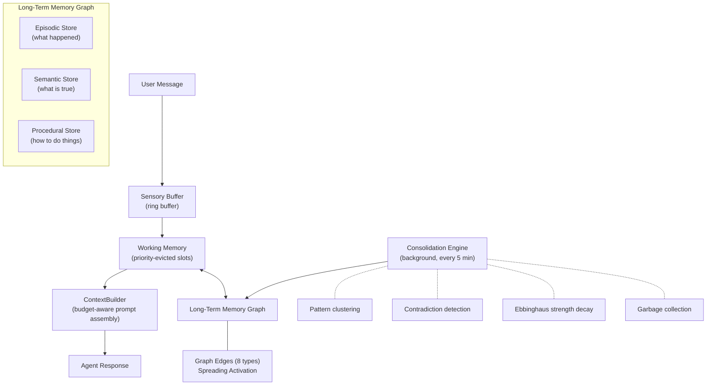
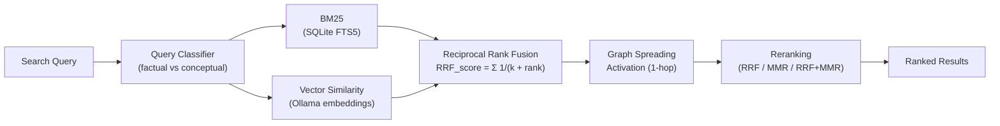
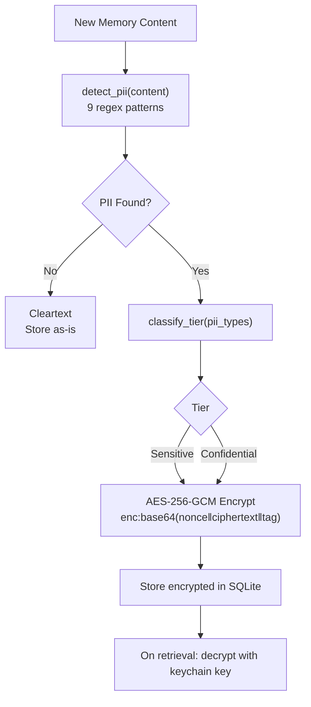
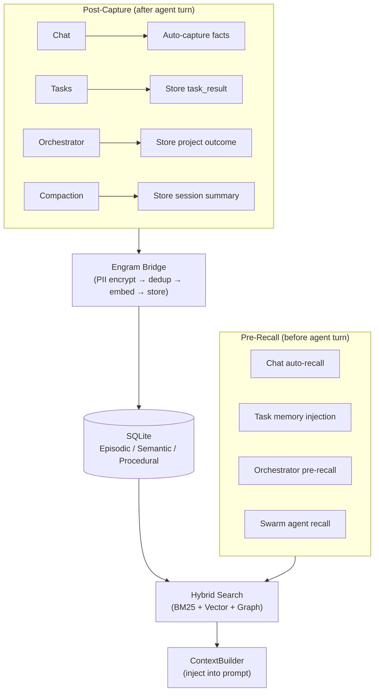

# Project Engram — Memory Architecture Whitepaper

*A biologically-inspired memory system for persistent AI agents.*

**Version:** 1.0
**Status:** Implemented in OpenPawz v0.x
**License:** MIT

---

## Abstract

Project Engram is a three-tier memory architecture for desktop AI agents. It replaces flat key-value memory stores with a biologically-inspired system modeled on how human memory works: incoming information flows through a sensory buffer, gets prioritized in working memory, and consolidates into long-term storage with automatic clustering, contradiction detection, and strength decay. The result is agents that remember context across sessions, learn from patterns, and forget gracefully.

This document describes the architecture as implemented in OpenPawz — a Tauri v2 desktop AI platform. All code is open source under the MIT License.

---

## Table of Contents

1. [Motivation](#motivation)
2. [Architecture Overview](#architecture-overview)
3. [The Three Memory Tiers](#the-three-memory-tiers)
4. [Long-Term Memory Graph](#long-term-memory-graph)
5. [Hybrid Search — BM25 + Vector Fusion](#hybrid-search)
6. [Consolidation Engine](#consolidation-engine)
7. [Context Window Intelligence](#context-window-intelligence)
8. [Memory Security](#memory-security)
9. [Memory Lifecycle Integration](#memory-lifecycle-integration)
10. [Category Taxonomy](#category-taxonomy)
11. [Schema Design](#schema-design)
12. [Configuration](#configuration)
13. [Current Limitations](#current-limitations)
14. [Future Directions](#future-directions)
15. [Frontier Capabilities](#frontier-capabilities-designed-implementation-phase-7)

---

## Motivation

Most AI chat applications treat memory as an afterthought — a flat table of key-value pairs appended to the system prompt. This approach has well-documented problems:

- **No prioritization.** All memories compete equally for context window space, regardless of relevance or importance.
- **No decay.** Outdated information persists indefinitely. A corrected fact and its outdated predecessor both appear in context.
- **No structure.** Episodic memories (what happened), semantic knowledge (what is true), and procedural memory (how to do things) are all stored in one undifferentiated list.
- **No security.** Sensitive information stored in plaintext. No PII detection, no encryption, no access control.
- **No budget awareness.** Memories are injected without regard to the model's context window, leading to truncation or context overflow.

Engram addresses each of these by modeling agent memory after the structure of biological memory systems.

---

## Architecture Overview



The system is implemented as 15 Rust modules under `src-tauri/src/engine/engram/`:

| Module | Purpose |
|--------|---------|
| `sensory_buffer.rs` | Ring buffer for current-turn incoming data |
| `working_memory.rs` | Priority-evicted slots with token budget |
| `graph.rs` | Memory graph operations (store, search, edges, activation) |
| `store.rs` / `schema.rs` | SQLite schema, migrations, CRUD operations |
| `consolidation.rs` | Background pattern detection, clustering, contradiction resolution |
| `retrieval.rs` | Retrieval cortex with quality metrics |
| `retrieval_quality.rs` | NDCG scoring and relevance warnings |
| `hybrid_search.rs` | Query classification (factual vs. conceptual) |
| `context_builder.rs` | Token-budget-aware prompt assembly |
| `tokenizer.rs` | Model-specific token counting with UTF-8 safe truncation |
| `model_caps.rs` | Per-model capability registry (context windows, features) |
| `reranking.rs` | RRF, MMR, and combined reranking strategies |
| `metadata_inference.rs` | Auto-extract tech stack, URLs, file paths from content |
| `encryption.rs` | PII detection, AES-256-GCM field encryption, GDPR purge |
| `bridge.rs` | Public API connecting tools/commands to the graph |

---

## The Three Memory Tiers

### Tier 1: Sensory Buffer

A fixed-capacity ring buffer (`VecDeque`) that accumulates raw input during a single agent turn: user messages, tool results, recalled memories, and system context.

**Properties:**
- Capacity: configurable (default 20 items)
- Lifetime: single turn — drained by the ContextBuilder and discarded
- Budget-aware: `drain_within_budget(token_limit)` returns items that fit within a token budget

**Purpose:** Prevents information loss during complex turns with many tool calls. The ContextBuilder reads from the sensory buffer to build the final prompt.

### Tier 2: Working Memory

A priority-sorted array of memory slots with a hard token budget. Represents the agent's "current awareness" — what it's actively thinking about.

**Properties:**
- Capacity: configurable token budget (default 4,096 tokens)
- Eviction: lowest-priority slot evicted when budget exceeded
- Sources: recalled long-term memories, sensory buffer overflow, tool results, user mentions
- Persistence: snapshots saved to SQLite on agent switch, restored when agent resumes

**Slot structure:**
```
WorkingMemorySlot {
    memory_id: String,      // links to long-term memory (if recalled)
    content: String,
    source: Recalled | SensoryBuffer | ToolResult | Restored,
    priority: f32,          // determines eviction order
    token_cost: usize,      // pre-computed token count
    inserted_at: DateTime,
}
```

**Priority calculation:** Recalled memories use their retrieval score. Sensory buffer items use recency score. Tool results use a configurable priority (default 0.7). User mentions get high priority (0.9).

### Tier 3: Long-Term Memory Graph

Persistent storage in SQLite with three distinct memory types, connected by typed graph edges.

#### Episodic Store
*What happened* — concrete events, conversations, task results, session summaries.

Each episodic memory has:
- Tiered content (full text, summary, key facts, tags — currently only full text populated)
- Category (18-variant enum)
- Importance score (0.0–1.0)
- Strength (1.0 on creation, decays over time via Ebbinghaus curve)
- Scope (global / agent / channel / channel_user)
- Optional vector embedding for semantic search
- Access tracking (count + last accessed timestamp)
- Consolidation state (fresh → consolidated → archived)

#### Semantic Store
*What is true* — structured knowledge as subject-predicate-object triples.

Examples:
- ("User", "prefers", "dark mode")
- ("Project Alpha", "uses", "Rust + TypeScript")
- ("API rate limit", "is", "100 requests/minute")

Triples with matching subject + predicate are automatically reconsolidated: the newer value replaces the older one, with confidence scores transferred.

#### Procedural Store
*How to do things* — step-by-step procedures with success/failure tracking.

Each procedure has:
- Content (the steps)
- Trigger condition (when to apply)
- Success and failure counters
- Success rate derived from execution history

---

## Long-Term Memory Graph

Memories are not isolated rows — they form a graph connected by typed edges:

| Edge Type | Meaning |
|-----------|---------|
| `RelatedTo` | General association |
| `CausedBy` | Causal relationship |
| `Supports` | Evidence supporting a claim |
| `Contradicts` | Conflicting information |
| `PartOf` | Component relationship |
| `FollowedBy` | Temporal sequence |
| `DerivedFrom` | Source derivation |
| `SimilarTo` | Semantic similarity |

### Spreading Activation

When memories are retrieved by search, the graph is traversed to find associated memories. Adjacent nodes receive an activation boost proportional to their edge weight, biased by edge type. This implements a simplified version of spreading activation from cognitive science.

Currently 1-hop traversal: direct neighbors of retrieved memories are boosted. The activation score is blended with the original retrieval score to produce the final ranking.

---

## Hybrid Search

Engram uses three search signals, fused with reciprocal rank fusion (RRF):



### 1. BM25 Full-Text Search (SQLite FTS5)

SQLite's FTS5 extension with `porter unicode61` tokenizer. Handles exact keyword matches, stemming, and phrase queries. All FTS5 query operators are sanitized before execution to prevent injection.

### 2. Vector Similarity Search

When Ollama is available with an embedding model (e.g., `nomic-embed-text`), memories are embedded at storage time. Search queries are embedded at query time. Cosine similarity between query and memory embeddings produces a relevance score.

Embedding generation is optional — if no embedding model is configured, the system falls back to BM25-only search with no degradation in keyword accuracy.

### 3. Graph Spreading Activation

After BM25 and vector results are collected, the memory graph is traversed to find related memories via typed edges. Associated memories receive a score boost.

### Fusion Strategy

Results from all three signals are merged using **Reciprocal Rank Fusion (RRF)**:

$$
\text{RRF\_score}(d) = \sum_{i} \frac{1}{k + \text{rank}_i(d)}
$$

Where $k = 60$ (standard constant) and $\text{rank}_i(d)$ is the rank of document $d$ in signal $i$. This produces a unified ranking that benefits from all three signals without requiring score normalization.

### Reranking

After fusion, results are optionally reranked using one of four strategies:

| Strategy | Method | Use Case |
|----------|--------|----------|
| RRF | Reciprocal rank fusion only | Default, fast |
| MMR | Maximal marginal relevance (λ=0.7) | Diversity-focused |
| RRF+MMR | RRF followed by MMR | Best quality |
| CrossEncoder | Model-based reranking (falls back to RRF+MMR) | Future |

### Query Classification

The `hybrid_search.rs` module analyzes queries to determine the optimal search strategy:
- **Factual queries** (who, what, when, specific entities) → weight BM25 higher
- **Conceptual queries** (how, why, explain, abstract topics) → weight vector similarity higher
- Signal weights are adjusted dynamically per query

---

## Consolidation Engine

A background process runs every 5 minutes (configurable) performing four operations:

### 1. Pattern Clustering

Memories with cosine similarity ≥ 0.75 are grouped using union-find clustering. Clusters of related memories are identified for potential fusion. This prevents memory bloat from repeated similar observations.

### 2. Contradiction Detection

When two memories share the same subject and predicate but have different objects, a contradiction is detected. Resolution: the newer memory wins, the older memory's confidence is transferred proportionally, and a `Contradicts` graph edge is created.

### 3. Ebbinghaus Strength Decay

Memory strength decays following a simplified Ebbinghaus forgetting curve:

$$
\text{strength}(t) = S_0 \times e^{-\lambda t}
$$

Where $S_0$ is initial strength (1.0), $\lambda$ is the decay rate, and $t$ is time since creation. Important memories (importance > 0.7) decay slower. Accessed memories get strength boosts.

### 4. Garbage Collection

Memories with strength below a threshold (default 0.1) are candidates for deletion. Important memories (importance ≥ 0.7) are protected from GC regardless of strength. Deletion is two-phase: content fields are zeroed before the row is deleted (anti-forensic measure).

After GC, the SQLite database is re-padded to 512KB bucket boundaries to prevent file-size side-channel leakage.

### Gap Detection

The consolidation engine also detects three types of knowledge gaps:
- **Missing context** — references to entities that have no associated memories
- **Temporal gaps** — periods with no memory activity for an active agent
- **Category imbalance** — agents with memory heavily concentrated in one category

Gaps are logged for diagnostic purposes.

---

## Context Window Intelligence

### ContextBuilder

The ContextBuilder is a fluent API for assembling the final prompt within a token budget:

```rust
let prompt = ContextBuilder::new(model_caps)
    .system_prompt(&base_prompt)
    .recall_from(&store, &query, agent_id, &embedding_client).await
    .working_memory(&wm)
    .sensory_buffer(&buffer)
    .messages(&conversation)
    .build();
```

**Budget allocation strategy:**
1. System prompt gets first priority (always included)
2. Recalled memories packed by importance × relevance score
3. Working memory slots packed by priority
4. Sensory buffer items packed by recency
5. Conversation messages packed newest-first until budget exhausted

### Model Capability Registry

Every supported model has a capability fingerprint:
- Context window size
- Maximum output tokens
- Tool/function calling support
- Vision support
- Extended thinking support
- Streaming support
- Tokenizer type

The registry covers all models from OpenAI, Anthropic, Google, DeepSeek, Mistral, xAI, Ollama, and OpenRouter. Unknown models fall back to conservative defaults (32K context, 4K output).

### Tokenizer

Model-specific token estimation:
- `Cl100kBase` — GPT-4, Claude (÷3.4 bytes)
- `O200kBase` — o1, o3, o4 (÷3.8 bytes)
- `Gemini` — Gemini models (÷3.3 bytes)
- `SentencePiece` — Llama, Mistral, local models (÷3.0 bytes)
- `Heuristic` — Fallback (÷4.0 bytes)

All calculations use `ceil()` to round up and are UTF-8 safe (truncation never splits a multi-byte character).

---

## Memory Security

### Field-Level Encryption

Memories containing PII are encrypted with AES-256-GCM before storage. The encryption key is stored in the OS keychain under a dedicated entry (`paw-memory-vault`), separate from the credential vault key.

**Automatic PII detection** uses 9 compiled regex patterns to identify sensitive content:
- SSN, credit card, phone numbers
- Email addresses, physical addresses
- Person names, geographic locations
- Credentials (passwords, API keys)
- Government IDs

**Encryption flow:**



### Query Sanitization

FTS5 operators are stripped from user queries before they reach SQLite. This prevents FTS5 injection attacks that could extract data via crafted queries.

### Prompt Injection Scanning

Every recalled memory is scanned against 10 injection patterns before being returned to the agent. Matches are logged and flagged but not suppressed — the agent receives the content with a warning annotation.

### Anti-Forensic Measures

- **Two-phase secure deletion** — Content zeroed before row deletion
- **Vault-size quantization** — Database padded to 512KB buckets
- **8KB pages** — Reduces file-size granularity
- **Incremental auto-vacuum** — Prevents immediate file shrinkage after deletions
- **PRAGMA secure_delete = ON** — SQLite zeros freed pages

### GDPR Compliance

`engram_purge_user(identifiers)` securely erases all memories matching a list of user identifiers across all tables, including snapshots and audit logs. Implements Article 17 (right to be forgotten).

---

## Memory Lifecycle Integration

Engram is wired into every major execution path:



### Chat

When `auto_recall` is enabled for an agent, the ContextBuilder performs a hybrid search and injects relevant memories into the system prompt before each agent turn. Agent responses can trigger auto-capture of facts, preferences, and observations.

### Tasks

Before a task agent runs, the top 10 relevant memories are searched and injected as a "Relevant Memories" system prompt section. After the agent completes, the task result is stored in episodic memory via the Engram bridge with category `task_result`.

### Orchestrator

The boss agent in multi-agent orchestration receives pre-recalled memories relevant to the project goal. After the orchestration completes, the project outcome is captured in episodic memory.

### Session Compaction

When a conversation is compacted (summarized to free context space), the compaction summary is stored in Engram episodic memory with category `session`. This ensures knowledge survives compaction.

### Channel Bridges

Messages from Discord, Slack, Telegram, and other channels are stored with channel and user scope metadata. This enables per-channel memory isolation — a user's Discord memories don't bleed into their Telegram conversations.

### Agent Tools

Agents have direct access to memory through 7 tools:

| Tool | Purpose |
|------|---------|
| `memory_store` | Store a memory with category and importance |
| `memory_search` | Hybrid search across all memory types |
| `memory_knowledge` | Store structured SPO triples |
| `memory_stats` | Get memory system statistics |
| `memory_delete` | Delete a specific memory |
| `memory_update` | Update memory content |
| `memory_list` | Browse memories by category |

---

## Category Taxonomy

18 categories, unified across Rust backend, agent tools, and frontend UI:

| Category | Description | Typical Source |
|----------|-------------|----------------|
| `general` | Uncategorized information | Fallback |
| `preference` | User preferences and settings | Agent observation |
| `fact` | Verified factual information | Agent or user |
| `skill` | Capability-related knowledge | Skill execution |
| `context` | Situational context | Auto-capture |
| `instruction` | User-provided directives | Explicit instruction |
| `correction` | Corrected information (supersedes prior) | User correction |
| `feedback` | Quality feedback on agent behavior | User feedback |
| `project` | Project-specific knowledge | Task/orchestrator |
| `person` | Information about people | Agent observation |
| `technical` | Technical details (APIs, configs, specs) | Agent or tools |
| `session` | Session summaries from compaction | Compaction engine |
| `task_result` | Outcomes of completed tasks | Task post-capture |
| `summary` | Condensed summaries | Consolidation |
| `conversation` | Conversational context | Auto-capture |
| `insight` | Derived observations and patterns | Agent reasoning |
| `error_log` | Error information for debugging | Error handlers |
| `procedure` | Step-by-step procedures | Procedural store |

Unknown categories gracefully fall back to `general` via the `FromStr` implementation.

---

## Schema Design

Six SQLite tables with FTS5 virtual tables and 13 indices:

```sql
-- Episodic memories (what happened)
episodic_memories (
    id, content, content_summary, content_key_facts, content_tags,
    outcome, category, importance, agent_id, session_id, source,
    consolidation_state, strength, trust_accuracy, trust_source_reliability,
    trust_consistency, trust_recency, trust_composite,
    scope_global, scope_project_id, scope_squad_id, scope_agent_id,
    scope_channel, scope_channel_user_id,
    embedding, embedding_model, negative_contexts,
    created_at, last_accessed_at, access_count
)

-- Semantic knowledge (SPO triples)
semantic_memories (
    id, subject, predicate, object, category, confidence,
    agent_id, source, embedding, embedding_model,
    created_at, updated_at
)

-- Procedural memory (how-to)
procedural_memories (
    id, content, trigger_condition, category,
    agent_id, source, success_count, failure_count,
    embedding, embedding_model, created_at, updated_at
)

-- Graph edges connecting memories
memory_graph_edges (
    id, source_id, source_type, target_id, target_type,
    edge_type, weight, metadata, created_at
)

-- Working memory snapshots for agent switching
working_memory_snapshots (
    agent_id, snapshot_json, saved_at
)

-- Audit trail
memory_audit_log (
    id, action, memory_type, memory_id, agent_id,
    details, created_at
)
```

FTS5 virtual tables are created for `episodic_memories` and `semantic_memories` to enable full-text search. Triggers keep FTS tables synchronized.

---

## Configuration

The `EngramConfig` struct provides 30+ tunable parameters:

| Parameter | Default | Description |
|-----------|---------|-------------|
| `sensory_buffer_capacity` | 20 | Max items in sensory buffer |
| `working_memory_budget` | 4096 | Token budget for working memory |
| `consolidation_interval_secs` | 300 | Background consolidation cycle |
| `decay_rate` | 0.05 | Ebbinghaus decay lambda |
| `gc_strength_threshold` | 0.1 | Minimum strength to survive GC |
| `gc_importance_protection` | 0.7 | Importance above this is GC-immune |
| `search_limit` | 10 | Default search result count |
| `min_relevance_threshold` | 0.2 | Minimum score for search results |
| `clustering_similarity_threshold` | 0.75 | Cosine similarity for clustering |
| `auto_recall_enabled` | true | Pre-recall before agent turns |
| `auto_capture_enabled` | true | Post-capture after agent turns |

---

## Current Limitations

These are known limitations in the current implementation. They are documented here for transparency, not as promises of future work.

1. **Vector search is O(n)** — Brute-force cosine scan over all embeddings. Adequate for <10K memories per agent, but will need an index (HNSW or similar) for larger scales.

2. **No proposition decomposition** — Memories are stored as whole text blobs. Splitting complex statements into atomic propositions would improve retrieval precision but requires NLP or LLM processing.

3. **Single-writer SQLite** — All writes go through one `Mutex<Connection>`. Sufficient for single-user desktop, but concurrent multi-agent heavy workloads may contend on the lock.

4. **Tiered content partially populated** — The schema supports full/summary/key_facts/tags columns, but currently only `content_full` is populated. Automatic summarization would require LLM calls at storage time.

5. **Spreading activation is 1-hop** — Only direct graph neighbors are boosted. Multi-hop traversal would capture more distant associations but adds latency.

6. **Working memory snapshots are structural** — The Tauri command saves/restores snapshot markers. Full working memory state capture requires engine-level integration during agent turns (the library supports this, but the command layer stores placeholder snapshots).

7. **No full-database encryption** — Individual PII fields are encrypted, but the database file itself is not encrypted with SQLCipher. An attacker with file access can read non-PII content.

8. **Embeddings require Ollama** — Vector search only works when an Ollama embedding model is running. Without it, search falls back to BM25-only.

---

## Future Directions

These are areas we're exploring. No commitments — just interesting problems.

- **HNSW vector index** — O(log n) approximate nearest neighbor search using `sqlite-vec` or a custom implementation
- **Proposition-level storage** — LLM-based decomposition of complex statements into atomic, independently retrievable facts
- **Smart history compression** — Three-tier message storage (verbatim → compressed → summary) with automatic tiering based on age
- **Topic-change detection** — Cosine divergence between consecutive messages to trigger working memory eviction
- **Momentum vectors** — Use trajectory of recent queries to bias search toward conversational direction
- **Pluggable vector backends** — Trait-based abstraction allowing HNSW, product quantization, or external vector stores
- **Process memory hardening** — `mlock` to prevent swapping, core dump prevention, `zeroize` Drop implementations on all memory structs
- **SQLCipher integration** — Full database encryption at rest

### Frontier Capabilities

These 8 capabilities were identified through analysis of cutting-edge memory research (Cognee, OpenMemory/HMD, HEMA, SHIMI, IMDMR, MemoriesDB) and represent the next evolution of Engram beyond any existing system:

- **Emotional memory dimension** (§37) — Affective scoring pipeline (valence/arousal/dominance/surprise) modulates decay rates, consolidation priority, and retrieval boost. Emotionally charged memories decay 40% slower.
- **Reflective meta-cognition layer** (§38) — Periodic self-assessment of knowledge confidence per domain, generating "I know / I don't know" maps that guide anticipatory pre-loading.
- **Temporal-axis retrieval** (§39) — Time as a first-class retrieval signal with B-tree temporal index, range queries, proximity scoring, and pattern detection. "What happened last week?" resolved natively.
- **Intent-aware multi-dimensional retrieval** (§40) — 6-intent classifier (informational/procedural/comparative/debugging/exploratory/confirmatory) dynamically weights all retrieval signals per query.
- **Entity lifecycle tracking** (§41) — Canonical name resolution, evolving entity profiles, entity-centric queries, and relationship emergence detection across all memory types.
- **Hierarchical semantic compression** (§42) — Multi-level abstraction tree (memories → clusters → super-clusters → domain summaries). Navigate knowledge at any zoom level.
- **Multi-agent memory sync protocol** (§43) — CRDT-inspired memory bus for peer-to-peer knowledge sharing between agents with vector-clock conflict resolution.
- **Memory replay & dream consolidation** (§44) — Idle-time hippocampal-inspired replay strengthens memories, discovers latent connections, and re-embeds with evolved context.

These capabilities are connected by 13 formal integration contracts (§45) ensuring they form a synergistic network rather than isolated features.

---

## References

- Ebbinghaus, H. (1885). *Memory: A Contribution to Experimental Psychology.*
- Anderson, J. R. (1983). *A Spreading Activation Theory of Memory.* Journal of Verbal Learning and Verbal Behavior, 22(3), 261-295.
- Robertson, S. E., & Zaragoza, H. (2009). *The Probabilistic Relevance Framework: BM25 and Beyond.* Foundations and Trends in Information Retrieval, 3(4), 333-389.
- Carbonell, J., & Goldstein, J. (1998). *The Use of MMR, Diversity-Based Reranking for Reordering Documents and Producing Summaries.* SIGIR '98.
- Cahill, L., & McGaugh, J. L. (1995). *A Novel Demonstration of Enhanced Memory Associated with Emotional Arousal.* Consciousness and Cognition, 4(4), 410-421.
- Flavell, J. H. (1979). *Metacognition and Cognitive Monitoring.* American Psychologist, 34(10), 906-911.
- Wilson, M. A., & McNaughton, B. L. (1994). *Reactivation of Hippocampal Ensemble Memories During Sleep.* Science, 265(5172), 676-679.
- Diekelmann, S., & Born, J. (2010). *The Memory Function of Sleep.* Nature Reviews Neuroscience, 11(2), 114-126.
- Shapiro, M. et al. (2011). *Conflict-Free Replicated Data Types.* SSS 2011.
- Getoor, L., & Machanavajjhala, A. (2012). *Entity Resolution: Theory, Practice & Open Challenges.* VLDB Tutorial.

---

*Project Engram is part of OpenPawz, an open-source AI platform licensed under MIT. Contributions welcome.*
