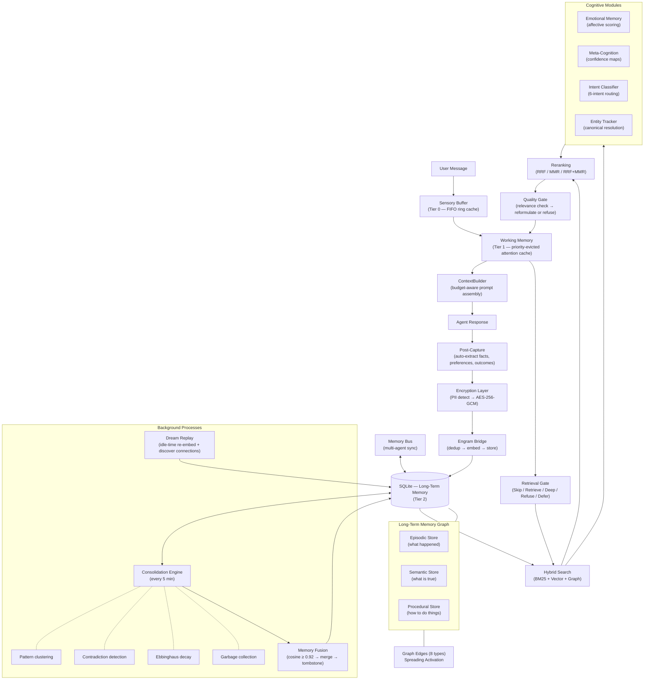
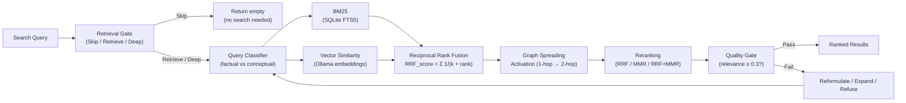
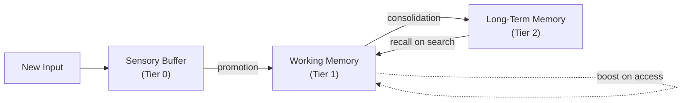
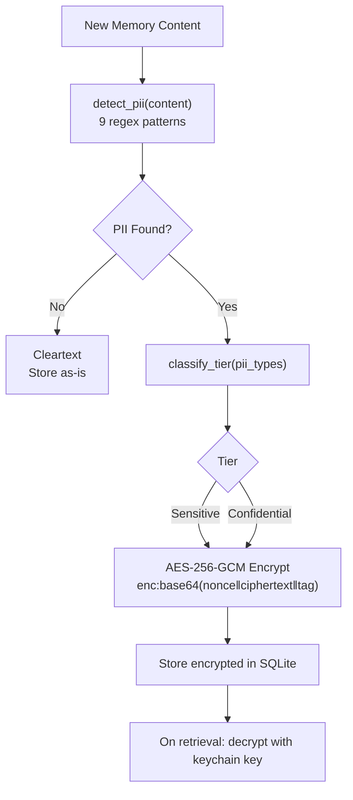
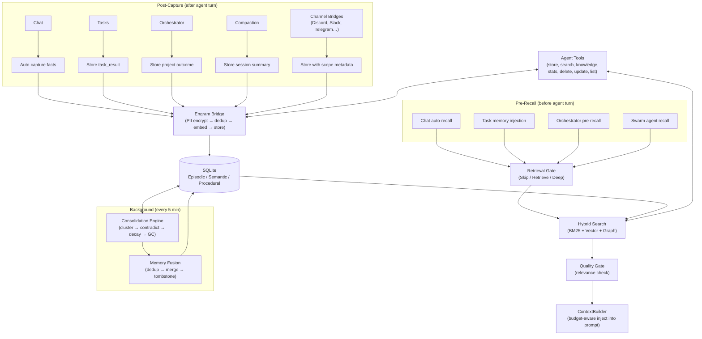

# Project Engram — Memory Architecture Whitepaper

*A biologically-inspired memory system for persistent AI agents.*

**Version:** 1.0
**Status:** Implemented in OpenPawz
**License:** MIT

---

## Abstract

Project Engram is a three-tier memory architecture for desktop AI agents. It replaces flat key-value memory stores with a biologically-inspired system modeled on how human memory works: incoming information flows through a sensory buffer, gets prioritized in working memory, and consolidates into long-term storage with automatic clustering, contradiction detection, and strength decay. The result is agents that remember context across sessions, learn from patterns, and forget gracefully.

This document describes the architecture as implemented in OpenPawz — a Tauri v2 desktop AI platform. The system is implemente a three memory tiers, a persistent graph, hybrid search with reciprocal rank fusion, background consolidation, field-level encryption, and full lifecycle integration across chat, tasks, orchestration, and multi-channel bridges.

All code is open source under the MIT License.

---

## Table of Contents

1. [Motivation](#motivation)
2. [Design Principles](#design-principles)
3. [Architecture Overview](#architecture-overview)
4. [The Three Memory Tiers](#the-three-memory-tiers)
5. [Long-Term Memory Graph](#long-term-memory-graph)
6. [Hybrid Search — BM25 + Vector Fusion](#hybrid-search)
7. [Retrieval Intelligence](#retrieval-intelligence)
8. [Caching Architecture](#caching-architecture)
9. [Consolidation Engine](#consolidation-engine)
10. [Memory Fusion](#memory-fusion)
11. [Context Window Intelligence](#context-window-intelligence)
12. [Memory Security](#memory-security)
13. [Memory Lifecycle Integration](#memory-lifecycle-integration)
14. [Concurrency Architecture](#concurrency-architecture)
15. [Observability](#observability)
16. [Category Taxonomy](#category-taxonomy)
17. [Schema Design](#schema-design)
18. [Configuration](#configuration)
19. [Frontier Capabilities](#frontier-capabilities)
20. [Quality Evaluation](#quality-evaluation)

---

## Motivation

Most AI memory implementations treat memory as a retrieval problem — store blobs, search blobs, inject blobs. This is a flat model that ignores how memory actually works in biological systems. The practical consequences are well-documented:

- **No prioritization.** All memories compete equally for context window space, regardless of relevance or importance.
- **No decay.** Outdated information persists indefinitely. A corrected fact and its outdated predecessor both appear in context.
- **No structure.** Episodic memories (what happened), semantic knowledge (what is true), and procedural memory (how to do things) are stored in one undifferentiated list.
- **No security.** Sensitive information stored in plaintext. No PII detection, no encryption, no access control.
- **No budget awareness.** Memories are injected without regard to the model's context window, leading to truncation or context overflow.
Engram addresses each of these by modeling agent memory after the structure of biological memory systems.
- **No evolution.** Memories are write-once, read-many — no consolidation, no contradiction resolution, no strengthening through repetition. The store grows linearly while quality degrades over time.
- **No gating.** Every query triggers a full memory search, even when the question is purely computational or already answered in the conversation. This wastes latency and pollutes the context with irrelevant material.

Human memory is not a database. It is a living graph with multiple storage tiers operating on different timescales, automatic consolidation that strengthens important memories and dissolves noise, episodic replay that reconstructs context, schema-based compression that abstracts patterns from instances, importance weighting that modulates storage strength, and interference-based forgetting that prevents retrieval pollution.

Engram implements all six properties.

---

## Design Principles

Five principles guide every architectural decision in Engram:

1. **Budget-first, always.** Every operation is token-budget-aware. The ContextBuilder never overflows a model's context window. Memories compete for inclusion based on relevance × importance, not insertion order. More context is not always better — attention dilution degrades answer quality, so injection counts are capped per model.

2. **Forgetting is a feature, not a bug.** Graceful decay via the Ebbinghaus curve is essential. Without measured forgetting, the memory store grows unbounded, retrieval precision degrades, and stale information pollutes context. Every forgetting cycle is measured: chain integrity percentage and NDCG delta are computed before and after garbage collection. If quality degrades, the cycle rolls back.

3. **Local-first, always offline.** All storage is local SQLite. All search is local (BM25 + optional local embeddings). No cloud dependency, no telemetry, no external vector stores. The system degrades gracefully — without an embedding model, search falls back to BM25-only with no loss in keyword accuracy.

4. **Security by default.** PII is detected automatically and encrypted before it touches disk. The database itself supports full-disk encryption. Anti-forensic measures prevent side-channel leakage through file size changes. GDPR compliance is built in.

5. **Observe everything.** Every search returns quality metrics (NDCG, latency, result count). Every consolidation cycle has measurable outcomes. Without measurement, optimization is guesswork.

---

## Architecture Overview



The system is implemented as 23 Rust modules under `src-tauri/src/engine/engram/`:

| Module | Purpose |
|--------|---------|
| `sensory_buffer.rs` | Ring buffer for current-turn incoming data |
| `working_memory.rs` | Priority-evicted slots with token budget |
| `graph.rs` | Memory graph operations (store, search, edges, activation) |
| `store.rs` / `schema.rs` | SQLite schema, migrations, CRUD operations |
| `consolidation.rs` | Background pattern detection, clustering, contradiction resolution |
| `retrieval.rs` | Retrieval cortex with quality metrics |
| `retrieval_quality.rs` | NDCG scoring and relevance warnings |
| `hybrid_search.rs` | Query classification (factual vs. conceptual) |
| `context_builder.rs` | Token-budget-aware prompt assembly |
| `tokenizer.rs` | Model-specific token counting with UTF-8 safe truncation |
| `model_caps.rs` | Per-model capability registry (context windows, features) |
| `reranking.rs` | RRF, MMR, and combined reranking strategies |
| `metadata_inference.rs` | Auto-extract tech stack, URLs, file paths from content |
| `encryption.rs` | PII detection, AES-256-GCM field encryption, GDPR purge |
| `bridge.rs` | Public API connecting tools/commands to the graph |
| `emotional_memory.rs` | Affective scoring pipeline (valence, arousal, dominance) |
| `meta_cognition.rs` | Self-assessment of knowledge confidence per domain |
| `temporal_index.rs` | Time-axis retrieval with range queries and proximity scoring |
| `intent_classifier.rs` | 6-intent query classifier for dynamic signal weighting |
| `entity_tracker.rs` | Canonical name resolution and entity lifecycle tracking |
| `abstraction.rs` | Hierarchical semantic compression tree |
| `memory_bus.rs` | Multi-agent memory sync protocol with conflict resolution |
| `dream_replay.rs` | Idle-time hippocampal-inspired replay and re-embedding |

---

## The Three Memory Tiers

### Tier 1: Sensory Buffer

A fixed-capacity ring buffer (`VecDeque`) that accumulates raw input during a single agent turn: user messages, tool results, recalled memories, and system context.

**Properties:**
- Capacity: configurable (default 20 items)
- Lifetime: single turn — drained by the ContextBuilder and discarded
- Budget-aware: `drain_within_budget(token_limit)` returns items that fit within a token budget

**Purpose:** Prevents information loss during complex turns with many tool calls. The ContextBuilder reads from the sensory buffer to build the final prompt.

### Tier 2: Working Memory

A priority-sorted array of memory slots with a hard token budget. Represents the agent's "current awareness" — what it's actively thinking about.

**Properties:**
- Capacity: configurable token budget (default 4,096 tokens)
- Eviction: lowest-priority slot evicted when budget exceeded
- Sources: recalled long-term memories, sensory buffer overflow, tool results, user mentions
- Persistence: snapshots saved to SQLite on agent switch, restored when agent resumes

**Slot structure:**
```
WorkingMemorySlot {
    memory_id: String,      // links to long-term memory (if recalled)
    content: String,
    source: Recalled | SensoryBuffer | ToolResult | Restored,
    priority: f32,          // determines eviction order
    token_cost: usize,      // pre-computed token count
    inserted_at: DateTime,
}
```

**Priority calculation:** Recalled memories use their retrieval score. Sensory buffer items use recency score. Tool results use a configurable priority (default 0.7). User mentions get high priority (0.9).

### Tier 3: Long-Term Memory Graph

Persistent storage in SQLite with three distinct memory types, connected by typed graph edges.

#### Episodic Store
*What happened* — concrete events, conversations, task results, session summaries.

Each episodic memory has:
- Tiered content (full text, summary, key facts, tags — currently only full text populated)
- Category (18-variant enum)
- Importance score (0.0–1.0)
- Strength (1.0 on creation, decays over time via Ebbinghaus curve)
- Scope (global / agent / channel / channel_user)
- Optional vector embedding for semantic search
- Access tracking (count + last accessed timestamp)
- Consolidation state (fresh → consolidated → archived)

#### Semantic Store
*What is true* — structured knowledge as subject-predicate-object triples.

Examples:
- ("User", "prefers", "dark mode")
- ("Project Alpha", "uses", "Rust + TypeScript")
- ("API rate limit", "is", "100 requests/minute")

Triples with matching subject + predicate are automatically reconsolidated: the newer value replaces the older one, with confidence scores transferred.

#### Procedural Store
*How to do things* — step-by-step procedures with success/failure tracking.

Each procedure has:
- Content (the steps)
- Trigger condition (when to apply)
- Success and failure counters
- Success rate derived from execution history

---

## Long-Term Memory Graph

Memories are not isolated rows — they form a graph connected by typed edges:

| Edge Type | Meaning |
|-----------|---------|
| `RelatedTo` | General association |
| `CausedBy` | Causal relationship |
| `Supports` | Evidence supporting a claim |
| `Contradicts` | Conflicting information |
| `PartOf` | Component relationship |
| `FollowedBy` | Temporal sequence |
| `DerivedFrom` | Source derivation |
| `SimilarTo` | Semantic similarity |

### Spreading Activation

When memories are retrieved by search, the graph is traversed to find associated memories. Adjacent nodes receive an activation boost proportional to their edge weight, biased by edge type. This implements a simplified version of spreading activation from cognitive science.

Currently 1-hop traversal: direct neighbors of retrieved memories are boosted. The activation score is blended with the original retrieval score to produce the final ranking.

---

## Hybrid Search

Engram uses three search signals, fused with reciprocal rank fusion (RRF):



### 1. BM25 Full-Text Search (SQLite FTS5)

SQLite's FTS5 extension with `porter unicode61` tokenizer. Handles exact keyword matches, stemming, and phrase queries. All FTS5 query operators are sanitized before execution to prevent injection.

### 2. Vector Similarity Search

When Ollama is available with an embedding model (e.g., `nomic-embed-text`), memories are embedded at storage time. Search queries are embedded at query time. Cosine similarity between query and memory embeddings produces a relevance score.

Embedding generation is optional — if no embedding model is configured, the system falls back to BM25-only search with no degradation in keyword accuracy.

### 3. Graph Spreading Activation

After BM25 and vector results are collected, the memory graph is traversed to find related memories via typed edges. Associated memories receive a score boost.

### Fusion Strategy

Results from all three signals are merged using **Reciprocal Rank Fusion (RRF)**:

```
RRF_score(d) = Σᵢ 1 / (k + rankᵢ(d))
```

Where *k* = 60 (standard constant) and *rankᵢ(d)* is the rank of document *d* in signal *i*. This produces a unified ranking that benefits from all three signals without requiring score normalization.

### Reranking

After fusion, results are optionally reranked using one of four strategies:

| Strategy | Method | Use Case |
|----------|--------|----------|
| RRF | Reciprocal rank fusion only | Default, fast |
| MMR | Maximal marginal relevance (λ=0.7) | Diversity-focused |
| RRF+MMR | RRF followed by MMR | Best quality |
| CrossEncoder | Model-based reranking (falls back to RRF+MMR) | Future |

### Query Classification

The `hybrid_search.rs` module analyzes queries to determine the optimal search strategy:
- **Factual queries** (who, what, when, specific entities) → weight BM25 higher
- **Conceptual queries** (how, why, explain, abstract topics) → weight vector similarity higher
- Signal weights are adjusted dynamically per query

---

## Retrieval Intelligence

Search is only half the problem. The other half is deciding *whether* to search, and *what to do* when results are weak. Engram implements a two-stage retrieval intelligence pipeline inspired by Self-RAG and CRAG research.

### Retrieval Gate

Before any search executes, the `RetrievalGate` classifies the inbound query and decides the retrieval strategy. This adds <1ms of latency but eliminates unnecessary search cycles and prevents context pollution from irrelevant memory injection.

Five retrieval modes:

| Mode | Trigger | Behavior |
|------|---------|----------|
| **Skip** | Computational queries, greetings, topic already in working memory | No search. The model answers from its own knowledge or the existing conversation. |
| **Retrieve** | Standard factual or procedural queries | Normal hybrid search pipeline (BM25 + vector + graph). |
| **DeepRetrieve** | Exploratory or temporal queries ("tell me everything about…") | Extended search with higher result limits, 2-hop graph activation, and broader scope. |
| **Refuse** | Post-retrieval: top result relevance below threshold | Graceful refusal — "I don't have information on that" rather than fabricating from weak matches. |
| **Defer** | Ambiguous references needing clarification | Ask the user for disambiguation before searching. |

The gate is rule-based by default, evaluating query structure, intent classification, and working memory coverage. This avoids the latency and unreliability of an LLM-based gating decision.

### Post-Retrieval Quality Check

After search returns results, the `QualityGate` evaluates whether the results are actually useful:

1. **Relevance check** — If the top result scores below 0.3, the query is reformulated (broader terms, synonym expansion) and retried once.
2. **Coverage check** — For exploratory queries, if result count is below threshold, graph expansion is triggered to pull in associated memories.
3. **Decomposition** — If a complex query fails as a whole, it is decomposed into sub-queries that are searched independently and results merged.
4. **Graceful refusal** — If reformulation and expansion both fail, the system refuses rather than injecting low-quality memories.

This two-stage pipeline means Engram retrieves when it should, skips when it shouldn't, and corrects when results are weak — rather than blindly injecting whatever the search returns.

---

## Caching Architecture

Engram's three-tier design is itself a caching hierarchy. Each tier operates as a bounded cache with a distinct eviction policy, TTL, and access pattern — mirroring the cache hierarchy in both CPU architecture and biological cognition.

### The Biological Cache Model

The Atkinson-Shiffrin model of human memory describes three stores with decreasing access speed and increasing capacity. Engram's tiers map directly:

| Tier | Engram Module | Biological Analog | Cache Role | Eviction Policy |
|------|---------------|-------------------|------------|-----------------|
| Tier 0 | `SensoryBuffer` | Iconic / echoic memory | **Perceptual cache** — raw stimuli before attentional filtering | FIFO ring; oldest entry evicted on overflow |
| Tier 1 | `WorkingMemory` | Baddeley's central executive | **Attention cache** — what the agent is actively thinking about | Priority-based; lowest-priority slot evicted when token budget exceeded |
| Tier 2 | LTM Graph + SQLite | Hippocampal long-term store | **Persistent store** — everything known, accessed via retrieval | Ebbinghaus strength decay → GC below threshold |

This is not a loose analogy. The eviction cascade is functionally identical to memory trace transfer in cognitive psychology: sensory traces that receive attention are promoted to working memory; working memory items that are rehearsed are consolidated to long-term storage. Items that fail to be promoted are lost — the system forgets gracefully.

### Tier 0: Sensory Cache

The `SensoryBuffer` is a bounded `VecDeque` ring buffer with explicit cache semantics:

- **Capacity-bounded:** configurable max entries (default 20)
- **FIFO eviction:** when full, `push()` evicts the oldest entry and returns it for promotion to working memory
- **Token-aware:** tracks cumulative token count; `drain_within_budget()` returns items that fit within a given token limit
- **Volatile:** contents are discarded after each agent turn

The returned evicted entry is the promotion signal — it tells the caller "this item was pushed out of sensory attention; decide whether it deserves a working memory slot." This mirrors the attentional gate in human perception.

### Tier 1: Attention Cache

`WorkingMemory` implements a priority-managed cache with LRU-like refresh semantics:

- **Token-budget-bounded:** total slot tokens cannot exceed the configured budget (default 4,096)
- **Priority eviction:** `evict_lowest()` removes the slot with the lowest priority score — items that haven't been referenced decay naturally
- **Priority decay:** `decay_priorities(0.95)` is called each turn, multiplicatively reducing all slot priorities. Unreferenced items age out over ~20 turns
- **Priority boost:** `boost_priority(id, delta)` refreshes recently-accessed items, equivalent to an LRU "touch" operation
- **Snapshot persistence:** on agent switch, the entire working memory is serialized to SQLite and restored when the agent resumes — cache state survives context switches

### Momentum Cache

Working memory maintains a sliding window of recent query embeddings (`momentum_embeddings: Vec<Vec<f32>>`, capped at 5). This trajectory cache serves two purposes:

1. **Priming** — biases retrieval toward the current conversation direction, exactly as semantic priming works in human cognition
2. **Anticipation** — the momentum vector (centroid of recent embeddings) predicts where the conversation is heading, enabling pre-fetch of likely-needed memories before the user asks

### Publication Buffer

The `MemoryBus` maintains a bounded FIFO publication queue with TTL-based eviction:

- **TTL expiry:** publications older than `PUBLICATION_TTL_SECS` are discarded on each insertion
- **Capacity cap:** when `MAX_PENDING_PUBLICATIONS` is reached, the oldest publication is evicted
- **Subscriber fan-out:** pending publications are delivered to registered subscribers upon drain, then removed

This ensures the event-driven memory pipeline never accumulates unbounded backlog, even if consumers stall.

### Cache Coherence

The three tiers maintain coherence through directional data flow:



There is no cache invalidation problem because the tiers are write-forward: data flows from fast/volatile to slow/persistent. Long-term memory never writes back to the sensory buffer. When a long-term memory is recalled via search, it enters working memory as a *new slot* with source `Recalled` — it does not attempt to synchronize with any existing tier-0 entry.

This unidirectional flow eliminates the coherence complexity that plagues traditional multi-level caches.

---

## Consolidation Engine

A background process runs every 5 minutes (configurable) performing four operations:

### 1. Pattern Clustering

Memories with cosine similarity ≥ 0.75 are grouped using union-find clustering. Clusters of related memories are identified for potential fusion. This prevents memory bloat from repeated similar observations.

### 2. Contradiction Detection

When two memories share the same subject and predicate but have different objects, a contradiction is detected. Resolution: the newer memory wins, the older memory's confidence is transferred proportionally, and a `Contradicts` graph edge is created.

### 3. Ebbinghaus Strength Decay

Memory strength decays following a simplified Ebbinghaus forgetting curve:

```
strength(t) = S₀ × e^(−λt)
```

Where *S₀* is initial strength (1.0), *λ* is the decay rate, and *t* is time since creation. Important memories (importance > 0.7) decay slower. Accessed memories get strength boosts.

### 4. Garbage Collection

Memories with strength below a threshold (default 0.1) are candidates for deletion. Important memories (importance ≥ 0.7) are protected from GC regardless of strength. Deletion is two-phase: content fields are zeroed before the row is deleted (anti-forensic measure).

After GC, the SQLite database is re-padded to 512KB bucket boundaries to prevent file-size side-channel leakage.

### Gap Detection

The consolidation engine also detects three types of knowledge gaps:
- **Missing context** — references to entities that have no associated memories
- **Temporal gaps** — periods with no memory activity for an active agent
- **Category imbalance** — agents with memory heavily concentrated in one category

Gaps are logged for diagnostic purposes.

---

## Memory Fusion

Consolidation handles clustering and contradiction detection, but it does not address **near-duplicate memories** — entries that express the same information in slightly different words. Over months of use, these duplicates accumulate linearly: "User prefers dark mode", "User prefers dark mode in editors", "User uses dark mode" all occupy separate storage, search bandwidth, and context tokens.

Memory fusion addresses this directly, inspired by FadeMem's fusion mechanism.

### Fusion Pipeline

During each consolidation cycle, the fusion engine:

1. **Candidate detection** — Identify memory pairs with cosine similarity ≥ 0.92 and compatible scopes (same agent, same scope tier).
2. **Merge** — Create a single strengthened entry with the union of propositions from both sources, the maximum of their strength values, and a provenance chain linking back to the originals.
3. **Edge redirection** — All graph edges pointing to the original entries are redirected to the merged entry, preserving graph connectivity.
4. **Tombstoning** — Original entries are marked as tombstones rather than deleted immediately. This allows recovery if a merge was too aggressive and maintains audit trail integrity.

### Quality Measurement

Every fusion cycle is measured:

- **Chain integrity percentage** — Multi-hop graph traversals that succeed before and after fusion. A fusion that breaks a retrieval chain is detected.
- **NDCG delta** — Normalized discounted cumulative gain is computed on a fixed query set before and after fusion. If NDCG drops by more than 5%, the fusion cycle is rolled back.
- **Storage reduction** — Bytes freed and entries removed are tracked per cycle.

The threshold (0.92 cosine) is tunable. Higher values produce more conservative merging. Lower values risk merging memories that carry distinct nuance.

---

## Context Window Intelligence

### ContextBuilder

The ContextBuilder is a fluent API for assembling the final prompt within a token budget:

```rust
let prompt = ContextBuilder::new(model_caps)
    .system_prompt(&base_prompt)
    .recall_from(&store, &query, agent_id, &embedding_client).await
    .working_memory(&wm)
    .sensory_buffer(&buffer)
    .messages(&conversation)
    .build();
```

**Budget allocation strategy:**
1. System prompt gets first priority (always included)
2. Recalled memories packed by importance × relevance score
3. Working memory slots packed by priority
4. Sensory buffer items packed by recency
5. Conversation messages packed newest-first until budget exhausted

### Model Capability Registry

Every supported model has a capability fingerprint:
- Context window size
- Maximum output tokens
- Tool/function calling support
- Vision support
- Extended thinking support
- Streaming support
- Tokenizer type

The registry covers all models from OpenAI, Anthropic, Google, DeepSeek, Mistral, xAI, Ollama, and OpenRouter. Unknown models fall back to conservative defaults (32K context, 4K output).

### Tokenizer

Model-specific token estimation:
- `Cl100kBase` — GPT-4, Claude (÷3.4 bytes)
- `O200kBase` — o1, o3, o4 (÷3.8 bytes)
- `Gemini` — Gemini models (÷3.3 bytes)
- `SentencePiece` — Llama, Mistral, local models (÷3.0 bytes)
- `Heuristic` — Fallback (÷4.0 bytes)

All calculations use `ceil()` to round up and are UTF-8 safe (truncation never splits a multi-byte character).

---

## Memory Security

### Field-Level Encryption

Memories containing PII are encrypted with AES-256-GCM before storage. The encryption key is stored in the OS keychain under a dedicated entry (`paw-memory-vault`), separate from the credential vault key.

**Automatic PII detection** uses 9 compiled regex patterns to identify sensitive content:
- SSN, credit card, phone numbers
- Email addresses, physical addresses
- Person names, geographic locations
- Credentials (passwords, API keys)
- Government IDs

**Encryption flow:**



### Query Sanitization

FTS5 operators are stripped from user queries before they reach SQLite. This prevents FTS5 injection attacks that could extract data via crafted queries.

### Prompt Injection Scanning

Every recalled memory is scanned against 10 injection patterns before being returned to the agent. Matches are logged and flagged but not suppressed — the agent receives the content with a warning annotation.

### Anti-Forensic Measures

- **Two-phase secure deletion** — Content zeroed before row deletion
- **Vault-size quantization** — Database padded to 512KB buckets
- **8KB pages** — Reduces file-size granularity
- **Incremental auto-vacuum** — Prevents immediate file shrinkage after deletions
- **PRAGMA secure_delete = ON** — SQLite zeros freed pages

### GDPR Compliance

`engram_purge_user(identifiers)` securely erases all memories matching a list of user identifiers across all tables, including snapshots and audit logs. Implements Article 17 (right to be forgotten).

---

## Memory Lifecycle Integration

Engram is wired into every major execution path:



### Chat

When `auto_recall` is enabled for an agent, the ContextBuilder performs a hybrid search and injects relevant memories into the system prompt before each agent turn. Agent responses can trigger auto-capture of facts, preferences, and observations.

### Tasks

Before a task agent runs, the top 10 relevant memories are searched and injected as a "Relevant Memories" system prompt section. After the agent completes, the task result is stored in episodic memory via the Engram bridge with category `task_result`.

### Orchestrator

The boss agent in multi-agent orchestration receives pre-recalled memories relevant to the project goal. After the orchestration completes, the project outcome is captured in episodic memory.

### Session Compaction

When a conversation is compacted (summarized to free context space), the compaction summary is stored in Engram episodic memory with category `session`. This ensures knowledge survives compaction.

### Channel Bridges

Messages from Discord, Slack, Telegram, and other channels are stored with channel and user scope metadata. This enables per-channel memory isolation — a user's Discord memories don't bleed into their Telegram conversations.

### Agent Tools

Agents have direct access to memory through 7 tools:

| Tool | Purpose |
|------|---------|
| `memory_store` | Store a memory with category and importance |
| `memory_search` | Hybrid search across all memory types |
| `memory_knowledge` | Store structured SPO triples |
| `memory_stats` | Get memory system statistics |
| `memory_delete` | Delete a specific memory |
| `memory_update` | Update memory content |
| `memory_list` | Browse memories by category |

---

## Concurrency Architecture

A desktop AI platform serves multiple concurrent consumers: the chat UI, background tasks, orchestration pipelines, 11+ channel bridges, and the consolidation engine — all reading and writing memory simultaneously. The concurrency model must handle this without blocking the Tokio runtime or causing SQLite write contention.

### Read Pool + Write Channel

Engram separates reads from writes using a two-path architecture:

- **Read path** — An r2d2 connection pool with 8 SQLite connections operating in WAL (Write-Ahead Logging) mode. All search queries, graph traversals, and stat reads execute on the pool concurrently. WAL mode allows readers to proceed without blocking on writers.
- **Write path** — A dedicated writer task receives all mutations through a `tokio::mpsc` channel. The writer serializes all inserts, updates, deletions, and consolidation writes through a single connection, eliminating SQLite write contention entirely.

```
Read requests ──→ r2d2 pool [8 WAL connections] ──→ result
Write requests ──→ mpsc channel ──→ dedicated writer task ──→ SQLite
```

The `mpsc::send()` + `oneshot::recv()` pattern is fully async-safe — no synchronous mutexes appear in async code, which prevents Tokio thread starvation under load.

### Storage Backend Trait

All storage access is mediated through the `MemoryBackend` trait, which abstracts the underlying database:

```rust
#[async_trait]
pub trait MemoryBackend: Send + Sync {
    async fn store_episodic(&self, memory: &EpisodicMemory) -> EngineResult<String>;
    async fn search_episodic_bm25(&self, query: &str, scope: &MemoryScope, limit: usize) -> EngineResult<Vec<(String, f64)>>;
    async fn search_episodic_vector(&self, embedding: &[f32], scope: &MemoryScope, limit: usize) -> EngineResult<Vec<(String, f64)>>;
    async fn add_edge(&self, edge: &MemoryEdge) -> EngineResult<()>;
    async fn get_neighbors(&self, memory_id: &str, min_weight: f64) -> EngineResult<Vec<(String, f64)>>;
    async fn apply_decay(&self, half_life_days: f64) -> EngineResult<usize>;
    async fn garbage_collect(&self, threshold: f64) -> EngineResult<usize>;
    // ... additional operations for semantic, procedural, graph, and lifecycle
}
```

This trait enables `MockMemoryStore` for test isolation, future backend swaps (RocksDB, PostgreSQL), and clean dependency injection across all modules.

### Vector Index Strategy

Vector similarity search uses a tiered indexing strategy:

| Memory Count | Index | Latency | RAM |
|-------------|-------|---------|-----|
| < 1,000 | Brute-force cosine scan | < 5ms | Negligible |
| 1,000 – 100,000 | HNSW (in-memory, pure Rust) | < 5ms | ~3KB/vector |
| > 100,000 | HNSW with disk-backed fallback | < 25ms | Bounded |

Both implementations sit behind a `VectorIndex` trait. The index warms from the database on startup and receives new embeddings on the write path. If no embedding model is available, vector search is disabled entirely and the system falls back to BM25-only with no loss in keyword accuracy.

---

## Observability

A memory system without measurement is a memory system without improvement. Engram instruments every operation to make debugging, optimization, and quality evaluation possible.

### Tracing

All public functions are instrumented with `tracing::instrument` spans organized in a hierarchy:

- `engram.search` — Covers the full search pipeline: gate decision, BM25, vector, graph activation, reranking, quality check
- `engram.store` — Covers PII detection, encryption, embedding generation, deduplication, and database write
- `engram.consolidate` — Covers pattern clustering, contradiction detection, fusion, decay, and garbage collection
- `engram.context` — Covers the ContextBuilder prompt assembly pass

Span metadata includes agent ID, query text (redacted if PII), result count, latency, and quality scores. These spans integrate with any `tracing::Subscriber` — local log files, structured JSON, or external collectors.

### Metrics

The `metrics` crate provides three categories of runtime instrumentation:

| Type | Metric | Purpose |
|------|--------|---------|
| Counter | `engram.search_count` | Total searches executed |
| Counter | `engram.store_count` | Total memories stored |
| Counter | `engram.gc_count` | Garbage collection cycles |
| Counter | `engram.gate_skip_count` | Retrieval gate skips (queries that didn't need memory) |
| Gauge | `engram.memory_count` | Current total memory count |
| Gauge | `engram.hnsw_size` | Current HNSW index size |
| Gauge | `engram.pool_active` | Active read pool connections |
| Histogram | `engram.search_latency_ms` | Search latency distribution |
| Histogram | `engram.store_latency_ms` | Store latency distribution |
| Histogram | `engram.consolidation_ms` | Consolidation cycle duration |

### Cognitive Debug Events

For real-time debugging, Engram emits Tauri events that the frontend debug panel can display:

- `engram:search` — Query, gate decision, result count, top scores, latency
- `engram:store` — Memory ID, category, importance, PII detected, encrypted fields
- `engram:quality` — NDCG score, relevance warnings, chain integrity

These events enable developers and users to observe the memory system's decision-making in real time without parsing log files.

---

## Category Taxonomy

18 categories, unified across Rust backend, agent tools, and frontend UI:

| Category | Description | Typical Source |
|----------|-------------|----------------|
| `general` | Uncategorized information | Fallback |
| `preference` | User preferences and settings | Agent observation |
| `fact` | Verified factual information | Agent or user |
| `skill` | Capability-related knowledge | Skill execution |
| `context` | Situational context | Auto-capture |
| `instruction` | User-provided directives | Explicit instruction |
| `correction` | Corrected information (supersedes prior) | User correction |
| `feedback` | Quality feedback on agent behavior | User feedback |
| `project` | Project-specific knowledge | Task/orchestrator |
| `person` | Information about people | Agent observation |
| `technical` | Technical details (APIs, configs, specs) | Agent or tools |
| `session` | Session summaries from compaction | Compaction engine |
| `task_result` | Outcomes of completed tasks | Task post-capture |
| `summary` | Condensed summaries | Consolidation |
| `conversation` | Conversational context | Auto-capture |
| `insight` | Derived observations and patterns | Agent reasoning |
| `error_log` | Error information for debugging | Error handlers |
| `procedure` | Step-by-step procedures | Procedural store |

Unknown categories gracefully fall back to `general` via the `FromStr` implementation.

---

## Schema Design

Six SQLite tables with FTS5 virtual tables and 13 indices:

```sql
-- Episodic memories (what happened)
episodic_memories (
    id, content, content_summary, content_key_facts, content_tags,
    outcome, category, importance, agent_id, session_id, source,
    consolidation_state, strength, trust_accuracy, trust_source_reliability,
    trust_consistency, trust_recency, trust_composite,
    scope_global, scope_project_id, scope_squad_id, scope_agent_id,
    scope_channel, scope_channel_user_id,
    embedding, embedding_model, negative_contexts,
    created_at, last_accessed_at, access_count
)

-- Semantic knowledge (SPO triples)
semantic_memories (
    id, subject, predicate, object, category, confidence,
    agent_id, source, embedding, embedding_model,
    created_at, updated_at
)

-- Procedural memory (how-to)
procedural_memories (
    id, content, trigger_condition, category,
    agent_id, source, success_count, failure_count,
    embedding, embedding_model, created_at, updated_at
)

-- Graph edges connecting memories
memory_graph_edges (
    id, source_id, source_type, target_id, target_type,
    edge_type, weight, metadata, created_at
)

-- Working memory snapshots for agent switching
working_memory_snapshots (
    agent_id, snapshot_json, saved_at
)

-- Audit trail
memory_audit_log (
    id, action, memory_type, memory_id, agent_id,
    details, created_at
)
```

FTS5 virtual tables are created for `episodic_memories` and `semantic_memories` to enable full-text search. Triggers keep FTS tables synchronized.

---

## Configuration

The `EngramConfig` struct provides 30+ tunable parameters:

| Parameter | Default | Description |
|-----------|---------|-------------|
| `sensory_buffer_capacity` | 20 | Max items in sensory buffer |
| `working_memory_budget` | 4096 | Token budget for working memory |
| `consolidation_interval_secs` | 300 | Background consolidation cycle |
| `decay_rate` | 0.05 | Ebbinghaus decay lambda |
| `gc_strength_threshold` | 0.1 | Minimum strength to survive GC |
| `gc_importance_protection` | 0.7 | Importance above this is GC-immune |
| `search_limit` | 10 | Default search result count |
| `min_relevance_threshold` | 0.2 | Minimum score for search results |
| `clustering_similarity_threshold` | 0.75 | Cosine similarity for clustering |
| `auto_recall_enabled` | true | Pre-recall before agent turns |
| `auto_capture_enabled` | true | Post-capture after agent turns |

---

## Frontier Capabilities

Eight modules extend the core architecture with cognitive capabilities drawn from neuroscience and memory research. Each module integrates into the existing pipeline through formal interface contracts — they share data through defined trait boundaries rather than ad-hoc coupling.

- **Emotional memory dimension** — The `emotional_memory.rs` module implements an affective scoring pipeline measuring valence, arousal, dominance, and surprise for each memory. Emotionally significant memories decay at 60% of the normal rate, receive consolidation priority boosts, and get retrieval score amplification. This models the well-documented effect that emotionally charged experiences are retained more strongly in biological memory.

- **Reflective meta-cognition** — The `meta_cognition.rs` module performs periodic self-assessment of knowledge confidence per domain, generating "I know / I don't know" maps across the agent's memory space. These maps guide anticipatory pre-loading — if the agent knows its knowledge of a topic is sparse, it can signal this to the user rather than hallucinating from weak memories.

- **Temporal-axis retrieval** — The `temporal_index.rs` module treats time as a first-class retrieval signal. A B-tree temporal index supports range queries ("what happened last week?"), proximity scoring (memories closer in time to the query context rank higher), and pattern detection (recurring events, periodic activity). This resolves temporal queries natively rather than forcing them through keyword or vector search.

- **Intent-aware retrieval weighting** — The `intent_classifier.rs` module implements a 6-intent classifier (informational, procedural, comparative, debugging, exploratory, confirmatory) that dynamically weights all retrieval signals per query type. A debugging query boosts error logs and technical memories. An exploratory query triggers broader graph activation. The intent signal feeds into the retrieval gate and the reranking pipeline.

- **HNSW vector index** — O(log n) approximate nearest neighbor search using `sqlite-vec` or a custom implementation
- **Proposition-level storage** — LLM-based decomposition of complex statements into atomic, independently retrievable facts
- **Smart history compression** — Three-tier message storage (verbatim → compressed → summary) with automatic tiering based on age
- **Topic-change detection** — Cosine divergence between consecutive messages to trigger working memory eviction
- **Momentum vectors** — Use trajectory of recent queries to bias search toward conversational direction
- **Pluggable vector backends** — Trait-based abstraction allowing HNSW, product quantization, or external vector stores
- **Process memory hardening** — `mlock` to prevent swapping, core dump prevention, `zeroize` Drop implementations on all memory structs
- **SQLCipher integration** — Full database encryption at rest

- **Entity lifecycle tracking** — The `entity_tracker.rs` module maintains canonical entity profiles with name resolution (aliases, abbreviations, misspellings all resolve to the same entity), evolving entity state, entity-centric queries ("what do I know about Project X?"), and relationship emergence detection across all memory types.

- **Hierarchical semantic compression** — The `abstraction.rs` module builds a multi-level abstraction tree: individual memories → clusters → super-clusters → domain summaries. This enables navigation of knowledge at any zoom level — from a single data point up to a high-level summary of an entire domain. The compression tree is rebuilt incrementally during consolidation.

- **Multi-agent memory sync** — The `memory_bus.rs` module implements a CRDT-inspired protocol for peer-to-peer knowledge sharing between agents. Vector-clock conflict resolution ensures convergence when multiple agents modify related memories concurrently. Agents can share discoveries, coordinate on projects, and maintain consistent world models without a central coordinator.

- **Memory replay and dream consolidation** — The `dream_replay.rs` module runs during idle periods, implementing hippocampal-inspired memory replay. During replay, memories are reactivated, latent connections between temporally distant memories are discovered, and embeddings are regenerated with evolved context. This mirrors the role of sleep in biological memory consolidation — strengthening important memories and discovering patterns that weren't obvious during waking activity.

These eight modules are connected through 13 integration contracts ensuring they operate as a synergistic network. For example, emotional scoring feeds into the retrieval gate's relevance calculation; intent classification adjusts the reranking strategy; entity tracking informs memory fusion's scope compatibility check; and the abstraction tree provides input to community-level summaries.

---

## Quality Evaluation

Engram's quality evaluation framework ensures that every subsystem is measurable and regressions are caught automatically.

### Retrieval Quality

Every search returns quality metadata alongside results:

- **NDCG (Normalized Discounted Cumulative Gain)** — Measures ranking quality against relevance judgments. Computed per-query and tracked over time.
- **Precision@k** — What fraction of the top-k returned memories are actually relevant to the query.
- **Latency** — End-to-end search time including gate decision, BM25, vector, graph activation, and reranking. Target: <10ms at 10K memories.

### Faithfulness Evaluation

Memory injection quality is evaluated along three dimensions:

1. **Faithfulness** — Are the injected memories factually consistent with the stored content? Claim decomposition verifies that the agent's response doesn't misrepresent memories.
2. **Context relevancy** — What percentage of injected memories are actually relevant to the query? Irrelevant injections waste context budget and risk attention dilution.
3. **Answer relevancy** — Does the agent's response actually address the user's query, given the injected memories?

### Unanswerability Detection

Not every query has an answer in memory. The `UnanswerabilityDetector` evaluates whether the system should refuse rather than fabricate:

- Intent-aware thresholds: factual queries require higher confidence (0.5) than exploratory queries (0.25)
- Procedural queries use an intermediate threshold (0.4) — partial procedures are worse than no procedure
- Detection feeds back into the retrieval gate's Refuse mode

### Forgetting Regression

Every consolidation cycle (decay + garbage collection + fusion) is evaluated for quality impact:

- Pre/post NDCG comparison on a fixed query set
- Chain integrity — multi-hop graph traversals that succeed before and after the cycle
- Automatic rollback if NDCG degrades by more than 5%

This prevents the system from forgetting useful information in pursuit of storage efficiency.

### Benchmark Harness

A Criterion benchmark suite measures core operations at scale:

| Benchmark | Target (10K memories) | Target (100K memories) |
|-----------|----------------------|------------------------|
| Hybrid search | < 10ms | < 25ms |
| Memory store | < 5ms | < 5ms |
| Consolidation cycle | < 500ms | < 2s |
| Context assembly | < 10ms | < 10ms |

These benchmarks run in CI. Performance regressions beyond defined thresholds block merges.

---

## References

- Ebbinghaus, H. (1885). *Memory: A Contribution to Experimental Psychology.*
- Anderson, J. R. (1983). *A Spreading Activation Theory of Memory.* Journal of Verbal Learning and Verbal Behavior, 22(3), 261-295.
- Tulving, E. (1972). *Episodic and Semantic Memory.* In Organization of Memory. Academic Press.
- Miller, G. A. (1956). *The Magical Number Seven, Plus or Minus Two.* Psychological Review, 63(2), 81-97.
- Bartlett, F. C. (1932). *Remembering: A Study in Experimental and Social Psychology.* Cambridge University Press.
- Nader, K., Schafe, G. E., & LeDoux, J. E. (2000). *Fear Memories Require Protein Synthesis in the Amygdala for Reconsolidation After Retrieval.* Nature, 406, 722-726.
- Robertson, S. E., & Zaragoza, H. (2009). *The Probabilistic Relevance Framework: BM25 and Beyond.* Foundations and Trends in Information Retrieval, 3(4), 333-389.
- Carbonell, J., & Goldstein, J. (1998). *The Use of MMR, Diversity-Based Reranking for Reordering Documents and Producing Summaries.* SIGIR '98.
- Cormack, G. V., Clarke, C. L. A., & Buettcher, S. (2009). *Reciprocal Rank Fusion Outperforms Condorcet and Individual Rank Learning Methods.* SIGIR '09.
- Malkov, Y. A., & Yashunin, D. A. (2018). *Efficient and Robust Approximate Nearest Neighbor Using Hierarchical Navigable Small World Graphs.* IEEE TPAMI.
- Cahill, L., & McGaugh, J. L. (1995). *A Novel Demonstration of Enhanced Memory Associated with Emotional Arousal.* Consciousness and Cognition, 4(4), 410-421.
- Flavell, J. H. (1979). *Metacognition and Cognitive Monitoring.* American Psychologist, 34(10), 906-911.
- Wilson, M. A., & McNaughton, B. L. (1994). *Reactivation of Hippocampal Ensemble Memories During Sleep.* Science, 265(5172), 676-679.
- Diekelmann, S., & Born, J. (2010). *The Memory Function of Sleep.* Nature Reviews Neuroscience, 11(2), 114-126.
- Shapiro, M. et al. (2011). *Conflict-Free Replicated Data Types.* SSS 2011.
- Getoor, L., & Machanavajjhala, A. (2012). *Entity Resolution: Theory, Practice & Open Challenges.* VLDB Tutorial.
- Park, J. S., et al. (2023). *Generative Agents: Interactive Simulacra of Human Behavior.* UIST '23.
- Wang, G., et al. (2023). *Voyager: An Open-Ended Embodied Agent with Large Language Models.* NeurIPS 2023.
- Shinn, N., et al. (2023). *Reflexion: Language Agents with Verbal Reinforcement Learning.* NeurIPS 2023.
- Asai, A., et al. (2024). *Self-RAG: Learning to Retrieve, Generate, and Critique Through Self-Reflection.* ICLR 2024.
- Yan, S., et al. (2024). *Corrective Retrieval Augmented Generation (CRAG).* ICLR 2024.
- Edge, D., et al. (2024). *From Local to Global: A Graph RAG Approach to Query-Focused Summarization.* Microsoft Research.
- Es, S., et al. (2024). *RAGAs: Automated Evaluation of Retrieval Augmented Generation.* EACL 2024.
- Chen, J., et al. (2023). *Dense X Retrieval: What Retrieval Granularity Should We Use?* ACL 2024.

---

*Project Engram is part of OpenPawz, an open-source AI platform licensed under MIT. Contributions welcome.*
