<div align="center">


<br>

**Your AI, your rules.**

A native desktop AI platform that runs fully offline, connects to any provider, and puts you in control.

[](https://github.com/OpenPawz/openpawz/actions/workflows/ci.yml)
[](LICENSE)
[](https://discord.gg/wVvmgrMV)
[](https://x.com/openpawzai)
[](https://www.instagram.com/openpawz)

*Private by default. Powerful by design. Extensible by nature.*

</div>

---

## Screenshots

<div align="center">

**OpenPawz in Action**

https://github.com/user-attachments/assets/9bee2c08-ca86-4483-89a1-3eae847054b4

<br>

**Integration Hub** — 25,000+ services via MCP Bridge, with category filters, connection health, and quick setup


<br>

**Fleet Command** — Manage agents, deploy templates, and monitor fleet activity


<br>

**Chat** — Session metrics, active jobs, quick actions, and automations


</div>

---

## Why OpenPawz?

OpenPawz is a native Tauri v2 application with a pure Rust backend engine. It runs fully offline with Ollama, connects to any OpenAI-compatible provider, and gives you complete control over your AI agents, data, and tools.

- **Private** — No cloud, no telemetry, no open ports. Credentials encrypted with AES-256-GCM in your OS keychain.
- **Powerful** — Multi-agent orchestration, 11 channel bridges, hybrid memory, DeFi trading, browser automation, research workflows.
- **Extensible** — 25,000+ integrations via embedded MCP bridge to n8n's community node ecosystem, unlimited providers, community skills via PawzHub, local Ollama workers, modular architecture.
- **Tiny** — ~5 MB native binary. Not a 200 MB Electron wrapper.

---

## The Integration Inversion

Every other automation platform locks integrations inside workflows. You must build a workflow before any tool is usable. OpenPawz inverts this — every integration is **simultaneously** a direct agent tool and a visual workflow node.

| | Zapier / Make / n8n (standalone) | OpenPawz |
|---|---|---|
| **Tool availability** | Locked inside workflows | Available directly in chat AND in workflows |
| **To use a tool** | Build trigger → action chain first | Just ask your agent |
| **AI's role** | One node inside the pipeline | The pipeline lives inside the agent |
| **Install a new package** | Workflow node only | Instant chat tool + workflow node |
| **25,000+ community nodes** | Manual sequential automation | AI-orchestrable via MCP bridge |

```
Install "@n8n/n8n-nodes-slack":

  n8n standalone:  available as a workflow node → must build a workflow to use it
  OpenPawz:        auto-deploys a workflow + indexes it for agent discovery
                   → "Hey Pawz, send hello to #general" — done
```

**How it works:** OpenPawz embeds n8n as an MCP server. n8n's MCP exposes three workflow-level tools: `search_workflows`, `execute_workflow`, and `get_workflow_details`. When you install a community package, Paw auto-deploys a per-service workflow (e.g. "OpenPawz MCP — Slack") that encapsulates the integration logic. The agent discovers workflows via semantic search and executes them via `execute_workflow` — all through the MCP bridge.

**The insight:** n8n's 25,000 community nodes were designed for manual automation. OpenPawz makes them AI-native — Paw auto-deploys workflows that compose n8n nodes with credential binding, error handling, and retries. The agent decides which workflow to execute based on your intent, and only needs the visual Flow Builder when you want multi-step orchestration with branching, loops, or scheduling.

---

## Original Research

OpenPawz introduces three novel methods for scaling AI agent tool usage and workflow execution. All are open source under the MIT License.

### The Librarian Method — Intent-Stated Tool Discovery

**Problem:** AI agents break when they have too many tools. Loading thousands of workflow definitions into context is impossible, and keyword pre-filters guess wrong because they lack intent.

**Solution:** The agent itself requests tools after understanding the user's intent. An embedding model performs semantic search over the workflow index and returns only the relevant workflows — on demand, per round. We recommend a local Ollama model like `nomic-embed-text` for zero cost, but any embedding model works.

```
User: "Email John about the quarterly report"
  → Agent calls request_tools("email sending capabilities")   ← agent has intent
  → Librarian (embedding model): embeds query → cosine search → email_send, email_read
  → Only relevant tools loaded instead of every available definition
```

**Key insight:** The LLM forms the search query (it has parsed intent). A pre-filter on the raw user message would have to guess — the agent knows.

📄 [Full case study: The Librarian Method](reference/librarian-method.mdx)

### The Foreman Protocol — Low-Cost Tool Execution

**Problem:** When a cloud LLM executes tools, the reasoning around formatting and calling them burns expensive tokens. The actual API calls (Slack, Trello, etc.) are free or cheap — but the LLM processing around them is not.

**Solution:** A cheaper worker model executes all MCP tool calls instead of the expensive Architect model. The critical enabler is **MCP's self-describing schemas** — the MCP server tells the worker model exactly how to call each tool. No pre-training. No configuration. Any new n8n community node is instantly executable. We recommend a local Ollama model like `qwen2.5-coder:7b` for zero cost, but any model from any provider works.

```
Architect (Cloud LLM): "Send hello to #general" → calls mcp_slack_send_message
  → Engine intercepts mcp_* call
  → Foreman (worker model): executes via MCP → n8n → Slack API
  → Tool execution handled by the cheapest capable model in the stack
```

**Key insight:** MCP servers are self-describing. The worker model doesn't need to know how to use 25,000+ integrations — MCP tells it at runtime.

📄 [Full case study: The Foreman Protocol](reference/foreman-protocol.mdx)

### The Conductor Protocol — AI-Compiled Flow Execution

**Problem:** Every workflow platform — n8n, Zapier, Make, Airflow — walks the graph node by node: sequential, synchronous, one LLM call per agent step. A 10-node AI pipeline with 6 agent steps takes 24+ seconds and 6 LLM calls. Cycles (feedback loops, agent debates) are structurally impossible — all require DAGs.

**Solution:** The Conductor treats flow graphs as **blueprints of intent** and compiles them into optimized execution strategies before a single node runs. Four primitives — Collapse (merge N agents → 1 LLM call), Extract (deterministic nodes bypass LLM entirely), Parallelize (independent branches run concurrently), and Converge (cyclic subgraphs iterate until outputs stabilize) — reduce a 10-node flow from 24s/6 calls to 4–8s/2–3 calls.

```
10-node flow, 6 agent steps:
  n8n / Zapier / Make: sequential walk → 24s+, 6 LLM calls
  OpenPawz Conductor:  compiled strategy → 4–8s, 2–3 LLM calls

Convergent Mesh (agent debate until consensus):
  n8n / Zapier / Make: impossible — DAG required
  OpenPawz Conductor:  bidirectional edges → iterative rounds → convergence
```

**Key insight:** 25,000+ n8n community nodes were designed for manual sequential automation. The Conductor makes them AI-orchestrable — describe a workflow in natural language, the NLP parser builds the graph, the Conductor compiles it, and the agents execute it. The entire n8n ecosystem becomes an AI-native automation engine.

📄 [Full case study: The Conductor Protocol](reference/conductor-protocol.mdx)

---

## Quality

Every commit is validated by a 3-job CI pipeline: Rust (check + test + clippy), TypeScript (tsc + eslint + vitest + prettier), and Security (cargo audit + npm audit). See [ENTERPRISE_PLAN.md](ENTERPRISE_PLAN.md) for the full hardening audit.

---

## Security

OpenPawz takes a defense-in-depth approach with 10 security layers. The agent never touches the OS directly — every tool call flows through the Rust engine where it can be intercepted, classified, and blocked.

### Zero Trust by Default

| Metric | Value |
|--------|-------|
| Open network ports | **0** — Tauri IPC only, no HTTP server |
| Credential encryption | **AES-256-GCM** with OS keychain key storage |
| Automated tests | **530** (164 Rust + 366 TypeScript) |
| CI security checks | `cargo audit` + `npm audit` on every push |
| Known CVEs | **0** enforced in CI |
| Clippy warnings | **0** enforced via `-D warnings` |

### 10 Security Layers

1. **Prompt injection scanner** — Dual TypeScript + Rust detection, 30+ patterns across 4 severity levels
2. **Command risk classifier** — 30+ danger patterns across 5 risk levels (critical → safe), color-coded approval modals
3. **Human-in-the-Loop approval** — Side-effect tools require explicit user approval; critical commands require typing "ALLOW"
4. **Per-agent tool policies** — Allowlist, denylist, or unrestricted mode per agent
5. **Container sandboxing** — Docker isolation with `CAP_DROP ALL`, memory/CPU limits, network disabled by default
6. **Browser network policy** — Domain allowlist/blocklist prevents data exfiltration
7. **Credential vault** — OS keychain + AES-256-GCM encrypted SQLite; keys never appear in prompts or logs
8. **TLS certificate pinning** — Custom `rustls` config pinned to Mozilla root CAs; OS trust store excluded to prevent MITM from compromised CAs
9. **Outbound request signing** — Every provider request SHA-256 signed (`provider ‖ model ‖ timestamp ‖ body`) with 500-entry audit ring buffer
10. **Memory encryption** — Engram memory system encrypts PII-containing memories with AES-256-GCM (separate keychain key). API keys wrapped in `Zeroizing<String>`, zeroed from RAM on drop. FTS5 query sanitization and prompt injection scanning on all recalled content

### Why This Matters

- **No plaintext secrets** — Credentials are encrypted at rest with per-field IVs. If the keychain is unavailable, the app blocks credential storage entirely rather than falling back to plaintext.
- **Agents can't go rogue** — Dangerous commands (`sudo`, `rm -rf`, `curl | bash`, `chmod 777`) are auto-denied or require explicit approval. Even in "allow all" session override mode, privilege escalation remains blocked.
- **90+ safe command patterns** — Common dev commands (`git status`, `ls`, `cat`, `npm test`) are auto-approved so you're not clicking "Allow" on every harmless action.
- **Financial guardrails** — Trading tools (swaps, transfers) have configurable per-transaction caps, daily loss limits, and pair whitelists. Read-only trading (balances, prices) is always auto-approved.
- **Filesystem sandboxing** — 20+ sensitive paths blocked (`~/.ssh`, `~/.aws`, `~/.gnupg`, `/etc`, `/root`). Path traversal blocked. Optional read-only mode disables all agent writes.
- **Channel access control** — Every channel bridge supports DM pairing, user allowlists, and per-agent routing. No open relay.
- **Full audit trail** — Every security event logged with risk level, tool name, decision, and matched pattern. Filterable dashboard with JSON/CSV export.
- **Skill vetting** — Community skills are checked against npm registry risk intelligence (download count, maintainer count, deprecation status) with a risk score before install.

See [SECURITY.md](SECURITY.md) for the complete security architecture.

---

## Features

### Multi-Agent System
- Unlimited agents with custom personalities, models, and tool policies
- Boss/worker orchestration — agents delegate tasks and spawn sub-agents at runtime
- Inter-agent communication — direct messages, broadcast channels, and agent squads
- Agent squads — team formation with coordinator roles for collaborative tasks
- Per-agent chat sessions with persistent history and mini-chat popups
- Agent dock with avatars (50 custom Pawz Boi sprites)

### 25,000+ Integrations — Zero-Gap Automation

OpenPawz ships with **400+ built-in integrations** compiled into the Rust binary. But the real breakthrough is the **MCP Bridge** — an embedded n8n engine that connects your agents to **25,000+ community integrations** via the Model Context Protocol. No plugins to install, no marketplace to browse. Your agent discovers and installs integrations at runtime, auto-deploys per-service workflows, and executes them on demand.

#### How It Works

```
User: "Generate a QR code for my website"
  → Agent calls request_tools("QR code generation")
  → Librarian (embedding model) finds n8n-nodes-base.qrCode
  → Auto-installs n8n community package (if needed)
  → Executes via MCP bridge
  → Returns QR code to user
```

#### Built-in (400+ native, compiled into binary)

| Category | Count | Examples |
|----------|-------|----------|
| Productivity | 40+ | Notion, Trello, Obsidian, Linear, Jira, Asana, Todoist, Google Workspace |
| Communication | 30+ | Slack, Discord, Telegram, WhatsApp, Teams, Email (IMAP/SMTP) |
| Development | 50+ | GitHub, GitLab, Bitbucket, Docker, Kubernetes, Vercel, Netlify, AWS |
| Data & Analytics | 35+ | PostgreSQL, MongoDB, Redis, Elasticsearch, BigQuery, Snowflake |
| Media & Content | 25+ | Spotify, YouTube, Whisper, ElevenLabs, Image Gen, DALL-E |
| Smart Home & IoT | 20+ | Philips Hue, Sonos, Home Assistant, MQTT, Zigbee |
| Finance & Trading | 30+ | Coinbase, Solana DEX, Ethereum DEX, Stripe, PayPal, QuickBooks |
| Cloud & Infrastructure | 40+ | AWS, GCP, Azure, Cloudflare, DigitalOcean, Terraform |
| Security & Monitoring | 25+ | 1Password, Vault, Datadog, PagerDuty, Sentry, Grafana |
| AI & ML | 20+ | Hugging Face, Replicate, Stability AI, Pinecone, Weaviate |
| CRM & Marketing | 30+ | Salesforce, HubSpot, Mailchimp, SendGrid, Intercom |
| Miscellaneous | 55+ | Weather, RSS, Web Scraping, PDF, OCR, QR codes, Maps |

#### MCP Bridge (25,000+ via embedded n8n)

| Layer | What It Does |
|-------|-------------|
| **Embedded n8n** | Auto-provisioned via Docker or npx — starts at launch, zero config |
| **MCP Transport** | Streamable HTTP at `/mcp-server/http` with JWT auth |
| **Workflow-Level MCP** | Three tools: `search_workflows`, `execute_workflow`, `get_workflow_details` |
| **Auto-Deploy** | Per-service workflows created automatically when community packages are installed |
| **Workflow RAG** | Embedding model discovers the right workflow via semantic search (local Ollama recommended) |
| **Local Worker** | Ollama `qwen2.5-coder:7b` executes MCP tool calls — no cloud costs |

### 10 AI Providers
| Provider | Models |
|----------|--------|
| Ollama | Any local model (auto-detected, fully offline) |
| OpenAI | GPT-4.1, GPT-4.1 mini, GPT-4.1 nano, o3, o4-mini |
| Anthropic | Claude Opus 4, Sonnet 4, Sonnet 4 Thinking, Haiku 3.5 |
| Google Gemini | Gemini 3.1 Pro, 3 Pro, 3 Flash (Preview), 2.5 Pro/Flash/Flash-Lite |
| OpenRouter | Meta-provider routing (100+ models) |
| DeepSeek | deepseek-chat, deepseek-reasoner |
| xAI (Grok) | grok-3, grok-3-mini |
| Mistral | mistral-large, codestral, pixtral-large |
| Moonshot/Kimi | moonshot-v1 models |
| Custom | Any OpenAI-compatible endpoint |

### 11 Channel Bridges
Telegram · Discord · IRC · Slack · Matrix · Mattermost · Nextcloud Talk · Nostr · Twitch · WebChat · WhatsApp

Each bridge includes user approval flows, per-agent routing, and uniform start/stop/config commands. The same agent brain, memory, and tools work across every platform.

### Memory System — Project Engram
- **Three-tier architecture** — Sensory buffer (ring buffer for current turn) → Working memory (priority-evicted slots) → Long-term graph (episodic, semantic, procedural stores)
- **Hybrid search** — BM25 full-text + vector similarity (Ollama embeddings) with reciprocal rank fusion and spreading activation across memory graph edges
- **Automatic consolidation** — Background engine runs pattern clustering, contradiction detection, Ebbinghaus strength decay, and garbage collection on a 5-minute cycle
- **18 memory categories** — Unified across Rust backend, agent tools, and frontend UI (general, preference, fact, project, person, technical, insight, procedure, etc.)
- **PII-aware encryption** — Automatic detection of 9 PII types with field-level AES-256-GCM encryption before storage. Separate keychain key from credential vault
- **Memory lifecycle** — Auto-recall injects relevant memories before agent turns; auto-capture stores results after task/orchestrator/compaction completion
- **Channel-scoped memories** — Memories from Discord, Slack, Telegram etc. are tagged with channel + user scope for isolated recall
- **GDPR Article 17** — Right-to-erasure API securely purges all memories for given user identifiers
- **Context budget** — Token-aware ContextBuilder packs memories into available context window with priority ordering and model-specific tokenizer
- **Memory Palace** — Visualization UI for browsing and managing stored memories

### Built-in Tools & Skills
- 25,000+ integrations (400+ native + 25K community integrations via MCP bridge workflows) with encrypted credential injection
- Community skills from the [skills.sh](https://skills.sh) ecosystem and PawzHub marketplace
- Three-tier extensibility: Skills (SKILL.md) → Integrations (pawz-skill.toml) → Extensions (custom views + storage)
- Kanban task board with agent assignment, cron scheduling, and event-driven triggers
- Inter-agent communication — direct messaging and broadcast channels
- Agent squads — team formation with coordinator roles and squad broadcasts
- Persistent background tasks with automatic re-queuing
- Research workflow with findings and synthesis
- Full email client (IMAP/SMTP via Himalaya)
- Browser automation with managed profiles
- DeFi trading on ETH (7 EVM chains) + Solana (Jupiter, PumpPortal)
- Dashboard widgets with skill output persistence
- 15 slash commands with autocomplete

### Webhooks & MCP Bridge
- **Embedded n8n engine** — auto-provisioned at launch via Docker or npx, zero configuration
- **MCP Bridge** — Streamable HTTP transport connects to n8n's MCP server, exposing workflow-level tools (`search_workflows`, `execute_workflow`, `get_workflow_details`)
- **Workflow auto-deploy** — agents install community packages, Paw auto-deploys per-service workflows, discoverable via semantic search
- **Local MCP workers** — Ollama `qwen2.5-coder:7b` executes MCP tool calls locally, $0 cost
- Generic webhook server — receive external events and route to agents
- MCP (Model Context Protocol) client — connect to any MCP server for additional tools
- Per-agent MCP server assignment
- Event-driven task triggers — tasks fire on webhooks or inter-agent messages
- Auto-approve mode for fully autonomous agent operation

### Voice
- Google TTS (Chirp 3 HD, Neural2, Journey)
- OpenAI TTS (9 voices)
- ElevenLabs TTS (16 premium voices)
- Talk Mode — continuous voice loop (mic → STT → agent → TTS → speaker)

### Token Savings & Cost Control

Most AI tools let token usage run unchecked — long conversations silently burn through context windows and your wallet. OpenPawz actively manages this for you:

- **Automatic session compaction** — When conversations approach the context window limit, older messages are summarized into a compact digest. Key facts are preserved in memory, the full session is archived, and the conversation continues seamlessly. **40–60% token savings** on long sessions.
- **Configurable context window** — Set per-agent context limits (4K–1M tokens) in Settings. Conservative defaults (32K) prevent accidental cost spikes on large-context models.
- **Live token meter** — Real-time context usage bar in every chat session. Click for a full breakdown of where tokens are going (system prompt, memory, conversation, tools). Color-coded warnings at 60% and 80%.
- **Session cost tracking** — Per-session cost displayed in the chat header and Mission Control dashboard. Input/output tokens tracked separately with per-model pricing.
- **Daily budget limits** — Set a daily spending cap. Budget alerts fire at 80% and hard-stop at 100%. Prevents runaway costs from automated tasks, cron jobs, or long agent loops.
- **Auto model tiering** — Enable `auto_tier` to automatically route simple queries to cheaper models. Complex tasks use your primary model. **Can cut costs 50%+** with no quality loss on basic questions.
- **Smart skill prompt budgeting** — When agents load skill instructions, the engine compresses and prioritizes them to fit within a token budget. Priority skills get full context; lower-priority skills are compressed or dropped. No wasted tokens on irrelevant tool docs.
- **Lean channel context** — Channel bridges (Discord, Telegram, etc.) use a minimal context strategy: core identity only, no memory recall overhead, only the tools needed for that channel. Fast responses, minimal token burn.
- **Free local inference** — Ollama models cost $0. Use local models for testing, development, and casual tasks. Switch to paid providers only when you need frontier capability.

---

## Architecture

```mermaid
flowchart LR
  subgraph Frontend["Frontend · TypeScript"]
    UI["Vanilla DOM · 20+ views"]
    KI["Kinetic Intelligence"]
    Icons["Material Icons"]
  end

  subgraph Engine["Rust Engine"]
    Tauri["Tauri Commands"]
    Integrations["25,000+ Integration Engine"]
    MCP["MCP Bridge · Embedded n8n"]
    Providers["AI Providers · Channel Bridges"]
    Tools["Tool Executor + HIL Approval"]
    DB["AES-256-GCM Encrypted SQLite"]
    Security["OS Keychain · Docker Sandbox"]
  end

  Frontend <-->|"Tauri IPC\n(typed)"| Engine
```



No Node.js backend. No gateway process. No open ports. Everything flows through Tauri IPC.

See [ARCHITECTURE.md](ARCHITECTURE.md) for the full technical breakdown.

---

## Installation

### Prerequisites

> **Note:** Node.js is only needed to build the frontend — the final app is a standalone ~5 MB native binary with no Node.js runtime.

| Requirement | Version | Why | Install |
|-------------|---------|-----|---------|
| **Node.js** | 18+ | Vite bundler + TypeScript compiler (build-time only) | [nodejs.org](https://nodejs.org/) |
| **Rust** | Latest stable | Compiles the native backend engine | [rustup.rs](https://rustup.rs/) |
| **Platform deps** | — | WebKit, SSL, system libraries (see below) | Per-platform |

#### Optional (runtime)

| Tool | Purpose | Install |
|------|---------|---------|
| **Ollama** | Fully local AI — no API keys needed | [ollama.com](https://ollama.com/) |
| **Docker** | Container sandboxing for agent commands | [docker.com](https://www.docker.com/) |
| **gnome-keyring** or **kwallet** | OS keychain for credential encryption (Linux) | System package manager |

### Platform-Specific Dependencies

<details>
<summary><strong>Linux (Debian / Ubuntu)</strong></summary>

```bash
# System libraries required by Tauri + WebKit
sudo apt update
sudo apt install -y \
  libwebkit2gtk-4.1-dev \
  build-essential \
  curl \
  wget \
  file \
  libxdo-dev \
  libssl-dev \
  libayatana-appindicator3-dev \
  librsvg2-dev

# Keychain (required for credential encryption)
# GNOME-based desktops usually have this already
sudo apt install -y gnome-keyring libsecret-1-dev

# Install Rust
curl --proto '=https' --tlsv1.2 -sSf https://sh.rustup.rs | sh
source "$HOME/.cargo/env"

# Install Node.js 18+ (via nvm)
curl -o- https://raw.githubusercontent.com/nvm-sh/nvm/v0.40.1/install.sh | bash
nvm install 22
```

</details>

<details>
<summary><strong>Linux (Fedora)</strong></summary>

```bash
sudo dnf install -y \
  webkit2gtk4.1-devel \
  openssl-devel \
  curl \
  wget \
  file \
  libxdo-devel \
  libappindicator-gtk3-devel \
  librsvg2-devel \
  gnome-keyring \
  libsecret-devel

# Install Rust
curl --proto '=https' --tlsv1.2 -sSf https://sh.rustup.rs | sh
source "$HOME/.cargo/env"
```

</details>

<details>
<summary><strong>Linux (Arch)</strong></summary>

```bash
sudo pacman -S --needed \
  webkit2gtk-4.1 \
  base-devel \
  curl \
  wget \
  file \
  openssl \
  libxdo \
  libappindicator-gtk3 \
  librsvg \
  gnome-keyring \
  libsecret

# Install Rust
curl --proto '=https' --tlsv1.2 -sSf https://sh.rustup.rs | sh
source "$HOME/.cargo/env"
```

</details>

<details>
<summary><strong>macOS</strong></summary>

```bash
# Install Xcode command line tools (provides clang, make, etc.)
xcode-select --install

# Install Rust
curl --proto '=https' --tlsv1.2 -sSf https://sh.rustup.rs | sh
source "$HOME/.cargo/env"

# Install Node.js (via Homebrew)
brew install node
```

macOS Keychain is used automatically — no additional setup needed.

</details>

<details>
<summary><strong>Windows</strong></summary>

1. Install [Visual Studio Build Tools](https://visualstudio.microsoft.com/visual-cpp-build-tools/) with:
   - "Desktop development with C++" workload
   - Windows 10/11 SDK
2. Install [Rust](https://rustup.rs/) — download and run `rustup-init.exe`
3. Install [Node.js 18+](https://nodejs.org/) — use the LTS installer

Windows Credential Manager is used automatically for the keychain.

</details>

<details>
<summary><strong>Containers / CI / Headless Linux</strong></summary>

If you're running in a Docker container, devcontainer, or headless server, there's no graphical keychain by default. You need to start one manually:

```bash
# Install gnome-keyring
sudo apt install -y gnome-keyring dbus-x11

# Start the keyring daemon
eval $(dbus-launch --sh-syntax)
eval $(gnome-keyring-daemon --start --components=secrets 2>/dev/null)
export GNOME_KEYRING_CONTROL
```

Without a running keychain, credential encryption will fail and integrations won't work. The app's **Settings → Security** panel shows keychain health status.

</details>

---

### Quick Start

```bash
# 1. Clone the repository
git clone https://github.com/OpenPawz/openpawz.git
cd paw

# 2. Install frontend dependencies
npm install

# 3. Run in development mode (hot-reload frontend + live Rust rebuilds)
npm run tauri dev
```

> **First build takes 3–5 minutes** while Rust compiles all dependencies. Subsequent builds are incremental (~5–15 seconds).

### Frontend Only (No Rust / Tauri Required)

If you just want to run the frontend UI without the Rust backend (useful for UI development or quick previews):

```bash
npm install
npm run dev
```

This starts the Vite dev server at `http://localhost:1420/` with hot-reload. The full Tauri backend (provider calls, credential vault, container sandbox, etc.) won't be available in this mode, but all views and UI components will render.

### Verify It's Working

After launching, OpenPawz opens to the Today dashboard. To verify everything is functional:

1. **Settings → Security** — check that keychain health shows "Healthy"
2. **Settings → Providers** — configure at least one AI provider (or install Ollama for local AI)
3. **Agents** — create an agent and start chatting

---

### Optional: Ollama (Fully Local AI)

For completely offline AI with no API keys or cloud dependency:

```bash
# Install Ollama
curl -fsSL https://ollama.com/install.sh | sh

# Pull a chat model
ollama pull llama3.1

# Pull the embedding model (used for memory search)
ollama pull nomic-embed-text
```

OpenPawz auto-detects Ollama on `localhost:11434` and lists available models automatically in **Settings → Providers**.

---

### Optional: Docker (Container Sandboxing)

To enable sandboxed command execution for agents:

```bash
# Install Docker (if not already installed)
curl -fsSL https://get.docker.com | sh
sudo usermod -aG docker $USER
# Log out and back in for group changes to take effect

# Verify Docker works
docker run --rm hello-world
```

Container sandboxing runs agent shell commands inside isolated Docker containers with `CAP_DROP ALL`, memory/CPU limits, and network disabled by default. Configure in **Settings → Security**.

---

### Configuring Integrations

OpenPawz stores all credentials in an AES-256-GCM encrypted vault backed by your OS keychain. There are two ways to add credentials:

**Option A: Settings → Skills** (recommended)
1. Open **Settings → Skills**
2. Find the integration (e.g. Slack, GitHub, n8n)
3. Enter your credentials and click **Save**
4. Toggle the skill to **Enabled**

**Option B: Integrations panel** (if using n8n)
1. Open the **Integrations** view
2. Click the service and follow the setup guide
3. Enter credentials, click **Test & Save**
4. The app tests the connection, then auto-provisions to the skill vault

> **Important:** Credentials must be saved through the app UI — setting environment variables (`.env` files, shell exports) does not work. The agent tools read exclusively from the encrypted skill vault in SQLite, not from environment variables.

---

### Run Tests

```bash
# TypeScript tests (360 tests)
npx vitest run

# Rust tests (242 tests)
cd src-tauri && cargo test

# TypeScript type-check
npx tsc --noEmit

# Rust lint (zero warnings enforced)
cd src-tauri && cargo clippy -- -D warnings

# Code formatting check
npx prettier --check "src/**/*.ts"
cd src-tauri && cargo fmt --check

# Run everything at once
npm run check
```

### Production Build

```bash
npm run tauri build
```

The built app will be in `src-tauri/target/release/bundle/` — platform-specific installer:

| Platform | Output |
|----------|--------|
| macOS | `.dmg` + `.app` |
| Linux | `.deb` + `.AppImage` |
| Windows | `.msi` + `.exe` |

---

### Troubleshooting

| Problem | Fix |
|---------|-----|
| **First build fails on Linux** | Make sure all system libraries are installed (see platform deps above) |
| **"Keyring init failed"** | No keychain daemon running — install `gnome-keyring` and start it (see headless section) |
| **"Missing required credentials" for a skill** | Credentials must be saved via the app UI (**Settings → Skills**), not via `.env` files |
| **Provision silently fails** | Check **Settings → Security** — if keychain is "unavailable", the vault can't encrypt credentials |
| **Ollama not detected** | Make sure Ollama is running (`ollama serve`) and accessible at `http://localhost:11434` |
| **n8n "no API access"** | Set `N8N_PUBLIC_API_ENABLED=true` in your n8n instance environment, restart n8n, and create an API key in n8n **Settings → API** |
| **Rust compilation OOM** | On low-memory machines (< 4 GB), close other apps or add swap: `sudo fallocate -l 4G /swapfile && sudo mkswap /swapfile && sudo swapon /swapfile` |
| **Docker sandbox won't start** | Ensure Docker is running and your user is in the `docker` group (`groups` to check) |

---

## Community

Join the conversation, share ideas, and follow development:

| Channel | Link |
|---------|------|
| Discord | [Join Server](https://discord.gg/wVvmgrMV) |
| X / Twitter | [@openpawzai](https://x.com/openpawzai) |
| Instagram | [@openpawz](https://www.instagram.com/openpawz) |
| Matrix | [#openpawz:matrix.org](https://matrix.to/#/#openpawz:matrix.org) |
| GitHub Discussions | [OpenPawz/openpawz Discussions](https://github.com/OpenPawz/openpawz/discussions) |
| Bluesky | [@openpawz.bsky.social](https://bsky.app/profile/openpawz.bsky.social) |
| Mastodon | [@openpawz@fosstodon.org](https://fosstodon.org/@openpawz) |

## Roadmap

Progress is tracked via [milestones](https://github.com/OpenPawz/openpawz/milestones) and [GitHub Projects](https://github.com/orgs/OpenPawz/projects):

- [**v0.2 — Packaging & Distribution**](https://github.com/OpenPawz/openpawz/milestone/1) — Stable binaries, Homebrew/AUR/Snap/Flatpak, Windows & macOS CI
- [**v0.3 — Plugin API & PawzHub**](https://github.com/OpenPawz/openpawz/milestone/2) — Community extension API, PawzHub marketplace, i18n
- [**v0.4 — Mobile & Sync**](https://github.com/OpenPawz/openpawz/milestone/3) — Mobile companion (iOS/Android), encrypted cloud sync
- [**v1.0 — Production Ready**](https://github.com/OpenPawz/openpawz/milestone/4) — Enterprise hardening, stable API, third-party security audit

See [ENTERPRISE_PLAN.md](ENTERPRISE_PLAN.md) for the hardening audit.

---

## Contributing

OpenPawz is built by one developer and needs your help. Every contribution matters — code, docs, tests, translations, packaging.

**Start here:**
- [`good first issue`](https://github.com/OpenPawz/openpawz/labels/good%20first%20issue) — scoped tasks for newcomers
- [`help wanted`](https://github.com/OpenPawz/openpawz/labels/help%20wanted) — bigger tasks we need help with
- [CONTRIBUTING.md](CONTRIBUTING.md) — full setup guide, code style, and "where to start" picker

**Claim an issue** by commenting "I'd like to work on this" — you'll be assigned within 24 hours. Questions? Ask in [Discord](https://discord.gg/wVvmgrMV) or [Discussions](https://github.com/OpenPawz/openpawz/discussions).

### Contributors

<a href="https://github.com/OpenPawz/openpawz/graphs/contributors">
  
</a>

---

## Documentation

| Document | Description |
|----------|-------------|
| [ARCHITECTURE.md](ARCHITECTURE.md) | Full technical breakdown — directory structure, module design, data flow |
| [SECURITY.md](SECURITY.md) | Complete security architecture — 7 layers, threat model, credential handling |
| [CONTRIBUTING.md](CONTRIBUTING.md) | Development setup, code style, testing, PR guidelines |
| [ENTERPRISE_PLAN.md](ENTERPRISE_PLAN.md) | Enterprise hardening audit — all phases with test counts |
| [CHANGELOG.md](CHANGELOG.md) | Version history and release notes |
| [Docs Site](https://www.openpawz.ai) | Full documentation with guides, channel setup, and API reference |

---

## Tech Stack

| Layer | Technology |
|-------|-----------|
| Framework | [Tauri v2](https://v2.tauri.app/) |
| Backend | Rust (async, Tokio) |
| Frontend | TypeScript (vanilla DOM) |
| Database | SQLite (21 tables, AES-256-GCM encrypted fields) |
| Bundler | Vite |
| Testing | vitest (TS) + cargo test (Rust) |
| CI | GitHub Actions (3 parallel jobs) |

---

## Disclaimer

OpenPawz is open-source software provided **"as is"** under the MIT License, without warranty of any kind.

**By using this software, you acknowledge and agree that:**

- The authors and contributors are **not responsible** for any damages, data loss, financial loss, security incidents, or other consequences arising from the use of this software.
- You are solely responsible for how you use this software, including any actions performed by AI agents, automated tasks, trading operations, or integrations you configure.
- AI-generated outputs may be inaccurate, incomplete, or inappropriate. Always review agent actions and outputs before relying on them.
- Trading and financial features are experimental. **Never risk funds you cannot afford to lose.** The developers are not financial advisors.
- You are responsible for compliance with applicable laws, regulations, and third-party terms of service in your jurisdiction.
- This software interacts with third-party APIs and services. The developers are not responsible for those services' availability, accuracy, or terms.

This is a community-driven open-source project. Use at your own risk.

---

## License

MIT — See [LICENSE](LICENSE)
