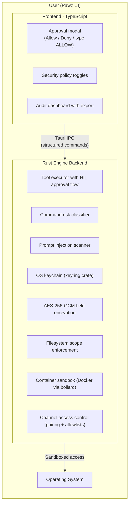

# Security

Pawz is a Tauri v2 desktop AI agent. Every system call flows through the Rust backend before reaching the OS, making it the natural enforcement point for all security controls.

## Trust at a Glance

| Metric | Value |
|--------|-------|
| Automated tests | 530 (164 Rust + 366 TypeScript) |
| CI jobs | 3 parallel (Rust + TypeScript + Security Audit) |
| Clippy warnings | 0 (enforced via `-D warnings`) |
| Known CVEs | 0 (`cargo audit` + `npm audit` in CI) |
| Credential encryption | AES-256-GCM (OS keychain for key storage) |
| Error handling | 12-variant typed `EngineError` enum (no `String` errors) |
| Network attack surface | Zero open ports (Tauri IPC only) |

---

## Architecture

**Key design principle**: The agent never touches the OS directly. Every tool call goes through the Rust tool executor. Read-only tools (fetch, read_file, web_search, etc.) are auto-approved at the Rust level. Side-effect tools (exec, write_file, delete_file) emit a `ToolRequest` event → the frontend shows a risk-classified approval modal → user decides → `engine_approve_tool` resolves.

---

## Human-in-the-Loop (HIL) Approval

Tool calls are classified into two tiers at the Rust engine level:

**Auto-approved (no modal):** Read-only and informational tools — `fetch`, `read_file`, `list_directory`, `web_search`, `web_read`, `memory_search`, `soul_read`, `soul_write`, `self_info`, `email_read`, `slack_read`, `create_task`, `image_generate`, etc.

**Requires user approval (modal shown):** Side-effect tools — `exec`, `write_file`, `append_file`, `delete_file`, and all trading write operations (swaps, transfers). The approval modal classifies each request by risk:

| Risk Level | Behavior | Example |
|------------|----------|---------|
| **Critical** | Auto-denied by default; red modal if auto-deny disabled, user must type "ALLOW" | `sudo rm -rf /`, `curl \| bash` |
| **High** | Orange warning modal | `chmod 777`, `kill -9` |
| **Medium** | Yellow caution modal | `npm install`, outbound HTTP |
| **Low** | Standard approval modal | unknown exec commands |
| **Safe** | Auto-approved if matches allowlist (90+ default patterns) | `git status`, `ls`, `cat` |

### Danger Pattern Detection

30+ patterns across multiple categories:

- **Privilege escalation** — `sudo`, `su`, `doas`, `pkexec`, `runas`
- **Destructive deletion** — `rm -rf /`, `rm -rf ~`, `rm -rf /*`
- **Permission exposure** — `chmod 777`, `chmod -R 777`
- **Disk destruction** — `dd if=`, `mkfs`, `fdisk`
- **Remote code execution** — `curl | sh`, `wget | bash`
- **Code injection** — `eval`, `exec` with untrusted input
- **Process termination** — `kill -9 1`, `killall`
- **Firewall disabling** — `iptables -F`, `ufw disable`
- **Account modification** — `passwd`, `chpasswd`, `usermod`
- **Network exfiltration** — `curl | cat`, `scp` outbound, `/dev/tcp`

### Command Allowlist / Denylist

Configurable regex patterns in Settings:
- **Allowlist** — ~90+ default safe patterns (git, npm, node, python, ls, cat, etc.) — auto-approved
- **Denylist** — default dangerous patterns — auto-denied
- **Custom rules** — users can add their own regex patterns
- Patterns validated before saving; invalid regex is rejected

### Session Override

Timed "allow all" mode with configurable duration (30min, 1hr, 2hr). Privilege escalation commands remain blocked even during override. Auto-expires. Cancellable from Settings banner.

### Trading Approval Policy

Financial tools (swaps, transfers) require HIL approval by default. A configurable trading policy can auto-approve within limits:

- **Max trade size** — per-transaction USD cap
- **Daily loss limit** — cumulative daily spending cap
- **Allowed pairs** — whitelist of tradeable pairs
- **Transfer toggle + cap** — opt-in with per-transfer limit
- Applies to all chains: Coinbase, Solana (Jupiter), EVM DEX (Uniswap)
- Read-only trading tools (balances, quotes, portfolio, prices) are always auto-approved

---

## Prompt Injection Detection

Dual implementation (TypeScript + Rust) scanning for 30+ injection patterns across 4 severity levels. Detects attempts to override system prompts, extract secrets, or manipulate agent behavior.

---

## Container Sandboxing

Docker-based sandboxing via the `bollard` crate:
- `cap_drop ALL` — no Linux capabilities
- Memory and CPU limits
- Network isolation configurable
- Configurable per-agent sandbox policies

---

## Credential Security

### OS Keychain
All sensitive credentials stored in the platform keychain:
- macOS: Keychain
- Linux: libsecret
- Windows: Credential Manager

Config files contain keychain references, never plaintext secrets.

### Database Encryption — AES-256-GCM

Sensitive database fields are encrypted at rest using **AES-256-GCM** via the Web Crypto API (`crypto.subtle`).

**Key management:**
- A 256-bit encryption key is stored in the OS keychain (macOS Keychain / Linux libsecret / Windows Credential Manager)
- The Rust backend exposes `get_db_encryption_key` which returns the hex-encoded key via Tauri IPC
- The frontend imports the raw key bytes with `crypto.subtle.importKey('raw', ..., 'AES-GCM')`
- The key is held in memory only (`CryptoKey` object) — never written to disk or localStorage

**Encryption process:**
1. A fresh 12-byte IV is generated per field via `crypto.getRandomValues()`
2. Plaintext is UTF-8 encoded and encrypted with `crypto.subtle.encrypt({ name: 'AES-GCM', iv })`
3. IV and ciphertext are concatenated and base64-encoded
4. The stored value is prefixed with `enc:` — e.g. `enc:<base64(iv ‖ ciphertext)>`

**Decryption:** Values starting with `enc:` are detected automatically. The first 12 bytes of the decoded payload are extracted as the IV, the remainder as ciphertext, and decrypted with `crypto.subtle.decrypt()`.

**Fallback behavior:** If the keychain is unavailable, encryption initialization fails with a user-facing error dialog. Credential storage is blocked — the app continues operating but will not silently store secrets in plaintext.

**Applies to:** Channel credentials, API tokens, and other sensitive configuration stored in the local SQLite database (`paw.db`).

### Credential Audit Trail
Every credential access is logged to `credential_activity_log` with:
- Action performed
- Tool that requested access
- Whether access was allowed or denied
- Timestamp

### Enterprise Hardening

The following hardening measures were applied as part of a systematic enterprise audit:

- **XOR → AES-256-GCM**: The original XOR cipher for skill credentials was replaced with AES-256-GCM. Existing XOR-encrypted values are auto-migrated on first read. 11 unit tests validate encrypt/decrypt roundtrips and wrong-key rejection.
- **Silent fallback removed**: Missing OS keychain previously fell back to plaintext storage silently. Now shows a user-facing error and blocks credential operations.
- **Typed error handling**: All engine functions use a 12-variant `EngineError` enum via `thiserror 2` — no `Result<T, String>` in the engine internals.
- **Retry with circuit breakers**: Provider and bridge calls use exponential backoff (base 1s, max 30s, 3 retries) with `Retry-After` support. Circuit breaker trips after 5 consecutive failures (60s cooldown).
- **Persistent logging**: Structured log files with daily rotation and 7-day pruning. In-app log viewer with filtering.
- **530 automated tests**: 164 Rust tests (14 modules + 4 integration test files) + 366 TypeScript tests (24 test files) covering all security-critical paths.
- **3-job CI pipeline**: `cargo check` + `cargo test` + `cargo clippy -- -D warnings` + `cargo audit` + `npm audit` on every push.
- **TLS certificate pinning**: All provider connections use a custom `rustls::ClientConfig` pinned to Mozilla root certificates only. The OS trust store is explicitly excluded — a compromised or rogue system CA cannot intercept API traffic.
- **Outbound request signing**: Every AI provider request is SHA-256 signed before transmission (`provider ‖ model ‖ timestamp ‖ body`). Hashes are logged to an in-memory ring buffer (500 entries) for tamper detection and compliance auditing.
- **Memory encryption (secure zeroing)**: API keys in provider structs are wrapped in `Zeroizing<String>` from the `zeroize` crate. When a provider is dropped, the key memory is immediately zeroed using `write_volatile` to prevent dead-store elimination by the compiler.
- **Anti-forensic vault-size quantization (KDBX-equivalent)**: The Engram memory store uses three mitigations to prevent file-size side-channel leakage:
  1. **Bucket padding** — The SQLite database is padded to 512KB bucket boundaries (via `_engram_padding` table) so an attacker observing the file can only determine a coarse size bucket, not the exact memory count. Re-padded after every GC cycle. This is the SQLite equivalent of KDBX inner-content padding.
  2. **Secure erasure** — Memory deletion is two-phase: content fields are overwritten with empty values *before* the row is deleted, preventing plaintext recovery from freed SQLite pages or WAL replay. Complements `PRAGMA secure_delete = ON`.
  3. **8KB pages + incremental auto-vacuum** — Larger page size reduces file-size granularity; incremental vacuum prevents the file from shrinking immediately after deletions (which would reveal deletion count).

---

## Engram Memory Security

The Engram memory subsystem applies defense-in-depth to all stored agent memories (episodic, semantic, and procedural). This protects user data even if an attacker gains access to the SQLite database file.

### Field-Level Encryption

Memories containing personally identifiable information (PII) are automatically encrypted before storage using **AES-256-GCM** with a dedicated keychain key (`paw-memory-vault`), separate from the credential vault key.

**Automatic PII detection** scans memory content for 9 pattern types before storage:
- Social Security Numbers, credit card numbers, phone numbers
- Email addresses, physical addresses
- Person names, geographic locations
- Credentials (passwords, API keys, tokens)
- Government IDs

**Three security tiers:**

| Tier | Content | Treatment |
|------|---------|-----------|
| **Cleartext** | No PII detected | Stored as-is |
| **Sensitive** | PII detected (email, name, phone) | AES-256-GCM encrypted, `enc:` prefix |
| **Confidential** | High-sensitivity PII (SSN, credit card, credentials) | AES-256-GCM encrypted, `enc:` prefix |

Encrypted content uses the format `enc:<base64(nonce ‖ ciphertext ‖ tag)>`. A fresh 96-bit nonce is generated per encryption. Decryption is automatic on retrieval.

### Query Sanitization

- **FTS5 injection prevention** — All user-supplied search queries are sanitized before reaching SQLite's full-text search engine. FTS5 operators (`AND`, `OR`, `NOT`, `NEAR`, `*`, `"`, `{`, `}`, `^`) are stripped or escaped.
- **Input validation** — Memory content is capped at 256 KB. Null bytes are rejected. Category strings are validated against the 18-variant enum with graceful fallback to `general`.

### Prompt Injection Scanning

Recalled memories are scanned for 10 prompt injection patterns before being returned to the agent context:
- System prompt overrides (`ignore previous instructions`, `you are now`)
- Data exfiltration attempts (`output all`, `dump`, `show me the`)
- Role manipulation (`act as`, `pretend to be`)
- Instruction injection (`new instruction`, `from now on`)
- Delimiter attacks and encoding bypass attempts

Suspicious memories are flagged in logs with redacted previews.

### Log Redaction

Memory content in log output is automatically redacted:
- PII patterns are replaced with type-specific placeholders (e.g., `[EMAIL]`, `[SSN]`, `[CREDIT_CARD]`)
- Log previews are truncated to 80 characters
- Full content never appears in log files

### GDPR Right to Erasure

Article 17 compliance via the `engine_memory_purge_user` Tauri command:
- Accepts a list of user identifiers (names, emails, usernames)
- Securely erases all matching records across episodic, semantic, and procedural memory tables
- Purges working memory snapshots and audit log entries
- Two-phase deletion: content zeroed before row deletion
- Returns a count of erased records for compliance reporting

---

## Filesystem Sandboxing

### Tauri Scope
Filesystem access scoped via Tauri capabilities (`capabilities/default.json`). Shell access limited to `open` command only.

### Sensitive Path Blocking
20+ sensitive paths blocked from project file browsing:
`~/.ssh`, `~/.gnupg`, `~/.aws`, `~/.kube`, `~/.docker`, `/etc`, `/root`, `/proc`, `/sys`, `/dev`, filesystem root, home directory root.

### Per-Project Scope
File operations validated against the active project root. Path traversal blocked. Violations logged to the security audit.

### Read-Only Mode
Toggle in Security Policies blocks all agent filesystem write tools (create, edit, delete, move, chmod, etc.).

---

## Channel Access Control

Each of the 11 channel bridges supports:
- **DM policy** — pairing / allowlist / open
- **Pairing approval** — new users send a request → approved in Pawz → confirmation sent back
- **Per-channel allowlist** — specific user IDs
- **Per-agent routing** — configure which agents handle which channels

---

## Network Security

### Content Security Policy (CSP)
Restrictive CSP in `tauri.conf.json`:
- `default-src 'self'`
- `script-src 'self'` — no external scripts
- `connect-src 'self'` + localhost WebSocket only
- `object-src 'none'`
- `frame-ancestors 'none'`

### Network Request Auditing
Outbound tool calls are inspected for exfiltration patterns. URL extraction and domain analysis with audit logging.

### Outbound Domain Allowlist
Configurable allow/block lists with wildcard subdomain matching. Enforced in the `execute_fetch` tool handler. Test URL button in settings.

---

## Skill Vetting

Before every skill install:
1. **Safety confirmation modal** — shows security checks
2. **Known-safe list** — built-in set of community-vetted skill names
3. **npm registry risk intelligence** — fetches download count, last publish date, deprecation status, maintainer count, license
4. **Risk score display** — visual risk panel in the confirmation dialog
5. **Post-install sandbox check** — verifies skill metadata for suspicious tool registrations (`exec`, `shell`, `eval`, `spawn`)

---

## Audit Dashboard

Unified security audit log (`security_audit_log` table) capturing all security-relevant events:
- Event type, risk level, tool name
- Command details
- Session context
- Decision (allowed/denied)
- Matched pattern

Filterable by type, date, and severity. Export to JSON or CSV.

---

## Reporting Vulnerabilities

If you discover a security vulnerability, please report it responsibly by emailing the maintainer directly rather than opening a public issue. See the repository's contact information for details.
