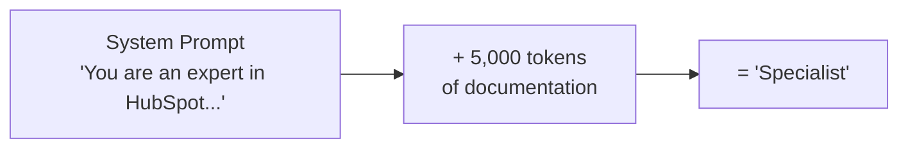
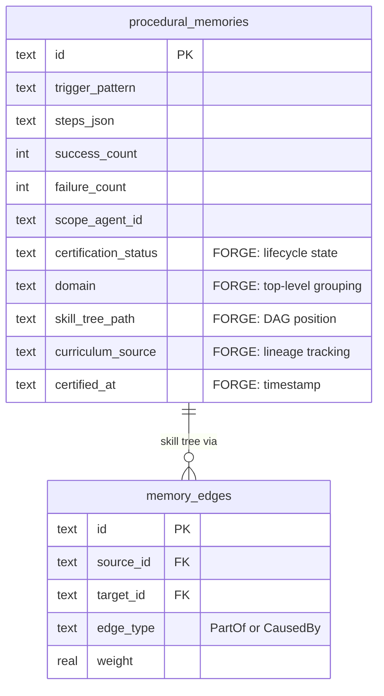
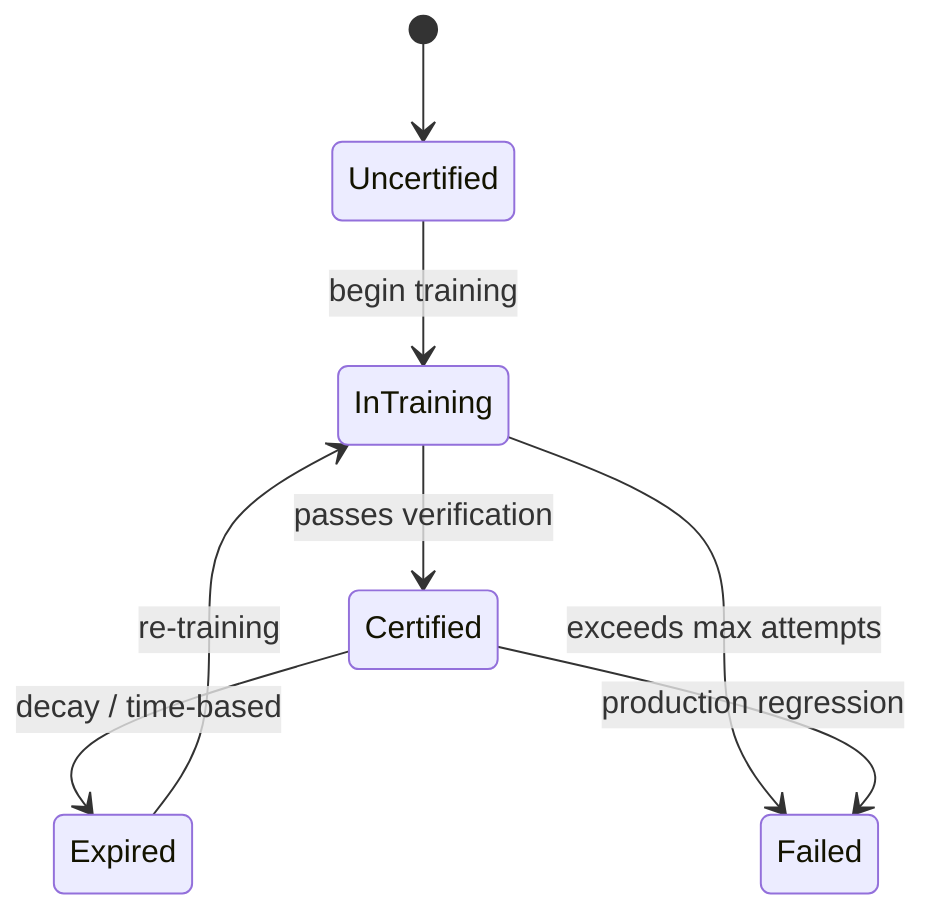
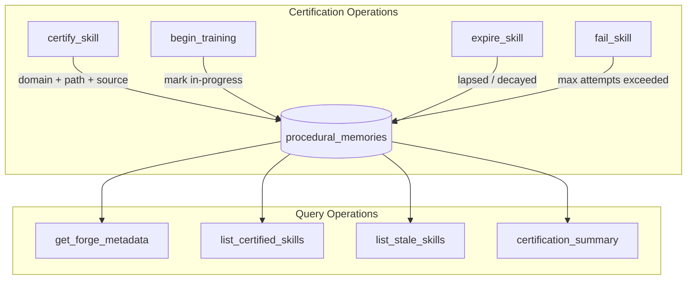
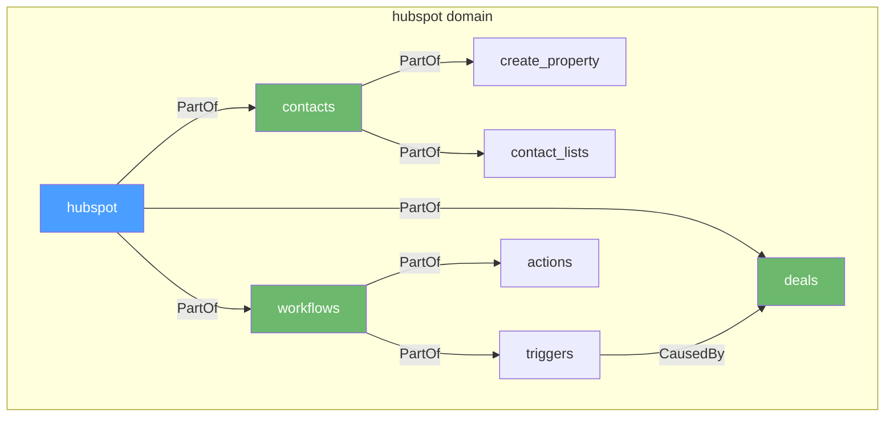
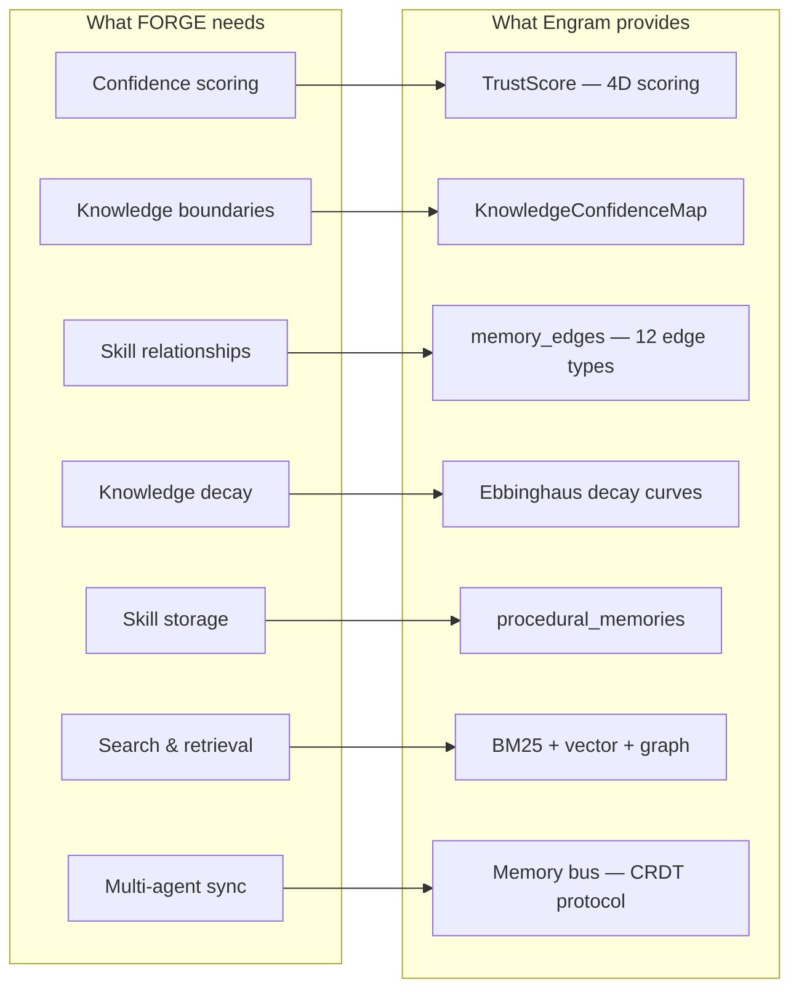

# THE FORGE — AI Agents That Earn Expertise

**Status:** Foundation Implemented  
**Author:** Team Lead  
**Date:** March 2026  
**Target:** OpenPawz Platform  

---

## Executive Summary

Every AI platform today creates "specialists" the same way: paste a markdown file into the system prompt. That's not expertise — it's a cheat sheet. THE FORGE is a certification layer on top of Engram where procedural memories are formally verified through structured testing. No parallel storage — FORGE extends Engram's existing procedural memories, memory edges, trust scores, meta-cognition, and Ebbinghaus decay.

**The moat:** You can copy a prompt file. You can't copy thousands of verified training cycles stored in Engram.

**Design principle:** The certification lifecycle is additive metadata on the memory system we already built. FORGE is training logic, not storage.

---

## Table of Contents

1. [The Problem](#the-problem)
2. [The Solution](#the-solution)
3. [What's Implemented](#whats-implemented)
4. [Architecture](#architecture)
5. [Integration With Engram](#integration-with-engram)
6. [Future Work](#future-work)
7. [First Target: HubSpot Specialist](#first-target-hubspot-specialist)

---

## The Problem

### How Everyone Builds AI "Specialists" Today

This approach has fundamental flaws:

| Problem | Impact |
|---------|--------|
| **No verification** | The agent claims expertise but has never been tested. It might hallucinate confidently about deprecated features. |
| **No knowledge boundaries** | The agent doesn't know what it doesn't know. It will answer questions about HubSpot features it's never encountered with the same confidence as features covered in its prompt. |
| **No evolution** | When HubSpot releases a new API version, the "specialist" is instantly outdated. No one notices until a customer hits a failure. |
| **No failure learning** | When the agent gives a wrong answer, there's no feedback loop. It will give the same wrong answer next time. |
| **Trivially copyable** | Your competitor copies the prompt file and has the same "specialist." Zero moat. |

### What Real Expertise Looks Like

A human HubSpot expert:
- Studied the platform systematically (curriculum)
- Was tested on their knowledge (certification)
- Knows their weak areas and says "I need to check that" (metacognition)
- Learns from mistakes in the field (failure feedback)
- Stays current as the platform evolves (continuous learning)
- Can prove their expertise with a track record (verifiable credentials)

THE FORGE gives agents all six properties.

---

## The Solution

### Core Concept: Certification on Existing Memory

Instead of building parallel storage or a separate training service, FORGE extends Engram inline. Every procedural memory can be formally certified, organized into a skill tree, and tracked through a lifecycle:

**Certification lifecycle:**

---

## What's Implemented

### Schema Extension

FORGE extends `procedural_memories` with five certification columns. All migrations are additive — existing procedural memories are untouched and default to `uncertified` status.

| Column | Purpose |
|--------|--------|
| `certification_status` | Lifecycle state: uncertified, in_training, certified, expired, failed |
| `domain` | Top-level grouping (e.g., `hubspot`, `stripe`) |
| `skill_tree_path` | Full DAG position (e.g., `hubspot.workflows.triggers.deal_stage`) |
| `curriculum_source` | URL or document reference for lineage tracking |
| `certified_at` | ISO 8601 timestamp of last certification |

Dedicated indexes on domain, certification status, and skill path ensure queries remain fast at scale.

### Certification Lifecycle

The certification module manages the full lifecycle of a procedural memory's training status:

- **Certify** — marks a procedural memory as verified, stamps the domain, skill tree path, curriculum source, and timestamp
- **Train** — marks a memory as in-progress evaluation
- **Expire** — flags a certified skill whose trust has decayed or time has elapsed
- **Fail** — marks a skill that exceeded maximum training attempts
- **Query** — retrieve metadata for individual skills, list all certified skills per agent/domain, find stale skills needing re-certification, or get a summary of certification counts

### Skill Tree DAG

Skill trees are DAGs built on Engram's existing `memory_edges` table — no new storage.

- **PartOf edges** encode parent→child hierarchy ("create_property is part of contacts")
- **CausedBy edges** encode prerequisites ("workflow triggers depend on deals knowledge")
- **`prerequisites_met()`** checks whether all upstream dependencies are certified before allowing a skill to advance
- **`list_domains()`** aggregates across all FORGE-tagged memories to show domain-level progress

---

## Architecture

### Design Decision: Extend Engram, Don't Duplicate It

FORGE deliberately avoids building parallel storage. Engram already provides the infrastructure that a certification system needs:

By extending the existing schema with certification columns rather than creating new tables, FORGE-certified skills automatically inherit hybrid search, graph traversal, Ebbinghaus decay, encryption, PII scanning, and multi-agent memory sync — without a single line of integration code.

---

## Integration With Engram

How FORGE connects to what already exists:

| Engram System | FORGE Relationship |
|---------------|-------------------|
| **Procedural Memories** | FORGE certifies them. The 5 new columns classify existing memories, not create new ones. |
| **Memory Edges (PartOf)** | FORGE uses them for parent→child skill tree structure. |
| **Memory Edges (CausedBy)** | FORGE uses them for prerequisite ordering between skills. |
| **TrustScore** | Existing trust scoring applies to FORGE-certified memories. Certified skills with high TrustScores are the most authoritative. |
| **KnowledgeConfidenceMap** | Meta-cognition can query certification status to say "I have verified knowledge on X" vs "I'm guessing about Y." |
| **Ebbinghaus Decay** | `fast_strength` / `slow_strength` decay naturally. When a certified skill's strength drops, it's a candidate for re-certification. `list_stale_skills()` makes this queryable. |
| **Consolidation Pipeline** | The 7-stage consolidation engine can incorporate certification status in its merge/prune decisions. |
| **Encryption / PII Scanning** | FORGE data inherits Engram's existing encryption and privacy protections. |

---

## Future Work

These are the natural next steps, roughly in priority order. They build on the foundation without requiring architectural changes.

### 1. Curriculum Ingestion
Ingest domain sources (URLs, API docs, courses) and decompose them into atomic skills that become procedural memories with FORGE metadata. Uses existing fetch tools + LLM provider abstraction.

### 2. Test Runner
Execute structured tests against specialists. L0 (deterministic/API), L1 (template), L2 (LLM-as-judge), L3 (adversarial). Results feed into certification lifecycle — `begin_training()` → test → `certify_skill()` or `fail_skill()`.

### 3. Master Craftsman Agent
A boss agent (using existing Orchestrator) that orchestrates the train→test→certify loop. Registers FORGE-specific tools in the tool executor. Uses existing sub-agent spawning.

### 4. Meta-Cognition Integration
Wire `get_forge_metadata()` and `certification_summary()` into the specialist's response pipeline so it can say "I have 94% confidence on this (certified)" vs "I don't have verified knowledge here."

### 5. Continuous Evolution
Background re-certification using Engram's consolidation engine pattern. Detect expired skills, domain source changes, production failures → queue re-training.

### 6. Frontend Dashboard
Skill tree visualization, certification status badges, training progress, domain-level confidence scores. Standard UI using existing view patterns.

---

## First Target: HubSpot Specialist

### Why HubSpot

| Factor | Rating | Reason |
|--------|--------|--------|
| **Bounded domain** | ★★★★★ | Clear boundaries — HubSpot is one product with defined features |
| **Existing curriculum** | ★★★★★ | HubSpot Academy offers free, structured courses |
| **Testable via API** | ★★★★★ | Developer test portals available. Workflows either work or they don't. |
| **Market demand** | ★★★★☆ | Large SMB market uses HubSpot. CRM/marketing automation help is in demand. |
| **Skill tree clarity** | ★★★★☆ | HubSpot modules (contacts, deals, workflows, reports) map cleanly to skill tree |

### Scope for V1

| Module | Skills | Test Tier |
|--------|--------|-----------|
| Contacts (properties, lists, lifecycle) | ~15 atomic skills | L0 (API) + L1 (template) |
| Deals (pipelines, stages, properties) | ~10 atomic skills | L0 (API) + L1 (template) |
| Workflows (triggers, actions, branching) | ~20 atomic skills | L0 (API) + L2 (LLM-judge) |
| Forms (creation, submission, integration) | ~8 atomic skills | L0 (API) |
| Reporting (dashboards, custom reports) | ~10 atomic skills | L1 (template) + L2 (LLM-judge) |
| **Total** | **~63 atomic skills** | |

---

## Competitive Landscape

| Platform | Approach to Expertise | FORGE Advantage |
|----------|----------------------|-----------------|
| **OpenAI Assistants** | File upload + retrieval | No verification, no skill boundaries, no evolution |
| **AutoGPT / AgentGPT** | Static system prompt | No training loop, no failure learning |
| **CrewAI** | Role-based prompts | Roles are labels, not earned competencies |
| **LangGraph** | Graph-based workflows | Workflow != knowledge. No skill verification. |
| **Custom RAG solutions** | Retrieval over docs | Retrieval != comprehension. No testing, no gap detection. |
| **Fine-tuning** | Weight updates on training data | Expensive, slow, opaque, no granular skill tracking |
| **THE FORGE** | **Structured training → verified certification → continuous evolution** | **Granular skill tracking, confidence-aware responses, self-healing knowledge, exportable proof of competence** |

---

## Appendix: Why This Is Hard to Replicate

Even if a competitor reads this document and builds the same pipeline:

1. **Training cycles are expensive.** Each certified specialist represents hundreds of LLM calls, test executions, and failure analyses. You can't shortcut this.

2. **Knowledge compounds.** A specialist with 6 months of production failures fed back through re-training has knowledge that a freshly-trained specialist doesn't. Time is a factor.

3. **Domain expertise is specific.** Our HubSpot specialist's failure patterns ("users commonly confuse enrollment vs. re-enrollment triggers") come from real production interactions. Generic training can't produce this.

4. **Engram integration is deep.** FORGE doesn't just store a JSON file of skills. It stores them in a living memory graph with decay, consolidation, meta-cognition, and multi-agent sync. Replicating this requires replicating Engram.

5. **The training infrastructure is the smaller part.** FORGE is a thin certification layer. The memory system it depends on — Engram — is a massive, mature infrastructure. FORGE is the last mile on top of years of memory architecture work.

---

*This document reflects the implemented FORGE foundation. The vision extends beyond what's built — curriculum ingestion, test runners, and continuous evolution are future work — but the storage foundation, certification lifecycle, and skill tree DAG are real, tested, and running.*
