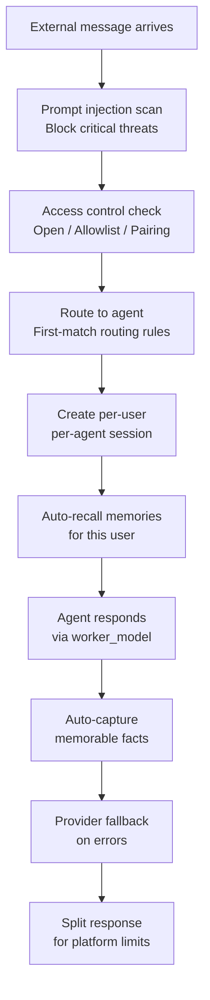

# Channels

Connect your Pawz agents to messaging platforms. Users on those platforms can chat with your agents directly.

<Note>
All incoming messages are scanned for **prompt injection** — messages with critical severity are blocked automatically.
</Note>

---

## Supported channels

<Columns cols={3}>
  <Card title="Telegram" href="/channels/telegram">
    Bot API — public bots, group chats
  </Card>
  <Card title="Discord" href="/channels/discord">
    Gateway WebSocket — community servers
  </Card>
  <Card title="Slack" href="/channels/slack">
    Bot API — workplace teams
  </Card>
  <Card title="Matrix" href="/channels/matrix">
    Client-Server API — decentralized chat
  </Card>
  <Card title="IRC" href="/channels/irc">
    IRC protocol — classic chat rooms
  </Card>
  <Card title="Mattermost" href="/channels/mattermost">
    WebSocket API — self-hosted teams
  </Card>
  <Card title="Nextcloud" href="/channels/nextcloud">
    Talk API — Nextcloud users
  </Card>
  <Card title="Nostr" href="/channels/nostr">
    NIP relay protocol — decentralized social
  </Card>
  <Card title="Twitch" href="/channels/twitch">
    IRC + API — live streaming chat
  </Card>
  <Card title="Webchat" href="/channels/webchat">
    HTTP/WebSocket — your own website
  </Card>
  <Card title="WhatsApp" href="/channels/whatsapp">
    Evolution API — personal & group messaging
  </Card>
</Columns>

---

## How channels work

## DM policies

Control who can message your agents:

| Policy | Behavior |
|--------|----------|
| **Open** | Anyone can chat |
| **Allowlist** | Only approved users |
| **Pairing** | Users must pair with a code |

## Channel routing

Route messages to specific agents based on rules:

1. Go to **Settings → Channels**
2. Add routing rules with filters:
   - **Channel** — which platform
   - **User filter** — specific users
   - **Channel ID filter** — specific channels/groups
   - **Agent** — which agent handles it

Rules are evaluated **first-match-wins** — the first matching rule determines the agent.

## Security

- All incoming messages are scanned for prompt injection
- Messages with `critical` severity are blocked automatically
- Each user gets an isolated session (no cross-user contamination)
- Access control is per-channel and per-user
- Channel agents use `worker_model` by default (cheaper, faster)

## Provider fallback

If the primary provider fails (billing, auth, or rate limit errors), Pawz automatically tries other configured providers before failing.
