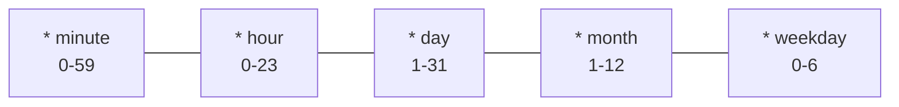

# Automations

Automations are recurring tasks that run on a schedule using cron expressions.

## How it works

1. Create a task in the **Tasks** view
2. Set a cron schedule
3. Enable the cron toggle
4. The engine checks for due tasks every **60 seconds**

## Creating an automation

1. Go to **Automations** in the sidebar (or **Tasks → New Task**)
2. Set the task title and description
3. Assign an agent
4. Enter a **cron schedule**
5. Enable cron

## Cron syntax

Standard 5-field cron expressions:

### Common schedules

| Schedule | Cron | Description |
|----------|------|-------------|
| Every morning | `0 9 * * *` | 9 AM daily |
| Twice daily | `0 9,17 * * *` | 9 AM and 5 PM |
| Weekdays only | `0 9 * * 1-5` | 9 AM Mon–Fri |
| Every hour | `0 * * * *` | On the hour |
| Every 30 min | `*/30 * * * *` | Half-hourly |
| Weekly | `0 9 * * 1` | Monday at 9 AM |
| Monthly | `0 9 1 * *` | First of month at 9 AM |

## Automation view

The Automations page shows three columns:

| Column | Description |
|--------|-------------|
| **Active** | Currently enabled automations |
| **Paused** | Disabled automations |
| **Run History** | Past execution results |

## Actions

| Action | Description |
|--------|-------------|
| **Run now** | Execute immediately without waiting for schedule |
| **Edit** | Modify the task, schedule, or agent |
| **Pause** | Disable without deleting |
| **Enable** | Re-activate a paused automation |
| **Delete** | Remove permanently |

## Service status

The green heartbeat indicator at the top confirms the automation engine is active and checking for due tasks.

## Use cases

- **Morning Brief** — summarize your calendar and emails at 9 AM
- **News Digest** — research trending topics every evening
- **Health Check** — run a security audit daily
- **Blog Monitor** — check for new posts on followed blogs
- **Metric Reports** — pull and summarize analytics weekly
