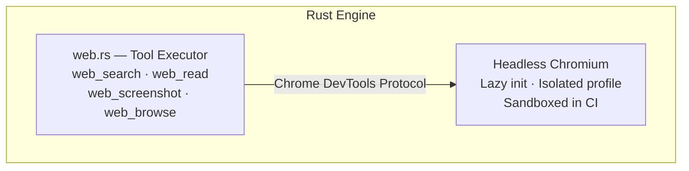

# Browser Sandbox

The browser sandbox lets agents browse the web in a controlled, auditable environment.

## Configuration

Go to **Settings → Advanced** to configure:

| Setting | Default | Description |
|---------|---------|-------------|
| **Headless** | On | Run browser without visible window |
| **Auto-close tabs** | On | Close tabs after agent finishes |
| **Idle timeout** | 300s | Kill browser after inactivity |

## Profiles

Create isolated browser profiles for different purposes:

- Each profile has its own cookies, storage, and history
- Agents can switch between profiles
- Prevents cross-contamination between tasks

## Network policy

Control which domains agents can access:

### Default allowed domains

| Domain | Purpose |
|--------|---------|
| `api.openai.com` | AI provider |
| `api.anthropic.com` | AI provider |
| `generativelanguage.googleapis.com` | AI provider |
| `openrouter.ai` | AI provider |
| `api.elevenlabs.io` | TTS provider |
| `duckduckgo.com` | Web search |
| `html.duckduckgo.com` | Web search |
| `api.coinbase.com` | Trading |
| `localhost` | Local services |

### Default blocked domains

| Domain | Reason |
|--------|--------|
| `pastebin.com` | Data exfiltration risk |
| `transfer.sh` | File sharing risk |
| `file.io` | File sharing risk |
| `0x0.st` | Anonymous upload risk |

### Custom rules

Add your own allowed or blocked domains in the browser settings. Blocked domains take priority over allowed.

### Request logging

Enable **log requests** to see all network requests the browser makes. Recent requests are shown in the settings panel for auditing.

## Agent tools

| Tool | Description |
|------|-------------|
| `web_browse` | Navigate to a URL and interact with the page |
| `web_screenshot` | Capture a screenshot of the current page |
| `web_read` | Extract text content from a page |

## Browser sandbox architecture

The browser sandbox uses **headless Chromium** via the `headless_chrome` Rust crate (Chrome DevTools Protocol):



- **Lazy initialization** — Chrome is only launched when an agent first calls `web_screenshot` or `web_browse`
- **Singleton instance** — one shared browser process with health checks; auto-relaunches if Chrome dies
- **Session continuity** — `web_browse` reuses the first tab for multi-step interactions within a session
- **Idle timeout** — configurable (default 300s), kills Chrome after inactivity

## Screenshot capture and vision analysis

The `web_screenshot` tool captures full-page screenshots and extracts visible text:

| Parameter | Default | Description |
|-----------|---------|-------------|
| `url` | (required) | Page to capture |
| `full_page` | `false` | Capture entire scrollable page |
| `width` | 1280 | Viewport width in pixels |
| `height` | 800 | Viewport height in pixels |

Screenshots are:
1. Saved as PNG to `$TMPDIR/paw-screenshots/screenshot-YYYYMMDD-HHMMSS.png`
2. Accompanied by extracted visible text (up to 5000 chars) so the agent can "read" the page
3. Viewable in **Settings → Advanced** screenshot gallery

:::tip
When `web_read` returns empty text (JavaScript-rendered pages), use `web_screenshot` instead — it waits for dynamic content to load and extracts visible text from the rendered DOM.
:::

## Form filling and interaction

The `web_browse` tool supports full page interaction:

| Action | Parameters | Description |
|--------|-----------|-------------|
| `navigate` / `goto` | `url` | Navigate to a URL and wait for load |
| `click` | `selector` | Click an element by CSS selector |
| `type` / `fill` | `selector`, `text` | Click an input and type text into it |
| `press` | `text` (key name) | Press a keyboard key (Enter, Tab, etc.) |
| `extract` / `read` | `selector` (optional) | Extract text content from elements |
| `javascript` / `eval` / `js` | `javascript` | Execute arbitrary JavaScript |
| `scroll` | `text` (up/down/top/bottom) | Scroll the page |
| `links` | — | List all links on the page (up to 50) |
| `info` | — | Get current page title and URL |

### Example: filling a login form

The agent can chain multiple `web_browse` calls:

```
1. web_browse(action: "navigate", url: "https://example.com/login")
2. web_browse(action: "type", selector: "#email", text: "user@example.com")
3. web_browse(action: "type", selector: "#password", text: "...")
4. web_browse(action: "click", selector: "button[type=submit]")
```

## Cookie and session management

Browser profiles provide isolated cookie and session storage:

| Feature | Description |
|---------|-------------|
| **Profile directory** | Each profile stores cookies, localStorage, and cache in `~/.paw/browser-profiles/<profile-id>/` |
| **Session persistence** | Cookies and logged-in sessions survive across agent tool calls within the same profile |
| **Profile isolation** | Different profiles have completely separate storage — no cross-contamination |
| **Profile switching** | Set the default profile in **Settings → Advanced** |

### Managing profiles

- **Create** — go to Settings → Advanced → Browser → "New Profile"
- **Delete** — removes the profile directory and all associated data
- **Set default** — choose which profile new browser sessions use

## Proxy support

Proxy configuration can be applied through Chrome launch flags. Set the `HTTP_PROXY` or `HTTPS_PROXY` environment variables before launching Pawz, and the headless Chrome instance will respect them.

## Security

- Network policy is enforced at the browser level — agents cannot bypass it
- All browser activity is contained within the profile
- Headless mode prevents agents from displaying arbitrary content
- Idle timeout prevents runaway browser sessions
