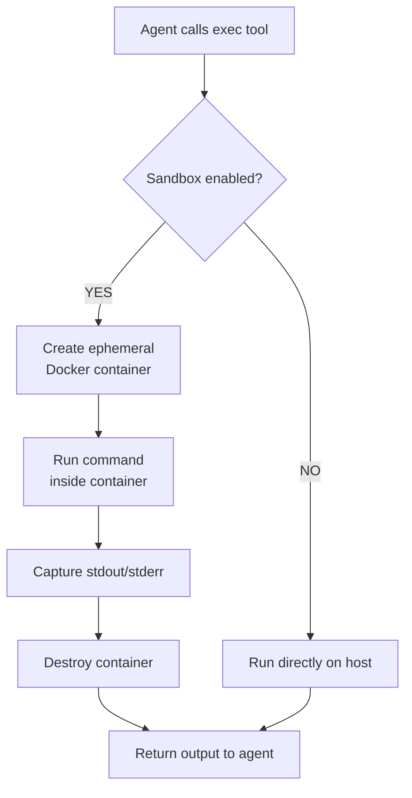

# Container Sandbox

The Container Sandbox runs agent `exec` commands inside ephemeral Docker containers instead of directly on your host machine. This provides strong isolation — each command runs in a fresh container with dropped capabilities, constrained resources, and optional network restrictions.

## How it works



The sandbox uses the [bollard](https://crates.io/crates/bollard) Rust crate to communicate with the Docker daemon.

## Enabling the sandbox

1. **Install Docker** on your system (Docker Desktop or Docker Engine)
2. Go to **Settings → Advanced**
3. Toggle **Container Sandbox** to enabled
4. Optionally select a preset or configure manually

:::warning
Docker must be installed and running for the sandbox to work. If Docker is unavailable, `exec` commands will fail when the sandbox is enabled.
:::

## Configuration

| Setting | Default | Description |
|---------|---------|-------------|
| `enabled` | `false` | Whether sandboxing is active |
| `image` | `alpine:latest` | Docker image used for containers |
| `timeout` | `30s` | Maximum execution time per command |
| `memory` | `256 MB` | Memory limit for the container |
| `cpu_shares` | `512` | Relative CPU weight (default Docker is 1024) |
| `network` | Disabled | Whether the container has network access |
| `workdir` | `/workspace` | Working directory inside the container |
| `bind_mounts` | `[]` | Host-to-container directory mounts (`host:container:mode`) |

## Security hardening

Every sandboxed container runs with strict security defaults:

- **`CAP_DROP ALL`**: All Linux capabilities are dropped — no privilege escalation possible
- **No privileged mode**: Containers cannot access host devices or kernel features
- **Output truncation**: Command output is truncated at **50,000 characters** to prevent memory exhaustion
- **Ephemeral**: Containers are destroyed after each command — no persistent state between executions

## Presets

Pawz includes 4 pre-built sandbox profiles for common use cases. Select a preset to instantly configure all settings.

### Minimal

The most restrictive configuration. Ideal for simple shell commands where you want maximum isolation.

| Setting | Value |
|---------|-------|
| Image | `alpine:latest` |
| Memory | 128 MB |
| Timeout | 15s |
| CPU shares | 512 |
| Network | Disabled |
| Workdir | `/workspace` |

**Best for**: Quick file operations, text processing, basic shell utilities.

### Development

A balanced profile with Node.js available and network access enabled. Suitable for running build scripts, linting, and test suites.

| Setting | Value |
|---------|-------|
| Image | `node:20-alpine` |
| Memory | 512 MB |
| Timeout | 60s |
| CPU shares | 512 |
| Network | **Enabled** |
| Workdir | `/workspace` |

**Best for**: JavaScript/TypeScript development, package installation, running tests, build processes.

### Python

Similar to Development but with Python 3.12 pre-installed. Great for data analysis, scripting, and ML tasks.

| Setting | Value |
|---------|-------|
| Image | `python:3.12-alpine` |
| Memory | 512 MB |
| Timeout | 60s |
| CPU shares | 512 |
| Network | **Enabled** |
| Workdir | `/workspace` |

**Best for**: Python scripts, pip package installation, data processing, Jupyter-style tasks.

### Restricted

The most locked-down profile. Minimal resources, no network, very short timeout. Use this when running untrusted or potentially dangerous commands.

| Setting | Value |
|---------|-------|
| Image | `alpine:latest` |
| Memory | 64 MB |
| Timeout | 10s |
| CPU shares | 256 |
| Network | Disabled |
| Workdir | `/workspace` |

**Best for**: Evaluating untrusted code, sandboxing risky commands, maximum isolation scenarios.

## Command risk assessment

The sandbox includes a built-in command risk scoring system that classifies commands into four levels:

| Risk level | Examples | Description |
|------------|----------|-------------|
| **Critical** | `rm -rf /`, `mkfs`, `dd of=/dev/...`, fork bombs | System-destroying commands |
| **High** | `sudo`, `su`, `chmod 777`, `curl | sh`, `eval` | Privilege escalation, piped execution |
| **Medium** | `curl`, `wget`, `rm`, `pip install`, `npm install`, `apt` | Network access, file modifications, package installs |
| **Low** | `ls`, `cat`, `echo`, `grep` | Read-only, safe operations |

:::info
Risk assessment is informational — it helps you understand what agents are doing. The sandbox enforces isolation regardless of risk level. All capabilities are dropped and containers are ephemeral.
:::

## Bind mounts

You can mount host directories into the container to give agents access to specific files:

```
/home/user/project:/workspace:ro
```

Format: `host_path:container_path:mode`

| Mode | Description |
|------|-------------|
| `ro` | Read-only access |
| `rw` | Read-write access |

:::warning
Be careful with `rw` mounts — the agent can modify files on your host filesystem through the container. Use `ro` when the agent only needs to read files.
:::

## Use cases

### Safe code execution

Let agents run code in a sandboxed environment where mistakes can't damage your system:

```
You: Write and run a Python script that calculates prime numbers up to 1000

Agent: [uses exec tool → runs inside Python sandbox container]
```

### Untrusted command evaluation

When an agent suggests a shell command you're unsure about, the sandbox provides a safety net:

- If the command is destructive, it only affects the ephemeral container
- All Linux capabilities are dropped, preventing privilege escalation
- Network can be disabled to prevent data exfiltration

### Build and test isolation

Run project builds and test suites without polluting your host environment:

- Dependencies installed in the container don't affect your system
- Failed builds can't leave behind broken state
- Each run starts from a clean image

:::tip
For development workflows, use the **Development** or **Python** preset with bind mounts pointing to your project directory. This gives agents access to your code while keeping execution sandboxed.
:::
