# Extensions

Extensions are the most powerful tier of the Pawz extensibility system. They have everything an [Integration](/docs/guides/integrations) has — credentials, instructions, widgets — plus **custom sidebar views** and **persistent data storage**.


**Extensions vs. Integrations**: An [Integration](/docs/guides/integrations) connects your agent to an API or CLI tool with encrypted credentials and optional dashboard widgets. An Extension does all of that **plus** registers a custom sidebar view and can persist structured data across sessions.

---

## What Extensions Add

| Feature | Skill | Integration | Extension |
|---------|-------|-------------|-----------|
| Prompt injection | ✓ | ✓ | ✓ |
| Credential vault | — | ✓ | ✓ |
| Binary detection | — | ✓ | ✓ |
| Dashboard widgets | — | ✓ | ✓ |
| **Custom sidebar view** | — | — | **✓** |
| **Persistent storage** | — | — | **✓** |
| **Data-bound UI** | — | — | **✓** |

---

## How Extensions Work

1. **Manifest** — A `pawz-skill.toml` with `[view]` and/or `[storage]` sections
2. **Sidebar view** — The extension registers a tab in the sidebar with its own icon and label
3. **Persistent data** — The extension declares storage tables; agents use `skill_store_*` tools to persist structured data across sessions
4. **Data-bound rendering** — The custom view reads from the extension's storage and renders live data (tables, charts, pipelines, feeds)
5. **Widget** — An optional dashboard card shows a summary on the Today page


---

## Extension Manifest

An extension is a `pawz-skill.toml` with the additional `[view]` and `[storage]` sections:

```toml
[skill]
id = "simple-crm"
name = "Simple CRM"
version = "1.0.0"
author = "community"
category = "productivity"
icon = "contacts"
description = "A lightweight CRM with contacts, deals, and activity tracking"

[[credentials]]
key = "CRM_WEBHOOK"
label = "Import Webhook (optional)"
description = "Incoming webhook URL for importing contacts from external systems"
required = false
placeholder = "https://..."

[instructions]
text = """
You have a CRM system with persistent storage. Use the storage tools to manage data:

## Contacts
- skill_store_set: Add or update a contact (name, email, company, stage)
- skill_store_query: Search contacts by name, company, or stage
- skill_store_get: Get a specific contact by ID

## Deals
- skill_store_set: Create or update deals (name, value, stage, contact_id)
- skill_store_query: Filter deals by stage (new, qualified, proposal, closed)

## Activity
- skill_store_set: Log activities (type: call/email/meeting, notes, contact_id)
- skill_store_query: Get activity feed for a contact or date range

When the user asks about their pipeline, contacts, or deals, query storage first.
"""

[widget]
type = "table"
title = "Active Deals"
refresh = "5m"

[[widget.fields]]
key = "name"
label = "Deal"
type = "text"

[[widget.fields]]
key = "value"
label = "Amount"
type = "currency"

[[widget.fields]]
key = "stage"
label = "Stage"
type = "badge"

[view]
id = "crm-pipeline"
label = "CRM"
icon = "contacts"

[storage]
namespace = "crm"
tables = ["contacts", "deals", "activities"]
```

### `[view]` Section

| Field | Type | Required | Description |
|-------|------|----------|-------------|
| `id` | string | ✓ | Unique view identifier (used in routing). |
| `label` | string | ✓ | Sidebar tab label. |
| `icon` | string | ✓ | Material Symbols icon name. |

The view registers as a sidebar tab. When clicked, Pawz renders the extension's data from storage using the widget field schema.

### `[storage]` Section

| Field | Type | Required | Description |
|-------|------|----------|-------------|
| `namespace` | string | ✓ | Storage namespace (isolated per extension). |
| `tables` | string[] | ✓ | Table names the extension can read/write. |

Storage is backed by SQLite. Each extension has its own namespace — no extension can read another extension's data.

---

## Storage Tools

Extensions expose three agent tools for persistent data management:

| Tool | Parameters | Description |
|------|-----------|-------------|
| `skill_store_set` | `namespace`, `table`, `id`, `data` (JSON) | Create or update a record |
| `skill_store_get` | `namespace`, `table`, `id` | Get a record by ID |
| `skill_store_query` | `namespace`, `table`, `filter` (JSON) | Query records with filters |

### Example: Agent interaction

**User**: "Add a new contact — John Smith, john@acme.com, Acme Corp"

**Agent** calls `skill_store_set`:
```json
{
  "namespace": "crm",
  "table": "contacts",
  "id": "john-smith",
  "data": {
    "name": "John Smith",
    "email": "john@acme.com",
    "company": "Acme Corp",
    "stage": "new",
    "created": "2025-01-21T10:30:00Z"
  }
}
```

**User**: "Show me all contacts at Acme"

**Agent** calls `skill_store_query`:
```json
{
  "namespace": "crm",
  "table": "contacts",
  "filter": { "company": "Acme Corp" }
}
```

---

## Example Extensions

### CRM Pipeline

Track contacts, deals, and activities. The sidebar view shows a Kanban-style pipeline with deal stages. Dashboard widget shows active deal summary.

| Credentials | Storage | Widget |
|-------------|---------|--------|
| Optional webhook import | contacts, deals, activities | Table: Active Deals |

### Smart Home Dashboard

Control and monitor your IoT devices from a dedicated sidebar tab. Combines Philips Hue, Sonos, and Eight Sleep into one unified view.

| Credentials | Storage | Widget |
|-------------|---------|--------|
| Device API tokens | devices, scenes, automations | KV: Device Status |

### Portfolio Tracker

Unified portfolio view across all exchanges and wallets. The sidebar shows allocation charts, P&L, and trade history.

| Credentials | Storage | Widget |
|-------------|---------|--------|
| Exchange API keys | holdings, trades, snapshots | Metric: Portfolio Value |

### Content Calendar

Plan, schedule, and track content across platforms. The sidebar shows a calendar grid with publish dates and status badges.

| Credentials | Storage | Widget |
|-------------|---------|--------|
| Social media tokens | posts, campaigns, analytics | Table: Upcoming Posts |

---

## Modular Workspace Integration

Extension sidebar views integrate with the [Modular Workspace](/docs/guides/modular-workspace) system:

- Extension views appear in the **Custom** workspace profile toggle grid
- Users can show/hide extension views like any built-in view
- Extension views respect the active workspace profile
- Hidden extension views preserve their data — nothing is lost

When you install an extension, its sidebar tab appears automatically. If you're using a preset workspace profile (Developer, Marketer, etc.), you may need to switch to **Custom** or **All** to see the extension view.

---

## Per-Agent Scoping

Like Skills and Integrations, Extensions are assigned to agents from the **Agents** tab:

1. Open the **Agents** tab → select an agent → go to their **Skills** sub-tab
2. Enable or disable the extension for that agent
3. Only assigned agents receive the extension's instructions and credentials in their prompt
4. All agents can *read* from the extension's storage (for dashboard rendering)
5. Only assigned agents can *write* to the extension's storage
6. The extension's sidebar view is always visible (it shows data, not agent context)

---

## Creating Extensions

Extensions are created the same way as integrations, with the addition of `[view]` and `[storage]` sections:

1. Start with the **In-App Wizard** or a template
2. Add your credentials and instructions (same as an integration)
3. Add a `[view]` section to declare a sidebar tab
4. Add a `[storage]` section to declare persistent tables
5. Test with a live agent — use chat to populate storage, verify the view renders
6. Publish to PawzHub

### Upgrade Path

You can upgrade a Skill to an Integration to an Extension incrementally:

```mermaid
graph TD
    A["SKILL.md\nTier 1 — Skill"]:::blue -->|add credentials + TOML| B["pawz-skill.toml\nTier 2 — Integration"]:::purple
    B -->|"add [view] + [storage]"| C["pawz-skill.toml + view\nTier 3 — Extension"]:::gold
    classDef blue fill:#3b82f6,color:#fff,stroke:#3b82f6
    classDef purple fill:#a855f7,color:#fff,stroke:#a855f7
    classDef gold fill:#eab308,color:#000,stroke:#eab308
```



Each step is additive. You never need to rewrite — you just add more sections to the manifest.

---

## Security

Extensions have the same security model as Integrations, with additional protections for storage:

| Layer | Protection |
|-------|-----------|
| **Credentials** | XOR-encrypted, 32-byte key in OS keychain |
| **Network** | Domain allowlist/blocklist on every `fetch` |
| **Shell** | Docker sandbox routing when enabled |
| **Storage** | Namespaced — extensions cannot read/write other extensions' data |
| **Write isolation** | Only assigned agents can write to storage |
| **View rendering** | Views are rendered by the app, not by the extension |
| **Resource limits** | Storage quotas prevent any single extension from filling disk |

Extensions cannot:
- Execute arbitrary Rust code
- Render arbitrary HTML/JavaScript (views use the app's renderer)
- Access other extensions' storage namespaces
- Write to storage from unassigned agents
- Bypass domain or shell policies

---

## Tier Badges

Every item in the Skills tab shows its tier badge:

| Badge | Color | Meaning |
|-------|-------|---------|
| 🔵 **Skill** | Blue `#3B82F6` | SKILL.md — prompt injection only |
| 🟣 **Integration** | Purple `#8B5CF6` | TOML — credentials, binaries, widgets |
| 🟡 **Extension** | Gold `#F59E0B` | TOML — views, storage, full power |

Additional quality badges:

| Badge | Meaning |
|-------|---------|
| ✓ **Verified** | Tested in a real workspace, CI-validated |
| ★ **Official** | Published by the Pawz team |
| 🔥 **Popular** | 50K+ installs |
