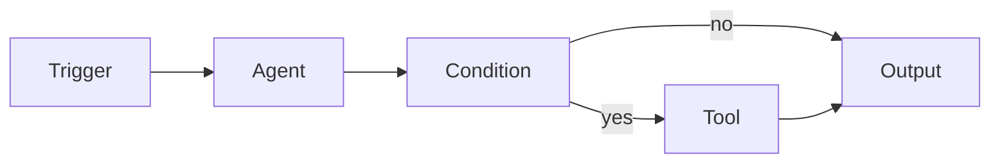

# Flows

Flows is a visual workflow builder for creating multi-step AI pipelines. Drag integrations onto a canvas, wire them together, and run — no code required.

## How it works



1. Open **Flows** from the sidebar
2. Click **+ New** or describe a flow in the text box
3. Drag integrations onto the canvas and wire them together
4. Configure each integration in the properties panel
5. Click **Run** to execute the flow

## Integration types

Every step in a flow is an integration. There are 9 kinds:

| Kind | Icon | Purpose |
|------|------|---------|
| **Trigger** | ⚡ | Event that starts the flow — webhook, cron, or user input |
| **Agent** | 🤖 | AI agent processing step — sends a prompt and gets a response |
| **Tool** | 🔧 | MCP tool invocation — call any connected tool |
| **Condition** | 🔀 | If/else branch — route data based on expressions |
| **Data** | 📊 | Data transform — map, parse, format, convert |
| **Code** | 💻 | Inline JavaScript — sandboxed execution with `input`/`context` |
| **Output** | 📤 | Terminal step — log, send, store, or post to chat |
| **Error** | ⚠️ | Error handler — catches failures from upstream integrations |
| **Group** | 📁 | Sub-flow — compound integration containing nested steps |

## Edge types

Edges connect integrations. Four kinds control data flow direction:

| Edge | Meaning |
|------|---------|
| **Forward** | Normal `A → B` — data flows from source to target |
| **Reverse** | Pull `B ← A` — target requests data from source |
| **Bidirectional** | Handshake `A ↔ B` — two-way data exchange |
| **Error** | Fallback `A --err→ B` — routes to error handler on failure |

## Building flows

### Canvas controls

| Action | How |
|--------|-----|
| **Pan** | Click and drag the canvas background |
| **Add integration** | Click an add button in the toolbar, or type in the text box |
| **Select** | Click an integration on the canvas |
| **Move** | Drag a selected integration |
| **Connect** | Drag from an output port (right side) to an input port (left side) |
| **Delete** | Select an integration or edge, then press the delete button |
| **Zoom** | Scroll wheel on the canvas |

### Text-to-flow

Type a natural-language description in the text box at the top and press Enter. The parser recognizes keywords and creates a flow automatically:

```
webhook → agent summarize → if important → send email
```

Keyword detection maps words to integration types:

| Keywords | Maps to |
|----------|---------|
| `trigger`, `webhook`, `cron`, `on`, `when` | Trigger |
| `agent`, `ai`, `llm`, `ask`, `think` | Agent |
| `tool`, `mcp`, `call`, `api`, `fetch` | Tool |
| `if`, `condition`, `branch`, `check` | Condition |
| `data`, `transform`, `map`, `parse` | Data |
| `output`, `send`, `email`, `notify`, `save` | Output |

### Properties panel

Click any integration on the canvas to open its configuration panel:

- **Label** — display name on the canvas
- **Description** — sub-label (model name, tool ID, etc.)
- **Kind** — integration type (trigger, agent, tool, etc.)
- **Config** — kind-specific settings:
  - **Agent**: prompt text, assigned agent (dropdown of your real agents)
  - **Code**: inline JavaScript with `input` and `context` variables
  - **Condition**: expression to evaluate
  - **Tool**: MCP tool name and parameters

When no integration is selected, the panel shows **flow properties** — name, description, folder, and stats.

## Folders

Flows can be organized into folders:

1. Open flow properties (click canvas background)
2. Set the **Folder** field (e.g. `Production`, `Drafts`)
3. Flows are grouped by folder in the sidebar with collapsible headers

Drag and drop flows between folders in the sidebar.

## Templates

Switch to the **Templates** tab in the sidebar to browse pre-built flow patterns.

### Categories

| Category | Examples |
|----------|----------|
| **AI & Agents** | Daily Digest, Multi-Agent Debate, Agent Chain |
| **Communication** | Email Auto-Responder, Team Notifications |
| **DevOps & CI** | Deploy Pipeline, Health Monitor |
| **Productivity** | Task Triage, Meeting Prep |
| **Data & Transform** | CSV Pipeline, Data Enrichment |
| **Research** | Deep Research, Literature Review |
| **Social & Content** | Content Calendar, Social Listener |
| **Finance & Trading** | Portfolio Monitor, Price Alerts |
| **Support** | Ticket Router, FAQ Bot |
| **Custom** | Build your own from scratch |

Click **Use Template** to instantiate a template as a new flow with auto-layout.

### Search & filter

- Type in the search box to filter by name, description, or tags
- Click a category chip to filter by category
- Click **All** to reset

## Execution

### Running a flow

1. Select a flow from the sidebar
2. Click the **Run** button (▶) in the toolbar
3. Watch integrations execute in order — status indicators show progress:
   - 🔴 **Running** — red breathing pulse
   - 🟢 **Success** — sage green border
   - ❌ **Error** — red border
   - ⏸ **Paused** — gold oscillating border

Data flows along edges with animated signal sweep.

### Debug mode

Step through a flow one integration at a time:

1. Click the **Debug** button (🐛) in the toolbar
2. Set **breakpoints** by right-clicking integrations
3. Use **Step** to advance one integration at a time
4. Inspect intermediate data values shown on edges
5. View the **debug inspector** panel for full input/output of each step

The execution cursor highlights the current integration with a gold ring.

### Error handling

- **Error edges** route failures to error handler integrations
- **Error integrations** catch and process failures (log, alert, retry)
- The flow report in chat shows step-by-step results with timing

## Scheduling

Flows can run on a schedule using cron expressions:

1. Open a flow's properties panel
2. Enable the **Schedule** toggle
3. Enter a cron expression

```
0 9 * * *       Every day at 9 AM
0 */2 * * *     Every 2 hours
0 9 * * 1-5     Weekdays at 9 AM
*/30 * * * *    Every 30 minutes
```

The scheduler checks every **30 seconds** for flows due to fire.

The hero stat counter shows how many flows have active schedules.

## Code integrations

Code integrations run sandboxed JavaScript:

```javascript
// Available variables:
// input  — output from the previous integration
// context — { flowId, nodeId, runId }

const data = JSON.parse(input);
return data.items.filter(item => item.score > 0.8);
```

- Code runs in a sandboxed `Function()` constructor — no access to DOM, fetch, or filesystem
- Return value becomes the integration's output, passed to downstream integrations
- Timeout enforced to prevent infinite loops

## Chat reporter

When a flow runs, a **flow report** appears in the chat conversation showing:

- Flow name and step count
- Progress bar
- Each step's status, duration, and output
- Final summary with success/error counts and total duration

## Persistence

- Flows are stored locally in `localStorage` under key `openpawz-flows`
- All data stays on your machine — no cloud sync
- Export/import via JSON serialization

## Keyboard shortcuts

| Key | Action |
|-----|--------|
| `Delete` / `Backspace` | Delete selected integration or edge |
| `Escape` | Deselect all |
