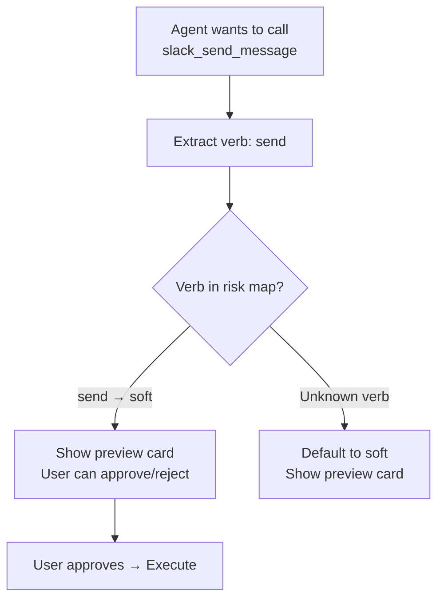
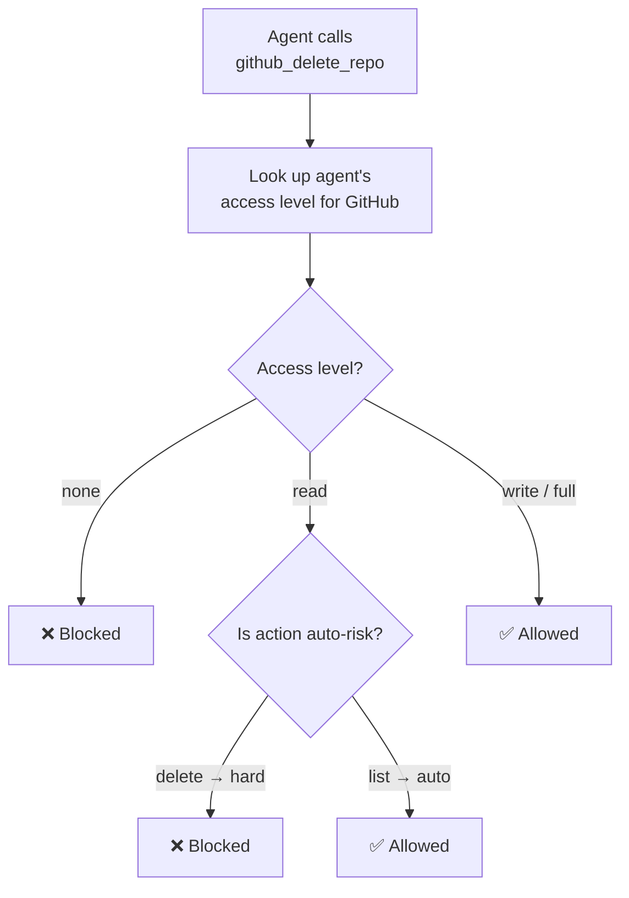

# Integration Guardrails

When agents interact with third-party services (Slack, GitHub, Gmail, Stripe, etc.), guardrails ensure they can't take destructive actions without oversight, exceed rate limits, or operate outside their assigned permissions.

<Note>
Guardrails are enforced at the **engine level** — they apply to all channels, all agents, and all integration methods (MCP Bridge, REST API, and direct tool calls).
</Note>

---

## Action Risk Classification

Every integration action is classified by its verb into one of three risk levels:

| Risk Level | Behavior | Example Verbs |
|------------|----------|---------------|
| **Auto** | Executed immediately, no approval needed | `list`, `get`, `search`, `read`, `fetch`, `count`, `check` |
| **Soft** | Preview card shown before execution | `send`, `create`, `update`, `post`, `comment`, `assign`, `move`, `upload`, `pin` |
| **Hard** | Explicit confirmation dialog required | `delete`, `remove`, `archive`, `close`, `bulk_send`, `transfer`, `modify_billing`, `revoke` |

### How classification works

The engine scans the action verb for known keywords. The first matching verb determines the risk level. If no known verb is found, the action defaults to **soft** (preview required) — erring on the side of caution.



### Risk metadata

Each risk level carries UI metadata for consistent display:

| Level | Icon | Label | Color |
|-------|------|-------|-------|
| Auto | `check_circle` | Auto-approved | Green |
| Soft | `visibility` | Preview | Yellow |
| Hard | `warning` | Confirm | Red |

---

## Rate Limits

Per-service rate limits prevent runaway agents from spamming APIs. Each service has a configured maximum number of actions within a sliding time window.

### Default limits

| Service | Max Actions | Window |
|---------|------------|--------|
| Slack | 30 | 15 min |
| Discord | 30 | 15 min |
| Telegram | 30 | 15 min |
| Gmail | 10 | 15 min |
| SendGrid | 10 | 15 min |
| GitHub | 20 | 15 min |
| Jira | 20 | 15 min |
| Linear | 20 | 15 min |
| HubSpot | 20 | 15 min |
| Salesforce | 20 | 15 min |
| Trello | 20 | 15 min |
| Notion | 20 | 15 min |
| Google Sheets | 30 | 15 min |
| Shopify | 15 | 15 min |
| Stripe | 10 | 15 min |
| Twilio | 15 | 15 min |
| Zendesk | 20 | 15 min |
| **Other** | 50 | 15 min |

<Tip>
Unlisted services fall back to the generic limit of **50 actions per 15 minutes**. You can override limits per-service in Settings.
</Tip>

### How rate limiting works

The engine tracks actions per service in a sliding window:

1. Each action increments the service counter
2. If the counter exceeds `maxActions`, the action is **blocked**
3. The window resets automatically after `windowMinutes`
4. You can manually reset a service's window (e.g., after resolving an issue)

### Rate limit response

When an agent hits a rate limit, it receives:

```json
{
  "allowed": false,
  "remaining": 0,
  "limit": 30
}
```

The agent is informed that the action was blocked and how many actions remain in the current window.

---

## Agent Service Permissions

Each agent can be assigned a specific **access level** per integration service, controlling what kinds of actions it's allowed to perform.

### Access levels

| Level | Can Do | Icon |
|-------|--------|------|
| **None** | Nothing — service is completely blocked | `block` |
| **Read** | Only auto-risk actions (list, get, search, read) | `visibility` |
| **Write** | All actions including reads, writes, and deletes | `edit` |
| **Full** | Everything — no restrictions at all | `admin_panel_settings` |

### How permissions are checked



<Tip>
Set research agents to **Read** access and action agents to **Write**. Reserve **Full** access for your primary agent.
</Tip>

---

## Dry-Run Plans

Before executing multi-step integration workflows, agents can generate a **dry-run plan** that shows every action they intend to take — with risk levels, targets, and previews.

### Plan structure

| Field | Description |
|-------|-------------|
| **Steps** | Ordered list of actions the agent will take |
| **Service** | Which integration each step targets |
| **Action** | The specific action (e.g., `send_message`, `delete_repo`) |
| **Target** | What the action operates on (e.g., `#general`, `my-repo`) |
| **Risk** | Auto / Soft / Hard classification |
| **Preview** | Optional human-readable description of the action |

### Automatic confirmation required

A plan requires explicit user confirmation when:

- **Any step is hard-risk** (delete, archive, transfer, etc.)
- **The plan has more than 3 steps** (regardless of risk levels)

This prevents agents from silently executing long chains of actions.

### Example plan

```
Plan: Deploy notification pipeline
─────────────────────────────────
1. [auto]  GitHub   → list_repos      → org/backend        "List repos"
2. [soft]  GitHub   → create_issue    → org/backend #142   "Create deploy tracking issue"
3. [soft]  Slack    → send_message    → #deployments       "Notify team"
4. [hard]  GitHub   → archive         → org/backend-old    "Archive legacy repo"

⚠️ This plan requires confirmation (contains hard-risk action)
```

---

## Credential Audit Log

Every integration action is logged to an audit trail for security review and compliance:

| Field | Description |
|-------|-------------|
| **Timestamp** | When the action was executed |
| **Agent** | Which agent performed the action |
| **Service** | Target integration service |
| **Action** | The specific action taken |
| **Access Level** | The agent's permission level at execution time |
| **Approved** | Whether the action was approved (via HIL or auto) |
| **Result** | `success`, `denied`, or `failed` |

---

## Related

- [Security](/reference/security) — full defense-in-depth overview
- [Integrations](/guides/integrations) — how integrations work
- [MCP Bridge](/guides/mcp-bridge) — 25,000+ tools via n8n
