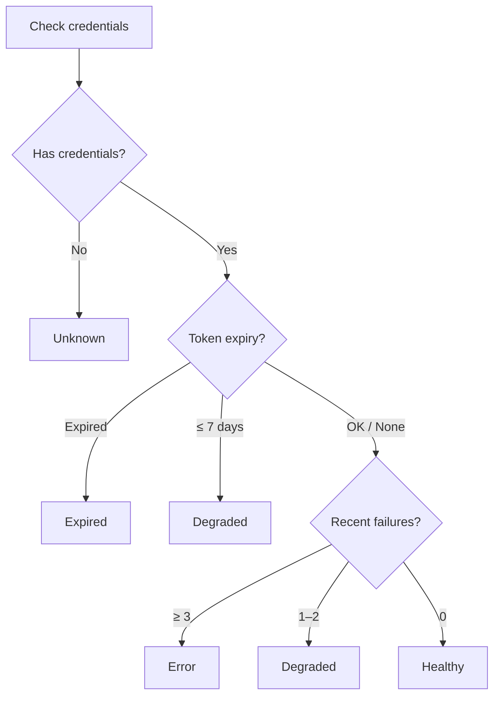

# Integration Health

The Integration Health system monitors all your connected services in real time — tracking connection status, token expiry, failure rates, and generating smart suggestions to keep everything running smoothly.

---

## Health Status

Each connected integration reports one of five statuses:

| Status | Icon | Color | Meaning |
|--------|------|-------|---------|
| **Healthy** | `check_circle` | Green | Connected and working normally |
| **Degraded** | `warning` | Yellow | Working but experiencing issues (token expiring soon, occasional failures) |
| **Error** | `error` | Red | Multiple recent failures — likely broken |
| **Expired** | `lock_clock` | Red | OAuth token or API key has expired |
| **Unknown** | `help` | Gray | No credentials configured |

### How status is determined

The engine derives health status automatically from three signals:

| Signal | Threshold | Result |
|--------|-----------|--------|
| No credentials | — | Unknown |
| Token expired | ≤ 0 days | Expired |
| Token expiring soon | ≤ 7 days | Degraded |
| Frequent failures | ≥ 3 recent | Error |
| Occasional failures | 1–2 recent | Degraded |
| All clear | — | Healthy |

<Tip>
Token expiry takes priority over failure count. If a token is expired, the status is always **Expired** regardless of failure count.
</Tip>

---

## Health Summary

The dashboard displays an aggregated health summary across all connected integrations:

| Metric | Description |
|--------|-------------|
| **Total** | Number of connected integrations |
| **Healthy** | Services operating normally |
| **Degraded** | Services with warnings |
| **Error** | Services with persistent failures |
| **Expired** | Services with expired credentials |
| **Needs Attention** | List of degraded, error, and expired services |

### Dashboard view

The Today view shows a compact health bar at the top. Services that need attention are highlighted with their status icon and a brief description of the issue.

---

## Token Expiry Tracking

For integrations using OAuth tokens, OpenPawz tracks expiry dates and warns you before they expire.

| Days Until Expiry | Action |
|-------------------|--------|
| > 7 days | No warning — status remains Healthy |
| ≤ 7 days | Status moves to **Degraded** — re-auth reminder shown |
| ≤ 0 days (expired) | Status moves to **Expired** — integration stops working |

<Note>
Not all integrations have token expiry. API key–based services (like GitHub personal access tokens or Stripe API keys) don't expire automatically — their status is based solely on failure count.
</Note>

---

## Smart Suggestions

When integrations are connected, OpenPawz generates contextual suggestions on the Today view to help you get started each day.

### Available suggestions

| Service | Suggestion | Action |
|---------|-----------|--------|
| **Gmail** | "You have unread emails — want me to summarize them?" | Summarize inbox |
| **Slack** | "Check your Slack messages and mentions" | Check Slack |
| **GitHub** | "Review assigned issues and open PRs" | Check GitHub |
| **HubSpot** | "Check your sales pipeline and deals" | View deals |
| **Trello** | "Check for stale cards on your boards" | Review boards |
| **Jira** | "Review your assigned tickets" | Check Jira |

Suggestions are capped at **3 per session** to avoid information overload. They're generated from your connected services — disconnected services don't generate suggestions.

---

## Service Health Data

Each integration tracks the following metrics:

| Field | Description |
|-------|-------------|
| **Service** | Integration identifier (e.g., `slack`, `github`) |
| **Status** | Current health status |
| **Last Checked** | When the service was last verified |
| **Token Expiry** | OAuth token expiry date (if applicable) |
| **Days Until Expiry** | Countdown to token expiry |
| **Recent Failures** | Number of failed actions in the recent window |
| **Today's Actions** | Successful actions executed today |
| **Message** | Optional status message (e.g., error details) |

---

## Chain Rules

Chain rules let you create automated follow-up actions when specific integration events occur. For example: "When a GitHub issue is created, post a message to Slack."

### Rule structure

| Field | Description |
|-------|-------------|
| **Trigger** | Service + action that starts the chain (e.g., `github:create_issue`) |
| **Then** | Service + action to execute (e.g., `slack:send_message`) |
| **Parameters** | Optional parameters for the follow-up action |
| **Enabled** | Toggle the rule on/off |

### Example chains

| Trigger | Then | Description |
|---------|------|-------------|
| `github:create_issue` | `slack:send_message` → `#dev` | Notify team when issues are created |
| `gmail:receive_email` | `trello:create_card` | Auto-create tasks from emails |
| `stripe:payment_received` | `slack:send_message` → `#revenue` | Revenue notifications |

<Tip>
Chain rules are a lightweight alternative to full n8n workflows. Use them for simple "if-this-then-that" automation. For complex multi-step flows, use the [n8n integration](/guides/n8n) instead.
</Tip>

---

## Related

- [Integration Guardrails](/guides/integration-guardrails) — risk classification and rate limits
- [Integrations](/guides/integrations) — how to install and configure integrations
- [Security](/reference/security) — credential encryption and access control
