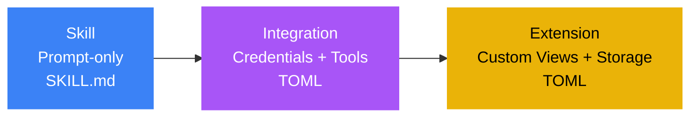
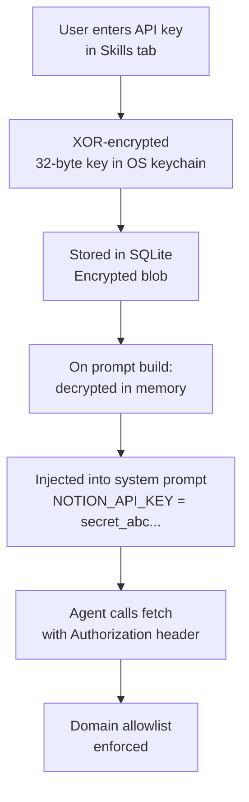

# Integrations

Integrations are the second tier of the Pawz extensibility system. They connect your agents to third-party APIs and CLI tools with full credential management, binary detection, and optional dashboard widgets. The 40 built-in integrations are compiled into the Rust binary. Community integrations can be installed via TOML manifests from PawzHub or manually from `~/.paw/skills/`.



**Integrations vs. Skills**: A [Skill](/docs/guides/skills) is a SKILL.md file that injects instructions into an agent's prompt — zero config. An Integration is a `pawz-skill.toml` file that additionally declares **credentials** (encrypted in the vault), **required binaries** (auto-detected), and optional **dashboard widgets**.

---

## How Integrations Work

1. **Author** creates a `pawz-skill.toml` manifest declaring what the integration does, what credentials it needs, and how the agent should use it
2. **Install** via PawzHub (in-app browser) or manually into `~/.paw/skills/{id}/`
3. **Configure** credentials in the **Skills** tab — Pawz generates the input form automatically from the manifest
4. **Assign to agents** — open the **Agents** tab, select an agent, and enable the integration in their Skills sub-tab
5. **Use** — the agent receives decrypted credentials and instructions in its system prompt, then calls APIs via `fetch` or CLI tools via `exec`



---

## The Manifest Format

Every integration is a single `pawz-skill.toml` file:

```toml
[skill]
id = "notion"
name = "Notion"
version = "1.0.0"
author = "yourname"
category = "productivity"
icon = "edit_note"
description = "Read and write Notion pages, databases, and blocks via the API"
install_hint = "Get your API key at https://www.notion.so/my-integrations"

[[credentials]]
key = "NOTION_API_KEY"
label = "Integration Token"
description = "Your Notion internal integration token"
required = true
placeholder = "secret_..."

[instructions]
text = """
You have access to the Notion API via the user's integration token.

## Reading pages
Use `fetch` with:
- URL: `https://api.notion.so/v1/pages/{page_id}`
- Headers: `Authorization: Bearer {NOTION_API_KEY}`, `Notion-Version: 2022-06-28`

## Searching
Use `fetch` with POST to `https://api.notion.so/v1/search`
Body: {"query": "search term"}
"""

[widget]
type = "table"
title = "Recent Pages"
refresh = "10m"

[[widget.fields]]
key = "title"
label = "Page"
type = "text"

[[widget.fields]]
key = "updated"
label = "Last Updated"
type = "datetime"

[[widget.fields]]
key = "status"
label = "Status"
type = "badge"
```

### Manifest Fields

#### `[skill]` — Required

| Field | Type | Required | Description |
|-------|------|----------|-------------|
| `id` | string | ✓ | Unique identifier. Alphanumeric + hyphens only. |
| `name` | string | ✓ | Display name. |
| `version` | string | ✓ | Semver version (e.g. `1.0.0`). |
| `author` | string | ✓ | Author name or GitHub username. |
| `category` | string | ✓ | One of: `vault`, `cli`, `api`, `productivity`, `media`, `smart_home`, `communication`, `development`, `system`. |
| `icon` | string | — | Material Symbols icon name (e.g. `edit_note`). |
| `description` | string | ✓ | Short description (10–500 chars). |
| `install_hint` | string | — | Instructions for getting credentials. |

#### `[[credentials]]` — Optional, repeatable

Declare API keys, tokens, or secrets the integration requires. Users enter these in the Skills tab. Pawz encrypts them with XOR (32-byte random key in the OS keychain) and injects decrypted values into the agent's system prompt at runtime.

| Field | Type | Required | Description |
|-------|------|----------|-------------|
| `key` | string | ✓ | Env var name (e.g. `NOTION_API_KEY`). |
| `label` | string | ✓ | UI label shown to the user. |
| `description` | string | — | Help text for where to find this credential. |
| `required` | bool | ✓ | Whether the integration works without it. |
| `placeholder` | string | — | Example value in the input field. |

:::info Credential Security
Credentials are never stored in plain text. They are encrypted in SQLite using XOR with a 32-byte random key stored in your OS keychain (service: `paw-skill-vault`). Decrypted values exist only in the agent's system prompt at runtime — never logged, never written to disk unencrypted, never transmitted externally. An AES-GCM upgrade is planned.
:::

#### `[instructions]` — Required

| Field | Type | Required | Description |
|-------|------|----------|-------------|
| `text` | string | ✓ | Agent instructions. |

The instructions tell the agent which endpoints to call, which CLI commands to run, how to authenticate, how to parse responses, and how to handle errors. At runtime, the engine appends a credentials block:

```
Credentials (use these values directly — do NOT ask the user for them):
- NOTION_API_KEY = secret_abc123...
```

#### `[widget]` — Optional

Declare a dashboard widget for persistent visual output on the Today/Dashboard view.

| Field | Type | Required | Description |
|-------|------|----------|-------------|
| `type` | string | ✓ | `status`, `metric`, `table`, `log`, or `kv`. |
| `title` | string | ✓ | Widget card title. |
| `refresh` | string | — | Auto-refresh interval (e.g. `5m`, `1h`). |

See [Widget Types](#widget-types) for examples of each type.

---

## Widget Types

Integrations can declare a dashboard widget to display persistent structured data. The widget card appears on the Dashboard alongside weather, tasks, and quick actions.

### Status

Single status indicator — service health, connection state, on/off checks.

```toml
[widget]
type = "status"
title = "Server Status"

[[widget.fields]]
key = "status"
label = "State"
type = "badge"

[[widget.fields]]
key = "uptime"
label = "Uptime"
type = "percentage"
```

### Metric

Single large number with trend — KPIs, revenue, counts.

```toml
[widget]
type = "metric"
title = "Monthly Revenue"

[[widget.fields]]
key = "value"
label = "MRR"
type = "currency"

[[widget.fields]]
key = "change"
label = "vs Last Month"
type = "percentage"
```

### Table

Rows of structured data — issues, deployments, records.

```toml
[widget]
type = "table"
title = "Active Issues"

[[widget.fields]]
key = "title"
label = "Issue"
type = "text"

[[widget.fields]]
key = "priority"
label = "Priority"
type = "badge"
```

### Log

Chronological event feed — incidents, messages, activity.

```toml
[widget]
type = "log"
title = "Recent Incidents"

[[widget.fields]]
key = "message"
label = "Event"
type = "text"

[[widget.fields]]
key = "severity"
label = "Level"
type = "badge"
```

### Key-Value (KV)

Key-value pairs — stats, config summaries, metadata.

```toml
[widget]
type = "kv"
title = "Project Stats"

[[widget.fields]]
key = "total_records"
label = "Records"
type = "number"

[[widget.fields]]
key = "storage_used"
label = "Storage"
type = "text"
```

### Field Types

| Type | Rendering | Example |
|------|-----------|---------|
| `text` | Plain text | "Deploy to production" |
| `number` | Locale-formatted | "1,234,567" |
| `badge` | Colored pill (green/yellow/red) | "Active" |
| `datetime` | Relative time | "2 hours ago" |
| `percentage` | Progress bar + number | "94.5%" |
| `currency` | Dollar symbol + formatted | "$12,450.00" |

---

## Built-in Integrations

Pawz ships with **40 built-in integrations** across 9 categories. These are compiled into the binary and cannot be uninstalled — only enabled or disabled per agent.

| Category | Count | Examples |
|----------|-------|---------|
| **Vault** | 10 | Email, Slack, GitHub, Coinbase, DEX Trading, Solana DEX |
| **API** | 4 | Notion, Trello, Google Workspace, Google Places |
| **CLI** | 3 | Weather, Blog Watcher, Summarize |
| **Productivity** | 5 | Apple Notes, Reminders, Things 3, Obsidian, Bear Notes |
| **Media** | 7 | Whisper, Image Gen, Video Frames, ElevenLabs, Spotify, GIF Search |
| **Smart Home** | 4 | Philips Hue, Sonos, Eight Sleep, Camera Capture |
| **Communication** | 2 | WhatsApp, iMessage |
| **Development** | 2 | tmux, Session Logs |
| **System** | 3 | 1Password, Peekaboo, Security Audit |

See the full catalog in [Skills](/docs/guides/skills#skill-categories).

---

## Per-Agent Scoping

Integrations are scoped to specific agents. When you install a community integration, you assign it to one or more agents.

- A **Marketing Agent** might have Notion, SendGrid, and X/Twitter integrations enabled
- A **DevOps Agent** might have GitHub, Vercel, and Cloudflare enabled
- A **Trading Agent** might have Coinbase and DEX Trading enabled

Each agent only receives the instructions and credentials for its own assigned integrations. This prevents prompt bloat and keeps each agent focused on its domain.

### Assigning integrations to agents

Skill and integration assignment is managed from the **Agents** tab, not from the Skills view:

1. Open the **Agents** tab in the sidebar
2. Select an agent (e.g. your Marketing Agent)
3. Go to the agent's **Skills** sub-tab
4. Enable or disable individual skills and integrations for that agent
5. Only enabled items are injected into that agent's prompt

---

## Installing Integrations

### From PawzHub (In-App)

1. Open the **Skills** tab in the sidebar
2. Search or browse the PawzHub catalog
3. Click **Install** on any integration (look for the 🟣 purple badge)
4. Configure credentials in the auto-generated form
5. Assign to agents via **Agents → [agent] → Skills**

### Manual Install

Place a `pawz-skill.toml` file in the skills directory:

```
~/.paw/skills/{skill-id}/pawz-skill.toml
```

For example:

```
~/.paw/skills/notion/pawz-skill.toml
~/.paw/skills/linear/pawz-skill.toml
~/.paw/skills/stripe/pawz-skill.toml
```

Pawz hot-reloads the skill directory — the integration appears in the Skills tab with a purple "Integration" badge.

### Uninstalling

Click **Uninstall** in the Skills tab. This removes the skill folder from `~/.paw/skills/`, cleans up stored credentials, and removes enabled state.

---

## Creating Integrations

### In-App Wizard

The **Create Skill** wizard in the Skills tab walks you through building an integration without writing TOML by hand:

1. **Basic Info** — name, category, icon, description
2. **Credentials** — add API key fields with labels and placeholders
3. **Instructions** — write or paste agent instructions (templates available for REST APIs, CLI tools, and web scrapers)
4. **Widget** — optionally declare dashboard output
5. **Test** — enable the integration and verify it works with a live agent
6. **Publish** — save locally, export TOML, or publish directly to PawzHub

### AI-Assisted Creation

Ask your agent:

> "Create an integration for the Linear API"

The agent fetches the API docs, generates a complete `pawz-skill.toml` with endpoints, auth headers, and instructions, then pre-fills the wizard for review.

### Template Starters

- **REST API** — `fetch` calls with auth headers, JSON parsing
- **CLI Tool** — `exec` commands with flag reference and binary detection
- **Web Scraper** — `fetch` + HTML parsing instructions

---

## Publishing to PawzHub

1. **Fork** the [`elisplash/pawzhub`](https://github.com/elisplash/pawzhub) repository
2. **Create** `skills/{your-skill-id}/pawz-skill.toml`
3. **Open a Pull Request** — CI validates your manifest automatically
4. **Maintainer reviews** and merges
5. Your integration appears in the in-app PawzHub browser

### CI Validation

| Check | Description |
|-------|-------------|
| Valid TOML | Syntax correct, required fields present |
| Unique ID | No collision with existing skills |
| Valid category | Must be an allowed category |
| Safe ID format | Alphanumeric + hyphens (no path traversal) |
| Semver version | `X.Y.Z` format |
| Description length | 10–500 characters |
| Widget validation | Field types match allowed values |
| Instruction-only | No executable code patterns |

---

## Security

### What integrations can do
- Inject instructions into the agent's system prompt
- Declare credential fields (encrypted by the engine)
- Declare widget schemas (rendered by the app)

### What integrations cannot do
- Execute arbitrary Rust code
- Bypass domain allowlist/blocklist
- Access the OS keychain directly
- Read engine source code
- Install blocked packages
- Run unsandboxed commands when Docker sandbox is enabled

### Runtime protections

| Layer | Protection |
|-------|-----------|
| **Credentials** | XOR-encrypted, 32-byte key in OS keychain |
| **Network** | Domain allowlist/blocklist on every `fetch` |
| **Shell** | Docker sandbox routing when enabled |
| **File system** | Engine source read-blocked |
| **Packages** | Blocked package list on `exec` |
| **Agent isolation** | Per-agent working directories |

---

## Readiness Check

Each integration card in Settings shows a status indicator:

| Status | Meaning |
|--------|---------|
| **Ready** ✅ | All credentials provided, binaries detected |
| **Missing credentials** ⚠️ | API keys needed — click to configure |
| **Missing binary** ⚠️ | CLI tool not on PATH — install hint shown |
| **Disabled** 🔘 | Integration is off for this agent |
