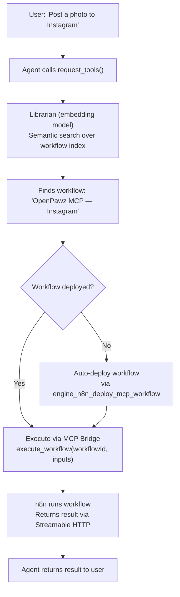
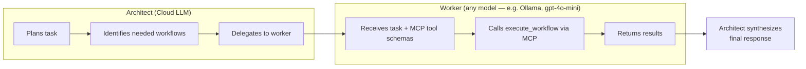

# MCP Bridge — Zero-Gap Automation

OpenPawz ships with 400+ native integrations compiled into the Rust binary. The **MCP Bridge** extends this to **25,000+** by embedding an n8n engine and connecting to it via the Model Context Protocol (MCP). Your agents discover, install, and execute any of n8n's community packages — automatically, at runtime, with zero configuration.

<Note>
This is the feature that makes OpenPawz the most connected AI agent platform in existence. No other tool — open source or commercial — offers this level of integration coverage.
</Note>

---

## How It Works



The flow is fully automatic. The user just asks for what they need — the agent figures out which workflow to use, deploys it if necessary, and executes it.

---

## Architecture

The MCP Bridge has four layers:

### 1. Embedded n8n Engine

n8n is auto-provisioned at app launch with zero user configuration:

| Method | How | When |
|--------|-----|------|
| **Docker** (preferred) | `bollard` crate manages a container with port 5678 mapped | Docker detected on system |
| **npx** (fallback) | `npx n8n start` as a child process | No Docker available |

The engine starts 8 seconds after app launch in a background thread. Health checks run before every MCP operation via `lazy_ensure_n8n()`.

### 2. MCP Transport — Streamable HTTP

n8n's MCP server uses **Streamable HTTP** at `/mcp-server/http`. This was confirmed working with n8n MCP Server v1.0.0 (protocol version `2024-11-05`).

| Detail | Value |
|--------|-------|
| **Endpoint** | `POST /mcp-server/http` |
| **Auth** | `Authorization: Bearer <mcp-api-key-jwt>` |
| **Accept** | `application/json, text/event-stream` |
| **Content-Type** | `application/json` |
| **Response format** | SSE (`event: message\ndata: {json}\n\n`) |

The transport is implemented in `transport.rs` alongside Stdio and legacy SSE transports.

### 3. n8n MCP Tools — Workflow-Level Operations

n8n's MCP server exposes **three workflow-level tools** — not individual node operations. This is the key architectural insight:

| MCP Tool | Purpose | Parameters |
|----------|---------|------------|
| `search_workflows` | Find workflows by name or description | `query`, `limit`, `projectId` |
| `execute_workflow` | Run a workflow with typed inputs | `workflowId`, `chatInput` / `formData` / `webhookData` |
| `get_workflow_details` | Inspect a workflow's nodes, triggers, and connections | `workflowId` |

The `execute_workflow` tool supports three input types:

| Input Type | When Used | Fields |
|-----------|-----------|--------|
| **Chat** | Workflows with a chat trigger | `chatInput` (string) |
| **Form** | Workflows with a form trigger | `formData` (key-value object) |
| **Webhook** | Workflows with a webhook trigger | `method`, `query`, `body`, `headers` |

n8n also declares `listChanged: true` capability — the server notifies when new workflows appear.

### 4. Workflow-First Integration

When an agent needs to use a community package (e.g. Instagram, Puppeteer):

1. The community package is installed inside the n8n container via npm
2. n8n restarts and loads the new node types
3. Paw **auto-deploys a workflow** via `engine_n8n_deploy_mcp_workflow` — e.g. "OpenPawz MCP — Instagram"
4. The workflow becomes executable through `execute_workflow(workflowId, inputs)`
5. The Librarian indexes the new workflow for semantic discovery

This is fundamentally different from exposing individual node types as MCP tools. Workflows are composable — a single workflow can chain multiple nodes (credential binding, error handling, retries, data transformation) into one coherent operation.

---

## The Architect/Worker Pattern

Cloud LLMs (Gemini, Claude, GPT) act as **Architects** — they plan and orchestrate. A cheaper **Worker** model executes MCP tool calls at reduced cost (or zero cost if running locally on Ollama). This is wired directly into the main chat loop: every MCP tool call from your cloud AI is automatically intercepted and delegated to the worker. Any model from any provider can serve as the Worker — local Ollama is recommended for zero-cost execution.



| Role | Model | Cost | Purpose |
|------|-------|------|---------|
| **Architect** | Gemini / Claude / GPT | Per-token | Planning, reasoning, user interaction |
| **Worker** | Any cheaper model (e.g. Ollama `worker-qwen`, or cloud `gpt-4o-mini`) | $0 local / low cloud | MCP tool execution, structured I/O |
| **Librarian** | Any embedding model (e.g. Ollama `nomic-embed-text`, or cloud embedding API) | $0 local / low cloud | Semantic workflow discovery (embeddings) |

### How It Works in Practice

When you say *"Send a message to #general on Slack"*:

1. **Architect** (Gemini/Claude) decides to call `execute_workflow` for the Slack messaging workflow
2. The engine **intercepts** the MCP tool call before execution
3. **Worker** (local Ollama, free) receives the task and the MCP tool schemas
4. Worker calls `execute_workflow(workflowId, webhookData)` via MCP → n8n executes the workflow → Slack API
5. Result flows back: Worker → Engine → Architect → User

The Architect never touches the MCP layer directly. The Worker doesn't need pre-built knowledge of Slack, Trello, or any integration — MCP provides the tool schemas, and each workflow encapsulates the integration logic.

<Note>
**This is the breakthrough:** The worker model doesn't need to know how to use 25,000+ integrations. n8n's MCP server is self-describing — it tells the worker what workflows are available and how to execute them. Any new workflow Paw deploys is instantly discoverable and executable with zero configuration, zero training, zero cost.
</Note>

### Fallback Behavior

If no `worker_model` is configured in **Settings → Models → Model Routing**, MCP tool calls fall back to direct JSON-RPC execution (the engine calls MCP servers directly). This still works but means the Architect model handles tool call formatting, costing more tokens.

### Setup (Ollama — Zero Cost)

1. Install Ollama and pull the base model: `ollama pull qwen2.5-coder:7b`
2. Go to **Settings → Advanced → Ollama** and click **Setup Worker Agent**
3. In **Settings → Models → Model Routing**, set `worker_model` to `worker-qwen`
4. That's it — all MCP tool calls now route through the free local worker

### Setup (Cloud — Any Provider)

1. Go to **Settings → Models → Model Routing**
2. Set your Worker Model to any cheap model (e.g. `gpt-4o-mini`, `gemini-2.0-flash`, `claude-haiku-4-5`)
3. All MCP tool calls now route through the cloud worker at a fraction of the Architect's cost

---

## What Can Agents Do?

With the MCP Bridge, your agents can access any service that has an n8n community package — via auto-deployed workflows. Here are some examples that require **no API keys**:

| Category | Examples |
|----------|----------|
| **Data Processing** | QR code generation, PDF creation, CSV parsing, JSON transformation |
| **Utilities** | UUID generation, hash computation, date/time conversion, regex matching |
| **Format Conversion** | Markdown → HTML, XML → JSON, image resize, base64 encode/decode |

And with API keys configured in n8n:

| Category | Examples |
|----------|----------|
| **CRM** | Salesforce, HubSpot, Pipedrive, Zoho, Freshdesk |
| **Project Management** | Jira, Asana, Monday.com, ClickUp, Basecamp |
| **Communication** | Twilio, SendGrid, Mailgun, Vonage, Intercom |
| **Analytics** | Google Analytics, Mixpanel, Amplitude, Segment |
| **Cloud** | AWS S3, Google Cloud Storage, Azure Blob, DigitalOcean Spaces |
| **Databases** | Airtable, Supabase, Firebase, FaunaDB, CockroachDB |
| **E-commerce** | Shopify, WooCommerce, Stripe, Square, PayPal |
| **Social Media** | Twitter/X, LinkedIn, Facebook, Instagram, TikTok |
| **DevOps** | PagerDuty, Datadog, New Relic, Sentry, Grafana |
| **AI Services** | OpenAI, Anthropic, Hugging Face, Replicate, Stability AI |

---

## All Five Directions

The workflow-first architecture supports every integration pattern:

| Direction | How | Example |
|-----------|-----|---------|
| **Forward** | Agent → `execute_workflow` → external service | "Send a Slack message" |
| **Backward** | n8n trigger → webhook → agent | Incoming email triggers agent response |
| **Bidirectional** | Read + write in same conversation | Read Jira tickets, then update them |
| **Single-use** | Agent builds an ephemeral workflow on the fly | One-time data migration |
| **Flows** | Conductor orchestrates multi-workflow chains | Daily report → email → Slack summary |

---

## Setup

The MCP Bridge requires **zero configuration** for basic operation. Everything is auto-provisioned.

### Prerequisites

| Requirement | Required? | Purpose |
|-------------|-----------|---------|
| **Docker** | Recommended | Preferred n8n runtime (container isolation) |
| **Node.js 18+** | Fallback | Used if Docker is not available (`npx n8n start`) |
| **Ollama** | Recommended | Local worker model + embedding model (zero cost). Not required if using cloud models for both roles. |

### Ollama Models (Recommended for Zero Cost)

If using Ollama locally, three models power the system:

```bash
# Worker model — executes MCP tool calls
ollama pull qwen2.5-coder:7b

# Embedding model — semantic workflow discovery + memory
ollama pull nomic-embed-text

# Chat fallback — default offline chat model
ollama pull llama3.2:3b
```

### Verify It's Working

After launching OpenPawz, check the logs for:

```
[n8n] Starting embedded n8n engine...
[mcp] Auto-registering n8n as MCP server at http://127.0.0.1:5678/mcp-server/http
[mcp:http] Connected to n8n MCP — protocol 2024-11-05
[mcp:http] Available tools: search_workflows, execute_workflow, get_workflow_details
```

You can also check n8n status in **Settings → Advanced → n8n Engine**.

---

## Community Node Browser

OpenPawz includes a built-in **Community Browser** UI for discovering n8n community packages:

1. Open **Settings → Advanced → Community Nodes**
2. Search the n8n community registry
3. Click **Install** to add a package
4. Paw auto-deploys a workflow for the new node type and refreshes the MCP tool list

Alternatively, agents can discover and install packages conversationally:

> "I need to generate QR codes"
>
> *Agent searches community nodes, finds the QR code package, installs it, deploys a workflow, and generates the QR code — all in one conversation.*

---

## vs. Zapier / Make / n8n Standalone

| | **OpenPawz MCP Bridge** | **Zapier** | **Make** | **n8n (standalone)** |
|---|---|---|---|---|
| **Integrations** | 25,000+ | 7,000+ | 2,000+ | 400+ built-in |
| **AI-driven** | Agents discover & execute workflows | Manual setup | Manual setup | Manual setup |
| **Auto-deploy** | Workflows created at runtime | Pre-configured | Pre-configured | Manual workflow building |
| **Cost** | $0 local / low cloud | $20–600/mo | $9–300/mo | Free (self-hosted) |
| **Natural language** | "Post a photo to Instagram" | Drag-and-drop | Drag-and-drop | Drag-and-drop |
| **Privacy** | 100% local | Cloud | Cloud | Self-hosted option |
| **Multi-agent** | Yes | No | No | No |

---

## Troubleshooting

| Problem | Solution |
|---------|----------|
| n8n not starting | Check Docker is running (`docker ps`) or Node.js 18+ is available (`node --version`) |
| MCP 403 "access is disabled" | Paw auto-enables MCP via `PATCH /rest/mcp/settings`. If manual, ensure `mcpAccessEnabled: true`. |
| MCP 406 "must accept both" | The transport must send `Accept: application/json, text/event-stream`. Check transport config. |
| "No MCP tools available" | Run `mcp_refresh` or restart the app. Check that n8n is healthy at `http://localhost:5678`. |
| Community package install fails | Ensure n8n has network access. Check container logs: `docker logs paw-n8n`. |
| Workflow not found after install | The auto-deploy step may have failed. Check logs for `engine_n8n_deploy_mcp_workflow` errors. |
| Worker model not found | If using Ollama, run `ollama pull qwen2.5-coder:7b`. Otherwise, configure any model as the worker in Settings → Models → Model Routing. |

---

## Security

- n8n runs **locally** — no cloud relay, no data leaves your machine
- Community packages are installed from the **official npm registry**
- MCP transport uses **localhost-only** connections (127.0.0.1:5678)
- MCP auth uses a **JWT with `mcp-server-api` audience** — separate from the REST API key
- All tool calls go through OpenPawz's **Human-in-the-Loop approval** system
- Credential injection for n8n nodes uses the same **AES-256-GCM encrypted vault**
- The MCP Bridge inherits all 10 security layers from the core platform
