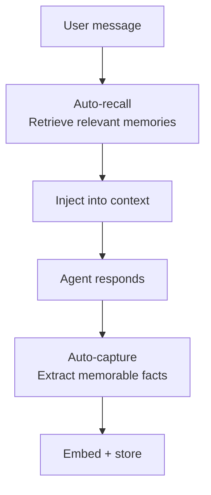

# Memory

Pawz has a built-in memory system that lets agents remember facts, preferences, and context across conversations.

## How it works



## Configuration

Go to **Settings → Sessions** to configure memory:

| Setting | Default | Description |
|---------|---------|-------------|
| **Embedding model** | `nomic-embed-text` | Model used to create vector embeddings |
| **Embedding base URL** | `http://localhost:11434` | Ollama endpoint for embeddings |
| **Embedding dimensions** | 768 | Vector size (match your model) |
| **Auto-recall** | On | Automatically retrieve relevant memories |
| **Auto-capture** | On | Automatically extract facts from conversations |
| **Recall limit** | 5 | Max memories injected per message |
| **Recall threshold** | 0.3 | Minimum relevance score (0–1) |

## Memory categories

Each memory is tagged with a category:

| Category | Use case |
|----------|----------|
| `general` | Catch-all |
| `preference` | User likes/dislikes, style preferences |
| `instruction` | Standing orders, rules |
| `context` | Background information |
| `fact` | Concrete facts, dates, numbers |
| `project` | Project-specific context |
| `person` | Info about people |
| `technical` | Technical details, tools, configs |

## Hybrid search

Memory retrieval uses a hybrid algorithm combining multiple signals:

1. **BM25** — text relevance via SQLite FTS5
2. **Vector cosine similarity** — semantic meaning via embeddings
3. **Weighted merge** — BM25 (0.4) + vector (0.6)
4. **Temporal decay** — half-life of 30 days (recent memories rank higher)
5. **MMR re-ranking** — λ=0.7 balances relevance vs. diversity
6. **Keyword fallback** — when both BM25 and vector search return no results, the engine falls back to a keyword search using SQL `LIKE` on memory content. This ensures memories can always be found even when embeddings are unavailable or the FTS index misses a match.

:::tip Keyword fallback
The keyword fallback is automatic — you don't need to configure anything. If semantic search and BM25 both return empty results for a query, Pawz transparently retries with a simple substring match so you never get a false "no results found."
:::

### Tuning search

In the Memory Palace, you can adjust:

| Parameter | Default | Effect |
|-----------|---------|--------|
| BM25 weight | 0.4 | Text match importance |
| Vector weight | 0.6 | Semantic match importance |
| Decay half-life | 30 days | How fast old memories fade |
| MMR lambda | 0.7 | 1.0 = pure relevance, 0.0 = max diversity |
| Threshold | 0.3 | Minimum score to include |

## Memory Palace

The Memory Palace is a dedicated view for managing all stored memories. It is organized into four tabs:

### Tabs

| Tab | Purpose |
|-----|-------|
| **Recall** | Semantic search interface — enter a natural-language query and view ranked results with relevance scores |
| **Remember** | Manual memory creation form — set content, category, and importance then save |
| **Graph** | Force-directed graph visualization of memory relationships, grouped by category with color-coded bubbles sized by importance |
| **Files** | Browse agent personality files (`IDENTITY.md`, `SOUL.md`, etc.) stored on disk |

#### Recall

Type a query into the search box and press **Enter** (or click the search button). Results are displayed as cards showing the category tag, relevance score (percentage), content preview, and importance. Clicking a memory in the sidebar also opens it in the Recall tab.

#### Remember

Manually store a new memory by filling in:
- **Content** — the text to remember
- **Category** — select from the standard categories (general, preference, instruction, etc.)
- **Importance** — 1–10 scale

Click **Save Memory** to persist it. The sidebar and stats update automatically.

#### Graph

Click **Render** to generate a bubble-chart visualization. Memories are grouped by category and laid out in a circle. Each bubble represents one memory — its size reflects importance, and its color maps to the category. This gives a quick visual overview of what your agent knows and where knowledge is concentrated.

#### Files

Browse and edit the agent's identity and personality files that live on disk. This tab is always available, even when the embedding model is not configured.

### Embedding status banner

At the top of the Memory Palace, a status banner shows whether the embedding model is loaded and operational:

| Status | Banner |
|--------|--------|
| Ollama not running | ⚠️ Warning — semantic search disabled, falls back to keyword matching |
| Model not pulled | ℹ️ Info — prompts you to pull the model (~275 MB) with a one-click button |
| Memories need vectors | ℹ️ Info — offers a **Embed All** button to backfill embeddings for existing memories |
| All good | ✅ Success — shows active model name (e.g. `nomic-embed-text` via Ollama) |

:::note
When embeddings are unavailable the banner tells you that memory search will fall back to keyword matching. You can still store and retrieve memories — just without semantic ranking.
:::

### Recent memories sidebar

On the right side of the Memory Palace, a sidebar displays the **20 most recently stored memories** for quick reference. Each card shows:
- Category tag
- Content preview (first 60 characters)
- Importance score

Click any card to jump to its full details in the Recall tab. A search box at the top of the sidebar lets you filter the visible cards by keyword.

### JSON export

Click the **Export** button in the Memory Palace toolbar to download all memories as a JSON file. The export includes:

```json
{
  "exportedAt": "2026-02-20T12:00:00.000Z",
  "source": "Paw Desktop — Memory Export",
  "totalMemories": 42,
  "memories": [
    {
      "id": "...",
      "content": "User prefers dark mode",
      "category": "preference",
      "importance": 7,
      "created_at": "..."
    }
  ]
}
```

The file is named `paw-memories-YYYY-MM-DD.json`. Use this for backup or to transfer memories between machines.

## Slash commands

Quick memory operations from any chat:

```
/remember <text>    Store a memory manually
/forget <id>        Delete a memory by ID
/recall <query>     Search memories and show results
```

## Auto-capture

When auto-capture is enabled, the engine extracts memorable facts from conversations using heuristics. It looks for:

- User preferences ("I prefer...", "I like...")
- Explicit instructions ("Always...", "Never...")
- Personal context (names, locations, roles)
- Concrete facts (dates, numbers, decisions)

## Embedding setup

Pawz auto-manages embeddings via Ollama:

1. Checks if Ollama is reachable
2. Auto-starts Ollama if needed
3. Checks if the embedding model is available
4. Auto-pulls the model if missing
5. Tests embedding generation

If you switch embedding models, use **backfill** to re-embed existing memories.

## Embedding backends

The engine tries endpoints in order:
1. Ollama `/api/embed` (current API)
2. Ollama `/api/embeddings` (legacy API)
3. OpenAI-compatible `/v1/embeddings`

This means you can use any OpenAI-compatible embedding API by changing the base URL.
