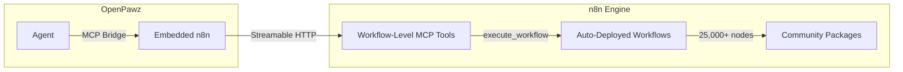
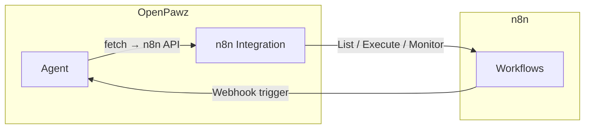
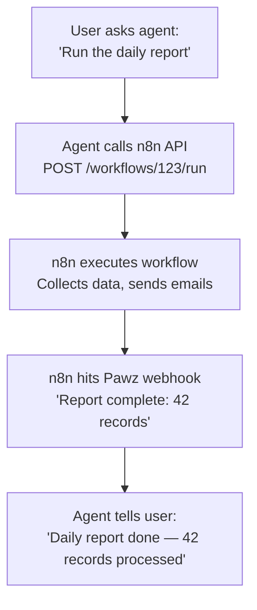

# n8n — Embedded Automation Engine

OpenPawz embeds [n8n](https://n8n.io) directly into the desktop app. It auto-provisions at launch (via Docker or npx), connects via the **Model Context Protocol (MCP)**, and provides access to **25,000+ community integrations** through auto-deployed workflows. No manual setup required.

<Note>
n8n in OpenPawz is **not a separate service you manage**. It's an embedded engine that starts automatically, runs locally, and is fully controlled by your agents via the MCP Bridge.
</Note>

---

## How It Works

OpenPawz uses n8n in two ways:

### 1. MCP Bridge (Primary)

The MCP Bridge connects your agents to n8n via the Model Context Protocol. n8n's MCP server exposes **three workflow-level tools** (`search_workflows`, `execute_workflow`, `get_workflow_details`). Paw auto-deploys per-service workflows that agents discover and execute:



See the [MCP Bridge guide](/guides/mcp-bridge) for the full architecture, including the **Architect/Worker pattern** where a local Ollama model executes MCP tool calls at zero cost — your cloud AI plans, the local worker executes.

### 2. REST API (Legacy — Still Supported)

The traditional n8n REST API integration for managing workflows directly:



---

## Setup

### Automatic (MCP Bridge — Recommended)

n8n is **auto-provisioned** when you launch OpenPawz. No manual setup required.

1. **Docker users**: n8n starts as a container via the `bollard` crate (port 5678)
2. **No Docker**: n8n starts via `npx n8n start` as a child process
3. The MCP Bridge connects automatically at `http://127.0.0.1:5678/mcp`

Verify it's working by checking the logs:
```
[n8n] Starting embedded n8n engine...
[mcp] Auto-registering n8n as MCP server at http://127.0.0.1:5678/mcp-server/http
[mcp:http] Available tools: search_workflows, execute_workflow, get_workflow_details
```

### Manual (REST API — Optional)

If you want to use the REST API integration with an **external** n8n instance:

#### 1. Get your n8n API key

1. Open your n8n instance (e.g. `http://localhost:5678`)
2. Go to **Settings → API**
3. Click **Create API Key**
4. Copy the key

#### 2. Install the integration

<Tabs>
  <Tab title="From PawzHub">
    1. Open the **Skills** tab in the sidebar
    2. Search for **n8n**
    3. Click **Install**
  </Tab>
  <Tab title="Manual">
    Place the manifest at:
    ```
    ~/.paw/skills/n8n/pawz-skill.toml
    ```
  </Tab>
</Tabs>

#### 3. Configure credentials

1. Go to **Settings → Skills**
2. Find the **n8n** integration
3. Enter:
   - **n8n API Key** — the key from step 1
   - **n8n Instance URL** — your n8n base URL (e.g. `http://localhost:5678`, no trailing slash)

#### 4. Assign to an agent

1. Open the **Agents** tab
2. Select the agent you want to connect
3. Go to the agent's **Skills** sub-tab
4. Enable **n8n**

---

## What your agent can do

| Action | Description |
|--------|-------------|
| **List workflows** | See all workflows with their active/inactive status |
| **Execute a workflow** | Trigger any workflow by name or ID, optionally passing input data |
| **Trigger via webhook** | Hit a workflow's webhook URL with a JSON payload |
| **Activate / Deactivate** | Turn workflows on or off |
| **Check executions** | View recent execution history, success/failure status |
| **Debug failures** | Fetch execution details to see which node failed and why |

---

## Example prompts

Once the integration is enabled, just talk to your agent:

> "List all my n8n workflows"

> "Run the 'Daily Report' workflow"

> "Check if the last run of 'Email Digest' succeeded"

> "Deactivate all workflows with 'test' in the name"

> "Trigger the onboarding webhook with this data: {name: 'Alice', email: 'alice@example.com'}"

---

## Bidirectional: n8n triggering agents

n8n can also trigger your Pawz agents using OpenPawz's built-in webhook server:

1. **Enable the webhook server** in OpenPawz (Settings → Webhook)
2. In n8n, add an **HTTP Request** node pointing to your Pawz webhook endpoint
3. Send a JSON payload with the message and target agent

This creates a full loop: agents trigger n8n workflows, and n8n workflows trigger agents.



---

## Dashboard widget

The integration includes a **Workflows** widget on the Dashboard showing:

| Column | Description |
|--------|-------------|
| **Workflow** | Workflow name |
| **Status** | Active (green) or Inactive (gray) |
| **Last Updated** | When the workflow was last modified |

The widget refreshes every 5 minutes.

---

## Troubleshooting

| Problem | Solution |
|---------|----------|
| 401 Unauthorized | Verify your API key in Skills settings. Regenerate if expired. |
| Connection refused | Check that your n8n instance is running and the URL is correct. |
| Workflow not found | Ask the agent to list all workflows first to confirm available IDs. |
| Execution fails | Ask the agent to fetch execution details — it will show which node errored. |
| Webhook not working | Ensure the n8n workflow is **active** and the webhook path matches. |

---

## Security notes

- Your n8n API key is **encrypted** in the Pawz vault (XOR, 32-byte key in OS keychain) — never stored in plain text
- In RAM, the API key is wrapped in `Zeroizing<String>` — automatically zeroed from memory when the provider is dropped
- API calls go directly from your machine to your n8n instance — no cloud relay
- All outbound requests use the **certificate-pinned TLS client** (Mozilla root CAs only, OS trust store excluded)
- Every outbound request is **SHA-256 signed** and logged to the audit ring buffer for tamper detection
- The `fetch` domain allowlist applies — make sure your n8n domain is allowed if you have a blocklist configured
