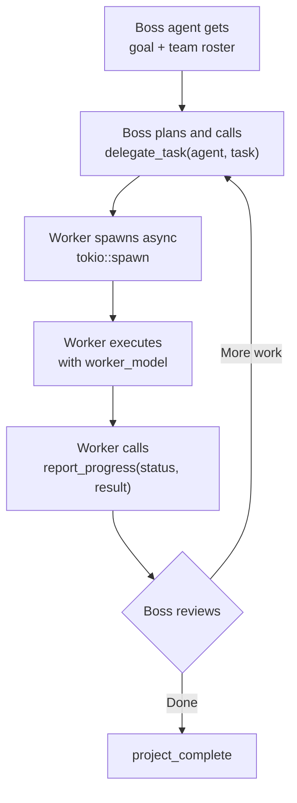

# Orchestrator

The Orchestrator enables multi-agent projects where a boss agent delegates tasks to worker agents.

## Concepts

| Role | Model | Description |
|------|-------|-------------|
| **Boss** | `boss_model` (expensive, powerful) | Plans, delegates, reviews results |
| **Worker** | `worker_model` (cheap, fast) | Executes specific tasks |

## Creating a project

1. Go to **Orchestrator** in the sidebar
2. Click **New Project**
3. Fill in:
   - **Title** — project name
   - **Goal** — what the project should accomplish
   - **Boss agent** — the agent that leads
   - **Workers** — add agents with specialties

## Agent specialties

Each agent on a project team has a **specialty** that determines how they're prompted and which model they use. The orchestrator supports two sets of specialties depending on context:

### Project sub-agents (`create_sub_agent`)

When the boss agent dynamically creates sub-agents during a project run:

| Specialty | Best for |
|-----------|----------|
| `coder` | Writing, reviewing, and debugging code |
| `researcher` | Finding information, web research |
| `designer` | Creative work, UI/UX, visual content |
| `communicator` | Writing emails, messages, docs |
| `security` | Security reviews, audits |
| `general` | Anything not covered above |

### Standalone agents (`create_agent`)

When creating agents via the `create_agent` tool or the Agents view:

| Specialty | Best for |
|-----------|----------|
| `coder` | Writing, reviewing, and debugging code |
| `researcher` | Finding information, web research, investigation |
| `writer` | Long-form content, reports, documentation, copywriting |
| `analyst` | Data analysis, evaluation, comparisons, assessments |
| `general` | Anything not covered above |

:::tip Custom system prompts
Every agent — regardless of specialty — can have a **custom system prompt** set at creation time via the `system_prompt` parameter. This gives you full control over the agent's behavior and personality beyond the specialty label. The boss agent can use `create_sub_agent` with a detailed `system_prompt` to create highly tailored workers on the fly.
:::

Specialty models can be configured in **Settings → Engine** under Model Routing. For example, setting `coder` to `gemini-2.5-pro` routes all coding tasks to that model.

## How it works



## Boss tools

| Tool | Description |
|------|-------------|
| `delegate_task` | Assign work to a worker agent |
| `check_agent_status` | See what a worker is doing |
| `send_agent_message` | Send a message to a worker |
| `project_complete` | Mark the project as done |
| `create_sub_agent` | Create a new agent on the fly |

## Worker tools

Workers have access to all standard safe tools plus:
- `report_progress` — send status updates back to the boss
  - Statuses: `working`, `done`, `error`, `blocked`

Workers can also use: email, slack, GitHub, REST API, webhooks, and image generation without HIL approval.

## Project statuses

| Status | Meaning |
|--------|---------|
| `planning` | Created, not started |
| `running` | Boss is actively delegating |
| `paused` | Manually paused |
| `completed` | Boss called project_complete |
| `failed` | Unrecoverable error |

## Message bus

The project detail view shows a real-time message bus (polled every 3s):

| Message type | From |
|-------------|------|
| `delegation` | Boss assigned a task |
| `progress` | Worker reporting status |
| `result` | Worker completed task |
| `error` | Something went wrong |
| `message` | Inter-agent communication |

## Model routing

Configure which models handle what in **Settings → Engine**:

| Setting | Purpose |
|---------|---------|
| `boss_model` | Model for the boss agent (typically expensive/powerful) |
| `worker_model` | Default model for workers (typically cheap/fast) |
| `specialty_models` | Per-specialty overrides (e.g., `coder` → `gemini-2.5-pro`) |
| `agent_models` | Per-agent overrides (highest priority) |
| `cheap_model` | Budget model for simple tasks when `auto_tier` is enabled |
| `auto_tier` | Automatically select `cheap_model` for simple tasks |

**Resolution priority:** agent_models > specialty_models > role-based > fallback

### Cheap model & auto-tier

The **cheap model** setting lets you reduce costs by routing simple tasks to a smaller, faster LLM while keeping the full model for complex work.

When `auto_tier` is enabled, every incoming message is classified by a complexity heuristic before model selection:

| Complexity | Routed to | Examples |
|------------|-----------|----------|
| **Simple** | `cheap_model` | "What time is it?", "Convert 5kg to lbs", basic Q&A |
| **Complex** | default model | Code generation, multi-step reasoning, analysis, research |

The classifier looks for signals like code keywords (`implement`, `refactor`, `debug`), reasoning phrases (`analyze`, `compare`, `step by step`), multi-step patterns (`and then`, `first,`, numbered lists), and message length (>1500 chars → complex).

```json title="Example model routing config"
{
  "boss_model": "gemini-2.5-pro",
  "worker_model": "gemini-2.0-flash",
  "cheap_model": "claude-3-haiku",
  "auto_tier": true,
  "specialty_models": {
    "coder": "gemini-2.5-pro",
    "researcher": "gemini-2.0-flash"
  }
}
```

:::info
The `auto_tier` / `cheap_model` mechanism applies to regular chat sessions. Within orchestrator projects, model selection uses the `boss_model` → `worker_model` → `specialty_models` → `agent_models` routing chain instead.
:::

### Execution limits

Orchestrator projects are bounded by the engine's global execution limits:

| Setting | Default | Description |
|---------|---------|-------------|
| `max_tool_rounds` | 20 | Maximum number of LLM ↔ tool call rounds per agent loop (boss or worker). When exceeded, the agent stops and returns its last output. |
| `tool_timeout_secs` | 300 | Timeout in seconds for individual tool call approvals (HIL). If the user doesn't approve within this window, the tool call is denied. |
| `max_concurrent_runs` | 4 | Maximum simultaneous agent runs across the whole engine (chat + cron + orchestrator). Chat always gets priority. |

The boss agent loop exits when:
- `project_complete` is called
- `max_tool_rounds` is exceeded
- An unrecoverable error occurs

Worker agent loops exit when:
- `report_progress` is called with status `done`
- `max_tool_rounds` is exceeded
- An error occurs

:::caution
There is no project-level timeout. A project with many delegated tasks can run for a long time if workers are slow or blocked. Monitor the message bus and use **check_agent_status** to catch stuck agents. You can also manually pause or delete a project from the UI.
:::
