# PawzHub — Marketplace

PawzHub is the community-driven marketplace for Pawz. It hosts all three tiers of the extensibility system — [Skills](/docs/guides/skills), [Integrations](/docs/guides/integrations), and [Extensions](/docs/guides/extensions) — making Pawz an infinitely extensible platform where anyone can create, publish, and install capabilities.

## Three Tiers, One Marketplace

```mermaid actions={false}
graph TD
    HUB["PawzHub Marketplace"] --> S["Skills\nPrompt-only · SKILL.md\nZero config · 1-click install"]:::blue
    HUB --> I["Integrations\nCredentials + Tools · TOML\nAPI keys · CLI binaries · Widgets"]:::purple
    HUB --> E["Extensions\nCustom Views + Storage · TOML\nSidebar tabs · Persistent data"]:::gold
    classDef blue fill:#3b82f6,color:#fff,stroke:#3b82f6
    classDef purple fill:#a855f7,color:#fff,stroke:#a855f7
    classDef gold fill:#eab308,color:#000,stroke:#eab308
```



| Tier | Badge | Format | Install Source |
|------|-------|--------|---------------|
| Skill | 🔵 Blue | SKILL.md | [skills.sh](https://skills.sh) + GitHub repos |
| Integration | 🟣 Purple | pawz-skill.toml | PawzHub registry (GitHub) |
| Extension | 🟡 Gold | pawz-skill.toml + [view]/[storage] | PawzHub registry (GitHub) |

## How It Works


Every skill — whether built-in or community — follows the same architecture:

1. **Skill manifest** declares what the skill does, what credentials it needs, and what data it outputs
2. **Credential vault** encrypts API keys with AES-GCM (key stored in OS keychain) and injects them into the agent prompt at runtime
3. **Engine tools** (`fetch`, `exec`, `read_file`, `write_file`) execute the actual API calls and commands
4. **Dashboard widgets** render structured output from skills as persistent visual cards

The skill author never writes Rust code. They describe the API integration in a TOML file. The engine handles execution, security, and credential management.

---

## Skill Manifest Format

Every PawzHub skill is a single `pawz-skill.toml` file:

```toml
[skill]
id = "notion"
name = "Notion"
version = "1.0.0"
author = "yourname"
category = "productivity"
icon = "edit_note"
description = "Read and write Notion pages, databases, and blocks via the API"
install_hint = "Get your API key at https://www.notion.so/my-integrations"

[[credentials]]
key = "NOTION_API_KEY"
label = "Integration Token"
description = "Your Notion internal integration token"
required = true
placeholder = "secret_..."

[instructions]
text = """
You have access to the Notion API via the user's integration token.

## Reading pages
Use `fetch` with:
- URL: `https://api.notion.so/v1/pages/{page_id}`
- Headers: `Authorization: Bearer {NOTION_API_KEY}`, `Notion-Version: 2022-06-28`

## Searching
Use `fetch` with POST to `https://api.notion.so/v1/search`
Body: {"query": "search term"}

## Creating pages
Use `fetch` with POST to `https://api.notion.so/v1/pages`
Headers: `Authorization: Bearer {NOTION_API_KEY}`, `Notion-Version: 2022-06-28`
Body: {"parent": {"database_id": "..."}, "properties": {...}}
"""

[widget]
type = "table"
title = "Recent Pages"
refresh = "10m"

[[widget.fields]]
key = "title"
label = "Page"
type = "text"

[[widget.fields]]
key = "updated"
label = "Last Updated"
type = "datetime"

[[widget.fields]]
key = "status"
label = "Status"
type = "badge"
```

### Manifest Fields

#### `[skill]` — Required

| Field | Type | Required | Description |
|-------|------|----------|-------------|
| `id` | string | Yes | Unique identifier. Alphanumeric + hyphens only. |
| `name` | string | Yes | Human-readable display name. |
| `version` | string | Yes | Semver version (e.g. `1.0.0`). |
| `author` | string | Yes | Author name or GitHub username. |
| `category` | string | Yes | One of the valid categories (see below). |
| `icon` | string | No | Material Symbols icon name (e.g. `edit_note`). |
| `description` | string | Yes | Short description (10-500 chars). |
| `install_hint` | string | No | Instructions for getting credentials. |

**Valid categories:** `vault`, `cli`, `api`, `productivity`, `media`, `smart_home`, `communication`, `development`, `system`

#### `[[credentials]]` — Optional (repeatable)

Declare API keys, tokens, or secrets the skill requires. Users enter these in the Skills tab. Pawz encrypts them with AES-GCM and stores the encryption key in the OS keychain. At runtime, decrypted values are injected into the agent's system prompt automatically.

| Field | Type | Required | Description |
|-------|------|----------|-------------|
| `key` | string | Yes | Environment variable name (e.g. `NOTION_API_KEY`). |
| `label` | string | Yes | UI label shown to the user. |
| `description` | string | No | Help text explaining where to find this credential. |
| `required` | bool | Yes | Whether the skill works without this credential. |
| `placeholder` | string | No | Example value shown in the input field. |

:::info Credential Security
Credentials are never stored in plain text. They are encrypted in SQLite using AES-GCM with a 256-bit key stored in your OS keychain (macOS Keychain, Windows Credential Manager, or Linux Secret Service). The agent receives decrypted values only in its system prompt at runtime — they are never logged, never written to disk unencrypted, and never transmitted externally.
:::

#### `[instructions]` — Required

| Field | Type | Required | Description |
|-------|------|----------|-------------|
| `text` | string | Yes | Agent instructions explaining how to use this skill. |

The instructions tell the agent:
- Which API endpoints to call (using the `fetch` tool)
- Which CLI commands to run (using the `exec` tool)
- How to format request headers, bodies, and authentication
- How to parse and present responses
- Error handling guidance

The engine automatically appends a credential block to the instructions at runtime:

```
Credentials (use these values directly — do NOT ask the user for them):
- NOTION_API_KEY = secret_abc123...
```

#### `[widget]` — Optional

Declare a dashboard widget for persistent visual output.

| Field | Type | Required | Description |
|-------|------|----------|-------------|
| `type` | string | Yes | Widget type: `status`, `metric`, `table`, `log`, or `kv`. |
| `title` | string | Yes | Widget card title. |
| `refresh` | string | No | Auto-refresh interval (e.g. `5m`, `1h`). |

#### `[[widget.fields]]` — Required if `[widget]` is present

| Field | Type | Required | Description |
|-------|------|----------|-------------|
| `key` | string | Yes | Data key matching the JSON output. |
| `label` | string | Yes | Column/field label displayed in the widget. |
| `type` | string | Yes | Field type: `text`, `number`, `badge`, `datetime`, `percentage`, or `currency`. |

---

## Widget Types

Skills can declare a dashboard widget to display persistent structured data. The widget appears on the Today/Dashboard view alongside weather, tasks, and quick actions.

### Status

Single status indicator — ideal for service health, connection state, or simple on/off checks.

```toml
[widget]
type = "status"
title = "Server Status"

[[widget.fields]]
key = "status"
label = "State"
type = "badge"

[[widget.fields]]
key = "uptime"
label = "Uptime"
type = "percentage"

[[widget.fields]]
key = "last_check"
label = "Last Check"
type = "datetime"
```

### Metric

Single large number with trend — ideal for KPIs, counts, revenue, or any headline number.

```toml
[widget]
type = "metric"
title = "Monthly Revenue"

[[widget.fields]]
key = "value"
label = "MRR"
type = "currency"

[[widget.fields]]
key = "change"
label = "vs Last Month"
type = "percentage"
```

### Table

Rows of structured data — ideal for lists, records, deployments, or any tabular output.

```toml
[widget]
type = "table"
title = "Active Issues"

[[widget.fields]]
key = "title"
label = "Issue"
type = "text"

[[widget.fields]]
key = "assignee"
label = "Assignee"
type = "text"

[[widget.fields]]
key = "priority"
label = "Priority"
type = "badge"

[[widget.fields]]
key = "updated"
label = "Updated"
type = "datetime"
```

### Log

Chronological event feed — ideal for notifications, incidents, messages, or activity streams.

```toml
[widget]
type = "log"
title = "Recent Incidents"

[[widget.fields]]
key = "message"
label = "Event"
type = "text"

[[widget.fields]]
key = "severity"
label = "Level"
type = "badge"

[[widget.fields]]
key = "timestamp"
label = "When"
type = "datetime"
```

### Key-Value (KV)

Key-value pairs — ideal for configuration summaries, stats, or metadata.

```toml
[widget]
type = "kv"
title = "Project Stats"

[[widget.fields]]
key = "total_records"
label = "Records"
type = "number"

[[widget.fields]]
key = "storage_used"
label = "Storage"
type = "text"

[[widget.fields]]
key = "last_sync"
label = "Last Sync"
type = "datetime"
```

### Field Types

| Type | Rendering | Example |
|------|-----------|---------|
| `text` | Plain text | "Deploy to production" |
| `number` | Formatted with locale separators | "1,234,567" |
| `badge` | Colored pill (green/yellow/red) | "Active" (green), "Warning" (yellow) |
| `datetime` | Relative time | "2 hours ago" |
| `percentage` | Progress bar + number | "94.5%" |
| `currency` | Dollar symbol + formatted | "$12,450.00" |

---

## Installing Skills

### From PawzHub (In-App)

1. Open the **Skills** tab in the sidebar
2. Click the **Browse PawzHub** section
3. Browse or search available skills by name or category
4. Click **Install** on any skill
5. Configure credentials if required
6. Assign to agents via **Agents → [agent] → Skills**

### Manual Install

Download a `pawz-skill.toml` file and place it in the skills directory:

```
~/.paw/skills/{skill-id}/pawz-skill.toml
```

For example:

```
~/.paw/skills/notion/pawz-skill.toml
~/.paw/skills/linear/pawz-skill.toml
~/.paw/skills/stripe/pawz-skill.toml
```

Restart Pawz (or the skill loader hot-reloads). The skill appears in the Skills tab with a "Community" badge.

### Uninstalling

- **Community skills**: Click the **Uninstall** button in the Skills tab. This deletes the skill folder from `~/.paw/skills/` and cleans up stored credentials and enabled state.
- **Core skills**: Cannot be uninstalled (they're compiled into the binary). Disable them per-agent in **Agents → [agent] → Skills** instead.

---

## Creating Skills

### In-App Wizard

The **Create Skill** wizard in the Skills tab walks you through building a skill without writing TOML by hand:

1. **Basic Info** — name, category, icon, description
2. **Credentials** — add API key fields with labels and placeholders
3. **Instructions** — write or paste agent instructions (templates available for REST APIs, CLI tools, and web scrapers)
4. **Widget** — optionally declare dashboard output with field types
5. **Test** — enable the skill and verify it works with a live agent
6. **Publish** — save locally, export TOML, or publish directly to PawzHub via GitHub PR

### AI-Assisted Creation

Ask your agent to create a skill for you:

> "Create a PawzHub skill for the Notion API"

The agent fetches the API docs, generates a complete `pawz-skill.toml` with endpoints, auth headers, and instructions, then pre-fills the wizard for your review.

### Template Starters

The wizard includes starter templates:

- **REST API** — fetch calls with auth headers, JSON parsing
- **CLI Tool** — exec commands with flag reference
- **Web Scraper** — fetch + HTML parsing instructions

---

## Publishing to PawzHub

### Submission Flow

1. **Fork** the [`elisplash/pawzhub`](https://github.com/elisplash/pawzhub) repository
2. **Create** `skills/{your-skill-id}/pawz-skill.toml`
3. **Open a Pull Request** — CI validates your manifest automatically
4. **Maintainer reviews** and merges
5. **`registry.json`** is auto-rebuilt — your skill appears in the in-app browser

### One-Click Publish (from Pawz)

If you created a skill using the in-app wizard:

1. Click **Publish to PawzHub** in the wizard's final step
2. Pawz opens a pre-filled GitHub PR on `elisplash/pawzhub`
3. CI validates, maintainer reviews, done

### CI Validation

Every PR is checked automatically:

| Check | Description |
|-------|-------------|
| Valid TOML | Syntax is correct, required fields present |
| Unique ID | No collision with built-in or existing skills |
| Valid category | Must be one of the defined categories |
| Safe ID format | Alphanumeric + hyphens only (no path traversal) |
| Semver version | Version follows `X.Y.Z` format |
| Description length | Between 10 and 500 characters |
| Widget validation | Field types match allowed values if widget is declared |
| Instruction-only | No executable code patterns detected |

### Quality Guidelines

Skills are accepted based on quality, not quantity. We learned from OpenClaw's ClawHub that accepting everything leads to 48% junk (1,180 spam, 396 malicious out of 5,705 submissions).

**Required:**
- Valid, well-tested `pawz-skill.toml`
- Clear, accurate description
- Working instructions that the agent can follow

**Recommended (earns a "Verified" badge):**
- Tested in a real Pawz workspace
- Includes a widget for dashboard output
- Screenshot or demo in the PR description
- Created using the in-app wizard

---

## Skill Architecture Deep Dive

### How Credentials Flow

```mermaid actions={false}
graph TD
    A["User enters API key\nin Skills tab"] --> B["AES-GCM encryption\n256-bit key from OS keychain"]
    B --> C["Stored in SQLite\nEncrypted blob"]
    C --> D["On prompt build:\ndecrypted in memory"]
    D --> E["Injected into prompt\nNOTION_API_KEY = secret_abc123..."]
    E --> F["Agent calls fetch\nwith Authorization header"]
    F --> G["Domain allowlist\nenforced"]
    G --> H["API response\nreturned to agent"]
```



### How Instructions Work

Skill instructions are injected into the agent's system prompt alongside all other enabled skills:

```
# Enabled Skills
You have the following skills available. Use exec, fetch,
read_file, write_file, and other built-in tools to leverage them.

## Notion Skill (notion)
You have access to the Notion API via the user's integration token.
[... full instructions ...]

Credentials (use these values directly — do NOT ask the user for them):
- NOTION_API_KEY = secret_abc123...

## Linear Skill (linear)
[... instructions ...]
```

The agent then uses the built-in `fetch` tool (supports GET/POST/PUT/PATCH/DELETE with custom headers and body) or `exec` tool (shell with Docker sandbox routing) to perform the actual API calls.

### How Widgets Work

1. Skill manifest declares a `[widget]` with type and fields
2. Agent runs the skill and produces structured JSON matching the widget schema
3. Agent calls the `skill_output` tool to persist the data
4. Dashboard reads `skill_outputs` table and renders the widget card
5. Optional `refresh` interval triggers periodic re-fetching

---

## Security Model

### What Community Skills Can Do

- Inject text into the agent's system prompt (instructions)
- Declare credential fields (encrypted by the engine, never handled by the skill)
- Declare widget schemas (rendered by the app, not by the skill)

### What Community Skills Cannot Do

- Execute arbitrary Rust code (no compiled tool functions)
- Bypass domain allowlist/blocklist (enforced by `execute_fetch`)
- Access the OS keychain directly (credential injection is engine-side)
- Read engine source code (blocked by `execute_read_file`)
- Install blocked packages (enforced by `execute_exec`)
- Run unsandboxed commands when Docker sandbox is enabled

### Runtime Protections

| Layer | Protection |
|-------|-----------|
| **Credentials** | AES-GCM encrypted, key in OS keychain |
| **Network** | Domain allowlist/blocklist on every `fetch` call |
| **Shell** | Docker sandbox routing when enabled |
| **File system** | Engine source code read-blocked |
| **Packages** | Blocked package list enforced on `exec` |
| **Agent isolation** | Each agent has its own working directory |

---

## PawzHub vs. Other Skill Registries

| | ClawHub (OpenClaw) | PawzHub (Pawz) |
|--|---|---|
| **Tiers** | Single (prompt-only) | Three: Skills, Integrations, Extensions |
| **Format** | Freeform SKILL.md | SKILL.md (Tier 1) + structured `pawz-skill.toml` (Tier 2–3) |
| **Credentials** | Manual env vars | Typed fields → vault-encrypted (AES-GCM) |
| **Output** | Chat text only | Dashboard widgets (5 types) + chat + custom views |
| **Quality control** | 48% junk/malicious | CI-validated, in-app tested |
| **Security** | VirusTotal after publish | Validated at submit, runtime policy enforced |
| **Creation** | Write markdown by hand | In-app wizard + AI generation |
| **Modularity** | Drop in folder | Per-agent scoping + per-workspace profiles |
| **Versioning** | None | Semver + update detection |
| **Storage** | None | Persistent key-value store (Extensions) |
| **Custom UI** | None | Custom sidebar views (Extensions) |
