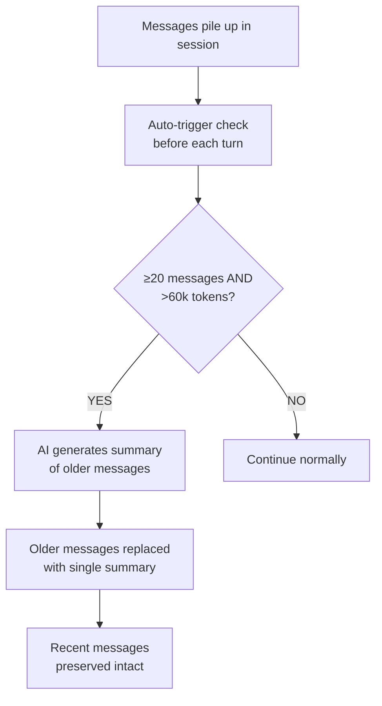

# Session Management

Sessions are the core unit of conversation in Pawz. Each session holds a complete chat history between you and an agent, with built-in tools for renaming, clearing, compacting, and deleting conversations.

## Session data model

Every session is stored in the engine's SQLite database with the following fields:

| Field | Type | Description |
|-------|------|-------------|
| `id` | UUID | Unique session identifier |
| `label` | String | User-friendly display name |
| `model` | String | AI model used in this session |
| `system_prompt` | String | Custom system prompt (if any) |
| `agent_id` | String | The agent assigned to this session |
| `message_count` | Number | Total messages in the session |
| `created_at` | Timestamp | When the session was created |
| `updated_at` | Timestamp | Last activity time |

## Session operations

### List

Retrieve all sessions, optionally filtered by agent. Sessions are displayed as cards in **Settings → Sessions** showing the label, model badge, message count, and timestamps.

### Rename

Update the session label to something more meaningful. Use the slash command:

```
/rename My research on quantum computing
```

Or click the rename action on the session card in Settings.

### Clear

Remove **all messages** from a session while keeping the session itself. This is useful when you want a fresh start without losing your session configuration.

:::warning
Clearing a session is destructive — all messages are permanently removed. Pawz requires a double-confirm before proceeding.
:::

### Delete

Permanently remove a session and all its messages from the database.

:::warning
Deletion is irreversible. A double-confirm dialog will appear before the session is removed.
:::

### Compact

Compress the session's message history using AI-generated summaries. See [Session Compaction](#session-compaction) below.

## Session compaction

Long conversations consume large context windows, which increases cost and can hit model token limits. Session compaction solves this by replacing older messages with a concise AI-generated summary.

### How it works



### Compaction configuration

| Setting | Default | Description |
|---------|---------|-------------|
| `min_messages` | 20 | Minimum message count before compaction triggers |
| `token_threshold` | 60,000 | Estimated token count threshold |
| `keep_recent` | 6 | Number of recent messages to preserve unchanged |
| `max_summary_tokens` | 2,000 | Maximum tokens for the generated summary |

### Token estimation

Pawz estimates token counts using a simple heuristic: **~4 characters per token**. This is intentionally conservative to avoid exceeding model context limits.

### Auto-trigger

Before each new conversation turn, the engine checks:

1. Does this session have **≥20 messages**?
2. Is the estimated token count **>60,000 tokens**?

If both conditions are met, compaction runs automatically before the new message is processed.

### Manual trigger

You can force compaction at any time using the slash command:

```
/compact
```

This is useful when you want to reclaim context space mid-conversation without waiting for the auto-trigger threshold.

:::tip
Use `/compact` proactively before starting a complex task in a long session. This gives the agent maximum context space to work with.
:::

## Session Settings UI

Navigate to **Settings → Sessions** to manage all your sessions in one place:

- **Session cards** show the label, model badge, message count, and timestamps
- **Expandable actions** per card: Rename, Clear, Delete
- **Double-confirm pattern** for all destructive operations (Clear and Delete)

## Slash commands for sessions

| Command | Description |
|---------|-------------|
| `/new [label]` | Start a new session (optional label) |
| `/rename <label>` | Rename the current session |
| `/clear` | Clear all messages in the current session |
| `/compact` | Manually trigger session compaction |

## Message history management

Pawz automatically maintains a clean conversation context before each agent turn.

### Failed message cleanup

When loading conversation history, Pawz deletes failed exchanges entirely from the context window. This includes:

- **Failed tool calls** — assistant + tool message pairs where every tool result was an error
- **Give-up responses** — assistant messages containing apology spirals or refusal language (e.g. "I keep hitting a wall", "I apologize for the difficulty")

This follows the VS Code pattern: the model never sees past failures, so it can't anchor on them or develop "learned helplessness." Each retry gets a clean slate.

:::tip
If an agent is struggling with a task, simply send a new message — the failed attempts are automatically removed from context, giving the agent a fresh perspective.
:::

### Request queueing

When you send a new message while an agent is still processing a previous request, Pawz queues the message instead of rejecting it. The active agent receives a yield signal and wraps up at the next round boundary. The queued message is then processed automatically.

This means you never need to wait for the agent to finish before typing your next message.

### Agent-scoped history

In multi-agent sessions, each agent only sees messages relevant to its own context. Cross-agent delegation results (from tools like `agent_send_message` and `agent_read_messages`) are filtered out for non-default agents, preventing one agent's context from polluting another's conversation.

:::info
Session data is stored in the engine-side SQLite database, separate from frontend state. This means sessions persist across app restarts and are tied to the backend engine.
:::
