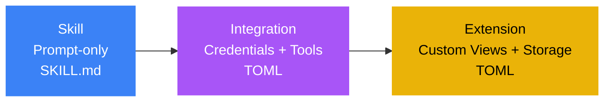

# Skills

Skills are the foundation of the Pawz extensibility system — the first of three tiers that make Pawz infinitely customizable.



**Skills** (this page) are prompt-only — they inject expert knowledge into your agent's system prompt with zero configuration. For credential-based API/CLI connections, see [Integrations](/docs/guides/integrations). For custom sidebar views and persistent data, see [Extensions](/docs/guides/extensions).

---

## Built-In Skills

Pawz ships with **40 built-in skills** that are compiled into the binary. These include credential-based vault skills, CLI tools, and instruction-based API skills.

### How built-in skills work

1. **Enable** a skill in the **Skills** tab (its own sidebar view)
2. **Provide credentials** (API keys, tokens) if required
3. **Install binaries** (CLI tools) if required
4. Enabled skills inject their tools and instructions into agent prompts automatically

### Skill architecture

Skills are Rust functions registered in the `skills/` module directory that the agent can invoke as tools. The architecture works as follows:

- **Registration**: Each skill is defined as a `SkillDefinition` struct in `skills/builtins.rs`, specifying its ID, name, category, required credentials, tool names, required binaries, and agent instructions.
- **Per-agent toggle**: Every skill is gated by an enable/disable toggle per-agent. When disabled, the skill's tools and instructions are not injected into the agent's prompt.
- **Categories**: Skills are organized into 9 categories for the UI. Each skill belongs to exactly one category and can be independently toggled on or off.
- **Vault skills** have dedicated tool functions (e.g. `email_send`, `coinbase_trade`) with encrypted credential storage. The engine executes these tools directly — credentials never appear in the agent prompt.
- **Instruction skills** inject CLI/API knowledge into the agent's system prompt. The agent then uses its built-in `exec` (shell) and `fetch` (HTTP) tools to interact with CLIs and APIs.
- **Credential encryption**: Credentials are stored encrypted in SQLite. The encryption key lives in the OS keychain, separate from the database.

## Built-in skill categories

Pawz ships with **40 built-in skills** across **9 categories**:

| # | Category | Description | Skill count |
|---|----------|-------------|-------------|
| 1 | **Vault** | Credential-based integrations with dedicated tool functions | 10 |
| 2 | **CLI** | Command-line tools the agent uses via `exec` | 3 |
| 3 | **API Integrations** | Third-party APIs the agent calls via `fetch`/`exec` | 4 |
| 4 | **Productivity** | Notes, reminders, and project management apps | 5 |
| 5 | **Media** | Audio, video, image generation, and music | 7 |
| 6 | **Smart Home** | IoT devices and home automation | 4 |
| 7 | **Communication** | Messaging platforms (WhatsApp, iMessage) | 2 |
| 8 | **Development** | Coding, terminals, and session logs | 2 |
| 9 | **System** | Security, UI automation, and password management | 3 |

### Vault (Credential-based)

| Skill | Credentials | Tools |
|-------|------------|-------|
| **Email** | SMTP_HOST, SMTP_PORT, SMTP_USER, SMTP_PASS, IMAP_HOST, IMAP_USER, IMAP_PASS | `email_send`, `email_read` |
| **Slack** | SLACK_BOT_TOKEN | `slack_send`, `slack_read` |
| **Telegram** | (uses channel bridge token) | `telegram_send`, `telegram_read` |
| **GitHub** | GITHUB_TOKEN (+ `gh` CLI) | `github_api` |
| **REST API** | REST_API_BASE_URL, REST_API_KEY | `rest_api_call` |
| **Webhooks** | WEBHOOK_URL, WEBHOOK_SECRET | `webhook_send` |
| **Discord** | DISCORD_BOT_TOKEN, DISCORD_DEFAULT_CHANNEL | `discord_send` (via Discord REST API) |
| **Coinbase** | COINBASE_API_KEY, COINBASE_API_SECRET | `coinbase_balance`, `coinbase_price`, `coinbase_buy`, `coinbase_sell`, `coinbase_send` |
| **DEX Trading** | DEX_RPC_URL, DEX_PRIVATE_KEY, DEX_WALLET_ADDRESS | 13 `dex_*` tools |
| **Solana DEX** | JUPITER_API_KEY, SOLANA_RPC_URL, SOLANA_PRIVATE_KEY, SOLANA_WALLET_ADDRESS | 7 `sol_*` tools |

### API Integrations

| Skill | Credentials | Required Binary |
|-------|------------|-----------------|
| **Notion** | NOTION_TOKEN | — |
| **Trello** | TRELLO_API_KEY, TRELLO_TOKEN | — |
| **Google Workspace** | — | `gog` |
| **Google Places** | GOOGLE_PLACES_API_KEY | `goplaces` |

### Productivity

| Skill | Required Binary |
|-------|-----------------|
| **Apple Notes** | `memo` |
| **Apple Reminders** | `remindctl` |
| **Things 3** | `things-cli` |
| **Obsidian** | `obsidian-cli` |
| **Bear Notes** | `grizzly` |

### Media

| Skill | Credentials | Required Binary |
|-------|------------|-----------------|
| **Whisper Local** | — | `whisper` |
| **Whisper API** | OPENAI_API_KEY | — |
| **Image Gen** | GEMINI_API_KEY | — |
| **Video Frames** | — | `ffmpeg` |
| **ElevenLabs TTS** | ELEVENLABS_API_KEY | `sag` |
| **Spotify** | — | `spotify_player` |
| **GIF Search** | — | `gifgrep` |

> **Image Gen** uses the `image_generate` tool to create images from text prompts via Gemini (Google AI). Provide a detailed description including style, lighting, composition, and mood for best results.

### Smart Home

| Skill | Required Binary | Description |
|-------|-----------------|-------------|
| **Philips Hue** | `openhue` | Control lights, rooms, and scenes |
| **Sonos** | `sonoscli` | Control speakers, playback, and volume |
| **Eight Sleep** | `eightctl` | Control pod temperature and alarms |
| **Camera Capture** | `camsnap` | Capture frames from RTSP/ONVIF/webcam cameras for vision analysis |

> **Camera Capture** (`camsnap`) can snap images from IP cameras, discover cameras on your network, and capture timed frame sequences. Use it for security monitoring, pet watching, or any vision-analysis workflow. Commands: `camsnap snap <url>`, `camsnap discover`, `camsnap stream <url> --frames 10 --interval 1s`.

### Communication

| Skill | Required Binary |
|-------|-----------------|
| **WhatsApp** | `wacli` |
| **iMessage** | `imsg` |

### CLI Tools

| Skill | Description |
|-------|-------------|
| **Weather** | Weather information |
| **Blog Watcher** | Monitor blogs for updates |
| **Summarize** | Text summarization (`summarize` binary) |

### Development

| Skill | Required Binary |
|-------|-----------------|
| **tmux** | `tmux` |
| **Session Logs** | `rg` (ripgrep) |

### System

| Skill | Required Binary |
|-------|-----------------|
| **1Password** | `op` |
| **Peekaboo** | `peekaboo` |
| **Security Audit** | — |

## Community Skills (Tier 1 — skills.sh ecosystem)

Community Skills are the first tier of the Pawz extensibility system — prompt-only knowledge packs that teach your agent new capabilities with zero configuration. They use the open-source [skills.sh](https://skills.sh) ecosystem.

:::tip Graduating to higher tiers
Need credentials, API keys, or dashboard widgets? Create a [Tier 2 Integration](/docs/guides/integrations). Need a custom sidebar view with persistent data? Create a [Tier 3 Extension](/docs/guides/extensions). Community Skills are the starting point — you can upgrade to higher tiers anytime.
:::

### How community skills work

Community skills use the **SKILL.md** format: a Markdown file with YAML frontmatter containing the skill's `name` and `description`, followed by a markdown body with instructions for the agent. When installed, the instructions are injected alongside your built-in skills into every agent prompt — across all channels (WhatsApp, Telegram, Discord, etc).

```markdown
---
name: Python Expert
description: Deep Python knowledge and best practices
---

You are an expert Python developer. When writing Python:
- Use type hints for all function signatures
- Follow PEP 8 naming conventions
- Prefer pathlib over os.path
...
```

### Searching for skills

The Community Skills section sits at the top of the **Skills** view with a keyword search bar and popular category tags.

1. Open the **Skills** tab in the sidebar — the Community Skills hero section is at the top
2. **Search by keyword**: Type any term (e.g. "marketing", "supabase", "trading") into the search bar and press Enter or click Search
3. Pawz queries the [skills.sh](https://skills.sh) directory API (`/api/search?q=`) and displays matching skills with **install counts** (e.g. "22.9K", "151.3K")
4. **Popular tags**: Click any of the quick-tag buttons (Coding, Marketing, DevOps, etc.) to instantly search that category
5. Each skill card shows the skill name, install count, source repo, and a **View on skills.sh** link

No authentication is required — the skills.sh API is public.

### Browsing a specific repo

You can also browse a specific GitHub repository directly:

1. Scroll below the search section to the **Browse Repository** area
2. Enter a GitHub repo in `owner/repo` format (e.g. `vercel-labs/agent-skills`)
3. Pawz scans the repo tree for SKILL.md files and shows all available skills
4. Click **Install** on individual skills or **Install All** to grab everything

### Installing skills

1. Click **Install** on any skill card — Pawz fetches the SKILL.md from the source GitHub repo
2. The skill's instructions are parsed from the Markdown body and stored locally
3. Installed skills are automatically enabled and included in all agent prompts across every channel

### Agent tools for skills

Agents have three built-in tools for working with community skills during conversations:

| Tool | Description |
|------|-------------|
| `skill_search` | Search the skills.sh directory by keyword (e.g. "find me a marketing skill") |
| `skill_install` | Install a skill by source and path (e.g. after finding one via search) |
| `skill_list` | List all currently installed community skills with their enabled/disabled status |

This means you can ask your agent to find and install skills conversationally — no need to visit the Skills tab.

### Managing community skills

- **Enable/disable**: Toggle individual community skills on or off without removing them
- **Remove**: Uninstall a community skill entirely (you can reinstall later)
- **Preview**: Expand the instructions preview to see exactly what gets injected into the prompt

### Compatible repositories

Any public GitHub repository containing SKILL.md files in the [skills.sh](https://skills.sh) format works. Browse the full directory at [skills.sh](https://skills.sh) to discover thousands of community-created skills with install counts and categories.

You can also create your own skills repository — just add SKILL.md files anywhere in the repo tree.

## Credential security

Credentials are stored in SQLite and encrypted with XOR using a 32-byte random key stored in your OS keychain (service: `paw-skill-vault`, key: `encryption-key`).

High-risk credentials (Coinbase, DEX) are **server-side only** — they are never injected into agent prompts. The engine uses them directly when executing trades.

## Custom instructions

Each skill can have custom instructions that override the defaults. These are injected into the agent's system prompt when the skill is enabled.

## Readiness check

The skill status indicator shows:
- **Ready** — all credentials and binaries present
- **Missing credentials** — API keys needed
- **Missing binary** — CLI tool not installed
- **Disabled** — skill is turned off
