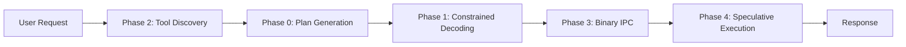
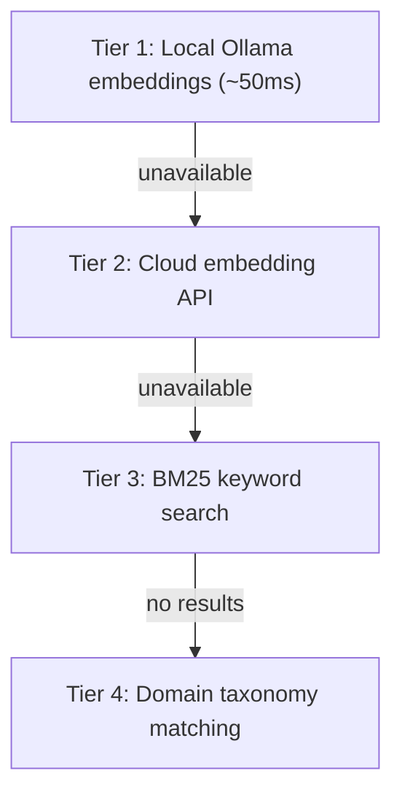

# Agent Execution Architecture

**5-Phase Optimization Pipeline — Eliminating Waste from the Agent Loop**

*Open source (MIT). Part of the OpenPawz project.*

---

## The Problem

Every AI agent platform today — including ours before this work — follows the same loop:

```
User speaks → Model reads everything → Model thinks → Model outputs text →
Engine parses text → Engine calls API → API returns data →
Engine serializes result → Model reads result → Model thinks again → ...repeat
```

Each cycle takes 2–10 seconds (LLM inference) plus network latency. A 5-step task takes 20–50 seconds. The bottleneck is not how fast models think — it's **how many times we make them think**.

---

## The Architecture

Five phases, each eliminating a specific category of waste. All phases are implemented, tested (162 dedicated tests), and wired into the live agent loop.



| Metric | Before | After All Phases |
|--------|--------|-----------------|
| **Avg inference calls per task** | 3–5 sequential | 1 planning + 1 synthesis |
| **JSON parse failures** | ~5% of tool calls | 0% (constrained decoding) |
| **Tool discovery latency** | ~2s (build index on first call) | <100ms (pre-built persistent index) |
| **Internal serialization** | JSON text | MessagePack binary |
| **Multi-step task latency** | 20–50s | 4–12s |
| **Token cost per task** | 100% baseline | ~40% of baseline |

---

## Phase 0 — Action DAG Planning

**20 tests · `engine/plan/` · Risk: Low**

Instead of sequential tool-by-tool execution, the model outputs a **complete execution plan** as a DAG (directed acyclic graph) in a single inference call. The engine executes independent nodes in parallel.

```
User: "Set up a weekly standup, invite the team, and summarize last week's action items"

Before (sequential):
  Round 1: Agent thinks → gmail_search → waits      (4s)
  Round 2: Agent reads → calendar_create → waits     (4s)
  Round 3: Agent reads → gmail_send → waits           (4s)
  Round 4: Agent reads → synthesize response          (3s)
  Total: 4 inference calls, ~15s

After (DAG planning):
  Round 1: Agent outputs plan:
    A(gmail_search) ‖ B(calendar_create) → C(gmail_send)
  Engine: A and B run in parallel → results feed C → C runs
  Round 2: Agent synthesizes response
  Total: 2 inference calls, ~5s
```

### How It Works

1. A system prompt section (`prompts/plan.md`) instructs the model to output an `execute_plan` tool call containing a DAG of actions
2. The Rust plan module validates the DAG (no cycles, valid dependencies, all tools exist)
3. `tokio::JoinSet` executes independent nodes concurrently
4. Results are assembled and injected into context for a final synthesis call
5. **Fallback:** If the model doesn't output a plan, the existing sequential loop continues unchanged

### Failover

- **Per-node error isolation** — Each node runs in its own `tokio::spawn` with catch boundaries
- **Retry with backoff** — Retryable errors (429, 5xx, timeouts) retry up to 2× with exponential backoff
- **Dependency-aware degradation** — If node B fails, dependent node C is skipped; independent nodes continue
- **Partial result synthesis** — The model tells the user what succeeded and what failed

**Files:** `engine/plan/atoms.rs`, `engine/plan/molecules.rs`, `engine/plan/executor.rs`

---

## Phase 1 — Constrained Decoding

**19 tests · `engine/constrained/` · Risk: Low-Medium**

Forces AI providers to generate **only valid JSON** when calling tools. The model cannot produce malformed tool calls because the token sampler restricts output to schema-valid tokens.

| Provider | Mechanism | Result |
|----------|-----------|--------|
| **OpenAI** | `strict: true` on function definitions | 100% schema compliance |
| **Anthropic** | `tool_choice` enforcement | Guaranteed tool selection |
| **Google Gemini** | `tool_config` with `function_calling_config` | Schema-constrained output |
| **Ollama** | `format: "json"` | JSON-only output |
| **Other** | Existing retry logic (fallback) | ~95% parse rate |

### Impact

Parse failures cause retry loops — each retry is another 2–10s inference call. Constrained decoding eliminates this entirely for supported providers.

**Files:** `engine/constrained/atoms.rs`, `engine/constrained/molecules.rs`

---

## Phase 2 — Embedding-Indexed Tool Registry

**31 tests · `engine/tool_registry/` · Risk: Low**

Extends [The Librarian Method](/reference/librarian-method) with a **persistent SQLite-backed tool registry** and four-tier search failover.

### Four-Tier Search Failover



1. **Vector similarity** — Cosine search on persisted embeddings (SQLite `tool_embeddings` table)
2. **BM25 full-text** — SQLite FTS5 keyword matching
3. **Domain expansion** — Sibling tools from the same skill domain
4. **Keyword fallback** — Substring matching on tool names/descriptions

### Key Features

- **Persistent** — Embeddings survive restarts (vs. in-memory rebuild)
- **Incremental** — Only new/changed tools are re-embedded
- **MCP auto-index** — New MCP tools are embedded on discovery
- **Graceful degradation** — Cached embeddings persist even when the embedding model becomes unavailable

**Files:** `engine/tool_registry/atoms.rs`, `engine/tool_registry/molecules.rs`

---

## Phase 3 — Binary IPC

**38 tests · `engine/binary_ipc/` · Risk: Medium**

Replaces JSON serialization with **MessagePack** (via `rmp-serde`) for high-frequency internal paths.

### Components

| Component | Purpose |
|-----------|---------|
| **EventBatcher** | Batches streaming engine events into MessagePack frames |
| **ResultAccumulator** | Assembles parallel DAG execution results into a single binary buffer |
| **BatchConfig** | Configurable batch size, flush interval, compression |

### What Changes

| Path | Before | After |
|------|--------|-------|
| SSE token streaming | JSON per token | MessagePack batch |
| Plan DAG result assembly | N × JSON parse | 1 × binary accumulate |
| Internal event bus | JSON events | MessagePack frames |

External protocols (OpenAI API, Gmail, MCP JSON-RPC) remain JSON — we only optimize paths we control on both sides.

**Expected latency reduction: 15–30%** on top of Phase 0's reduction from fewer inference calls.

**Files:** `engine/binary_ipc/atoms.rs`, `engine/binary_ipc/molecules.rs`

---

## Phase 4 — Speculative Execution

**54 tests · `engine/speculative/` · Risk: Medium-High**

**CPU branch prediction, applied to agents.** The engine learns tool transition patterns and pre-warms connections (or pre-fetches results) for the most likely next tool while the current tool is still executing.

### How It Works

1. **Pattern learning** — Tool call sequences are recorded in the `tool_sequences` SQLite table, building a transition probability matrix
2. **Prediction** — When tool A completes, the engine predicts the next tool based on historical patterns
3. **Threshold** — Only speculate when P(next | current) > 0.5
4. **Read-only** — Only speculate on read operations (list, search, fetch). Never speculatively execute writes
5. **Connection warming** — Pre-establish TCP/TLS connections to likely next API endpoints (100–300ms saved)
6. **Cancel on mismatch** — If the model calls a different tool, speculative work is discarded silently

### Example

```
Model calls: google_calendar_list
  Engine learns: P(google_calendar_create | google_calendar_list) = 0.45
                 P(gmail_send | google_calendar_list) = 0.62

  While calendar_list runs:
    → Pre-warm Gmail API connection
    → Pre-authenticate with Gmail OAuth token

  Model's next call: gmail_send  ← prediction hit!
    → Connection already warm. Saved 200–800ms.
```

**Expected hit rate: 60–70%** on common workflows.

**Files:** `engine/speculative/atoms.rs`, `engine/speculative/molecules.rs`

---

## Cross-Phase Data Flow

When all five phases work together on a single user request:

```
User: "Set up a weekly standup, invite the team, and
       summarize last week's action items from email"

  Phase 2: Tool discovery (<100ms)
    → Embedding search finds: calendar_create, gmail_search, gmail_send

  Phase 0: Single inference → DAG plan:
    A(gmail_search) ‖ B(calendar_create) → C(gmail_send)

  Phase 1: Plan JSON guaranteed valid via constrained decoding

  Phase 3: A & B results assembled via binary ResultAccumulator

  Phase 4: While A runs, Gmail send API pre-warmed

  Result: 2 inference calls instead of 6+.
  Task completes in 4–12s instead of 20–50s.
```

---

## Relationship to Other Protocols

| Protocol | Level | Relationship |
|----------|-------|-------------|
| [The Conductor Protocol](/reference/conductor-protocol) | Flow-level | Conductor compiles workflow graphs; Phase 0 extends parallel execution to conversations |
| [The Foreman Protocol](/reference/foreman-protocol) | Cost-level | Foreman reduces cost per call; these phases reduce the *number* of calls |
| [The Librarian Method](/reference/librarian-method) | Discovery-level | Phase 2 extends the Librarian with persistent storage and 4-tier failover |

---

## Implementation Status

All phases are **implemented, tested, and wired into the live agent loop.**

| Phase | Tests | Module | Status |
|-------|-------|--------|--------|
| Phase 0 — Action DAG | 20 | `engine/plan/` | ✅ Live |
| Phase 1 — Constrained Decoding | 19 | `engine/constrained/` | ✅ Live |
| Phase 2 — Tool Registry | 31 | `engine/tool_registry/` | ✅ Live |
| Phase 3 — Binary IPC | 38 | `engine/binary_ipc/` | ✅ Live |
| Phase 4 — Speculative Execution | 54 | `engine/speculative/` | ✅ Live |
| **Total** | **162** | | |

Full technical details: [.AGENT_EXECUTION_ROADMAP.md](https://github.com/OpenPawz/openpawz/blob/main/.AGENT_EXECUTION_ROADMAP.md)

---

## License & Attribution

The Agent Execution Architecture is part of **OpenPawz** and is released under the **MIT License**. You are free to use, modify, and redistribute these techniques in any project, commercial or otherwise. Attribution is appreciated but not required.

If you reference this work in academic papers or technical writing:

> OpenPawz (2025). "Agent Execution Architecture: 5-Phase Optimization Pipeline for Agentic AI Systems." https://github.com/OpenPawz/openpawz
