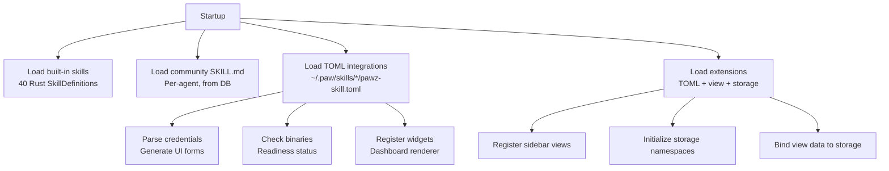
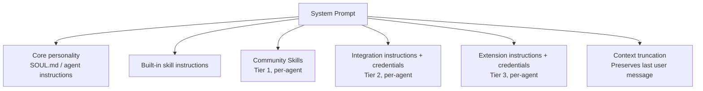
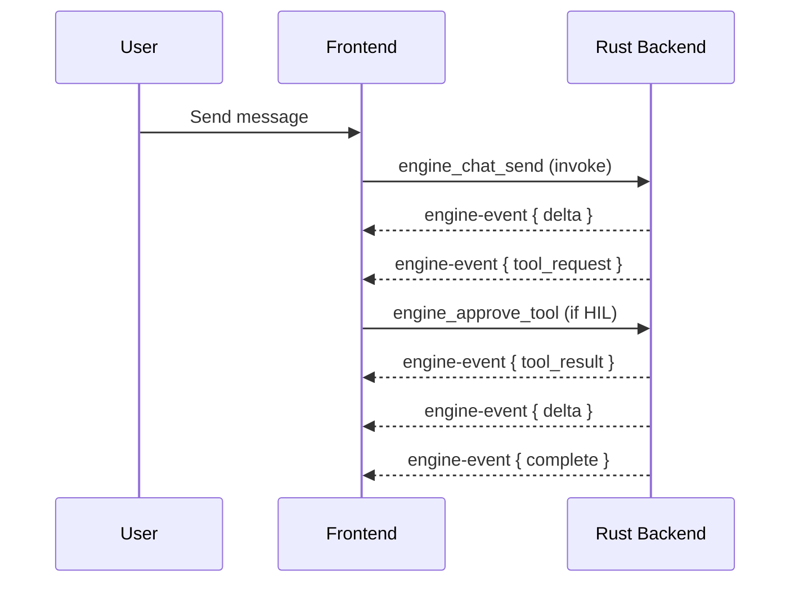

# Architecture

OpenPawz is a Tauri v2 desktop application with a Rust backend and TypeScript frontend.

## System overview

<Columns cols={1}>
  <Card title="Tauri Shell" icon="box">
    <Columns cols={1}>
      <Card title="TypeScript Frontend" icon="monitor" horizontal>
        Views · Feature Modules · IPC Bridge
      </Card>
    </Columns>
    <p style={{ textAlign: 'center', margin: '4px 0', opacity: 0.5 }}>↕ IPC (invoke / events)</p>
    <Columns cols={1}>
      <Card title="Rust Engine" icon="server" horizontal>
        Agent Loop · Providers · Channels · Memory · Skills · Orchestrator · Sandbox
      </Card>
    </Columns>
    <p style={{ textAlign: 'center', margin: '4px 0', opacity: 0.5 }}>↕</p>
    <Columns cols={1}>
      <Card title="SQLite Database" icon="database" horizontal>
        sessions · messages · memories · tasks · skills · agents · projects · trades
      </Card>
    </Columns>
  </Card>
</Columns>

## Extensibility — Three-Tier System

Pawz has a three-tier extensibility architecture. Each tier adds more power over the previous.

<Columns cols={1}>
  <Card title="Tier 3 — Extensions" icon="sparkles" color="#EAB308">
    Custom sidebar views · Dashboard widgets · Persistent data<br />
    `pawz-skill.toml` + `[view]` + `[storage]`
  </Card>
</Columns>
<Columns cols={1}>
  <Card title="Tier 2 — Integrations" icon="square-terminal" color="#A855F7">
    Credential vault · API access · CLI binaries · Widgets<br />
    `pawz-skill.toml` + `[[credentials]]` + `[instructions]`
  </Card>
</Columns>
<Columns cols={1}>
  <Card title="Tier 1 — Skills" icon="file-text" color="#3B82F6">
    Prompt injection only · Zero config · `SKILL.md` format<br />
    skills.sh ecosystem · Agent-installable
  </Card>
</Columns>

| Tier | Format | Capabilities |
|------|--------|-------------|
| **Skill** | `SKILL.md` | Prompt injection, zero config |
| **Integration** | `pawz-skill.toml` | + Credentials, binary detection, widgets |
| **Extension** | `pawz-skill.toml` + `[view]`/`[storage]` | + Custom sidebar views, persistent data |

### Skill loading pipeline



### Agent prompt assembly



For full details: [Skills](/docs/guides/skills) · [Integrations](/docs/guides/integrations) · [Extensions](/docs/guides/extensions) · [PawzHub](/docs/guides/pawzhub)

## Frontend (`src/`)

Vanilla TypeScript with DOM manipulation — no framework. Each view is a module that renders into the main content area.

### Views

| View | File | Purpose |
|------|------|---------|
| Today | `views/today/` | Dashboard with quick actions |
| Agents | `views/agents/` | Create, edit, manage agents |
| Tasks | `views/tasks/` | Kanban task board |
| Skills | `views/skills/` | Skill vault management |
| Research | `views/research/` | Research workflow |
| Orchestrator | `views/orchestrator/` | Multi-agent projects |
| Memory Palace | `views/memory-palace/` | Memory browser/search |
| Mail | `views/mail/` | Email integration |
| Trading | `views/trading/` | Trading dashboard |
| Automations | `views/automations/` | Cron task management |
| Settings | `views/settings-*/` | 11 settings tabs |

### Feature modules (`src/features/`)

Atomic design pattern — each feature has `atoms.ts` (data/state), `molecules.ts` (UI components), and `index.ts` (exports).

| Module | Purpose |
|--------|---------|
| `agent-policies` | Tool allowlist/denylist per agent |
| `browser-sandbox` | Browser config and network policy |
| `channel-routing` | Message routing rules |
| `container-sandbox` | Docker sandbox config |
| `memory-intelligence` | Memory search and config |
| `prompt-injection` | Injection detection patterns |
| `session-compaction` | Session summarization |
| `slash-commands` | Chat slash command definitions |

### IPC bridge (`src/engine-bridge.ts`)

All communication with the Rust backend goes through Tauri's `invoke()` and event system. The bridge provides typed wrappers for every engine command.

## Backend (`src-tauri/src/engine/`)

Rust async engine built on Tokio.

### Core modules

| Module | Purpose |
|--------|---------|
| `agent_loop.rs` | Main agent conversation loop |
| `providers.rs` | AI provider factory and routing |
| `channels.rs` | Channel bridge message handler |
| `memory.rs` | Hybrid search (BM25 + vector + temporal) |
| `skills.rs` | Skill catalog and credential vault |
| `orchestrator.rs` | Multi-agent project execution |
| `sandbox.rs` | Docker container execution |
| `tool_executor.rs` | Tool dispatch and execution |
| `sessions.rs` | Session and message persistence |
| `compaction.rs` | Session compaction/summarization |
| `routing.rs` | Channel-to-agent routing |
| `injection.rs` | Prompt injection detection |

### Channel bridges

Each channel has its own bridge module:

`telegram.rs` · `discord.rs` · `slack.rs` · `matrix.rs` · `irc.rs` · `mattermost.rs` · `nextcloud.rs` · `nostr.rs` · `twitch.rs` · `webchat.rs` · `whatsapp/`

### Provider implementations

| Implementation | Providers |
|---------------|-----------|
| `OpenAiProvider` | OpenAI, Ollama, OpenRouter, DeepSeek, Grok, Mistral, Moonshot, Custom |
| `AnthropicProvider` | Anthropic |
| `GoogleProvider` | Google Gemini |

## Database

Pawz uses **two SQLite databases** — one managed by the Rust engine, one by the TypeScript frontend.

### Engine database (Rust — `rusqlite`)

| Table | Contents |
|-------|----------|
| `sessions` | Chat sessions per agent (id, label, model, system_prompt, agent_id, timestamps) |
| `messages` | All messages with role, content, tool calls JSON, tool_call_id, name |
| `engine_config` | Key-value configuration store for engine settings |
| `agent_files` | Agent personality files (SOUL.md, AGENTS.md, etc.) per agent |
| `memories` | Stored facts with embedding vectors, category, importance, timestamps |
| `tasks` | Kanban tasks with title, description, status, priority, cron schedule, model override |
| `task_activity` | Task activity feed (created, assigned, status_change, agent_started, etc.) |
| `task_agents` | Multi-agent task assignments (agent_id, role: lead/collaborator) |
| `projects` | Orchestrator projects with title, goal, status, boss_agent |
| `project_agents` | Project agent assignments (role, specialty, status, current_task, model) |
| `project_messages` | Inter-agent messages (delegation, progress, result, error) |
| `trade_history` | Trading records (trade, transfer, dex_swap) with amounts and status |
| `positions` | Open trading positions with stop-loss/take-profit targets |
| `skill_credentials` | Encrypted API keys and secrets per skill |
| `skill_state` | Enabled/disabled state per skill |
| `skill_custom_instructions` | User-edited skill instructions (overrides defaults) |
| `community_skills` | Installed community skills from skills.sh ecosystem (name, description, instructions, source, enabled) |

### Frontend database (TypeScript — `@tauri-apps/plugin-sql`)

| Table | Contents |
|-------|----------|
| `agent_modes` | Chat modes (General, Code Review, Quick Chat) with model, prompt, temperature |
| `projects` | User workspace projects (build, research, create) |
| `project_files` | Files within workspace projects (path, content, language) |
| `automation_runs` | Cron job execution history (job_id, status, output, error) |
| `research_findings` | Research findings with title, content, source URL |
| `content_documents` | Content Studio documents (markdown, HTML, plaintext) |
| `email_accounts` | Email account configuration (IMAP/SMTP hosts, ports) |
| `emails` | Cached emails with body, read/starred status, agent draft fields |
| `credential_activity_log` | Audit trail for every credential access (action, tool, was_allowed) |
| `security_audit_log` | Security events (exec_approval, config_change, auto_deny, etc.) |
| `security_rules` | User-defined allow/deny patterns for command execution |

### Canvas database (Rust — `rusqlite`)

| Table | Contents |
|-------|----------|
| `canvases` | Canvas workspaces (title, timestamps) |
| `canvas_nodes` | Nodes on a canvas (type, position, size, data) |
| `canvas_edges` | Edges connecting canvas nodes (source, target, label) |

:::info
Sensitive fields in the frontend database are encrypted with AES-256-GCM using a key stored in the OS keychain. Encrypted values are prefixed with `enc:` for identification.
:::

## IPC bridge architecture

All communication between the TypeScript frontend and Rust backend uses Tauri's IPC system. The bridge (`src/engine/molecules/ipc_client.ts`) provides typed wrappers for every invoke command.

### Invoke commands (Frontend → Backend)

Commands are called via `invoke()` and return Promises:

| Category | Commands |
|----------|----------|
| **Chat** | `engine_chat_send`, `engine_chat_history` |
| **Sessions** | `engine_sessions_list`, `engine_session_rename`, `engine_session_delete`, `engine_session_clear`, `engine_session_compact` |
| **Config** | `engine_get_config`, `engine_set_config`, `engine_upsert_provider`, `engine_remove_provider`, `engine_status`, `engine_auto_setup` |
| **Agent files** | `engine_agent_file_list`, `engine_agent_file_get`, `engine_agent_file_set`, `engine_agent_file_delete` |
| **Memory** | `engine_memory_store`, `engine_memory_search`, `engine_memory_list`, `engine_memory_delete`, `engine_memory_stats`, `engine_get_memory_config`, `engine_set_memory_config`, `engine_test_embedding`, `engine_embedding_status`, `engine_embedding_pull_model`, `engine_ensure_embedding_ready`, `engine_memory_backfill` |
| **Skills** | `engine_skills_list`, `engine_skill_set_enabled`, `engine_skill_set_credential`, `engine_skill_delete_credential`, `engine_skill_revoke_all`, `engine_skill_get_instructions`, `engine_skill_set_instructions` |
| **Community Skills** | `engine_community_skills_list`, `engine_community_skills_browse`, `engine_community_skills_search`, `engine_community_skill_install`, `engine_community_skill_remove`, `engine_community_skill_set_enabled` |
| **Tasks** | `engine_tasks_list`, `engine_task_create`, `engine_task_update`, `engine_task_delete`, `engine_task_move`, `engine_task_activity`, `engine_task_set_agents`, `engine_task_run`, `engine_tasks_cron_tick` |
| **TTS / STT** | `engine_tts_speak`, `engine_tts_get_config`, `engine_tts_set_config`, `engine_tts_transcribe` |
| **Trading** | `engine_trading_history`, `engine_trading_summary`, `engine_trading_policy_get`, `engine_trading_policy_set`, `engine_positions_list`, `engine_position_close`, `engine_position_update_targets` |
| **Projects** | `engine_projects_list`, `engine_project_create`, `engine_project_update`, `engine_project_delete`, `engine_project_set_agents`, `engine_project_messages`, `engine_project_run` |
| **Agents** | `engine_list_all_agents`, `engine_create_agent`, `engine_delete_agent`, `engine_approve_tool` |
| **Browser** | `engine_browser_get_config`, `engine_browser_set_config`, `engine_browser_create_profile`, `engine_browser_delete_profile` |
| **Screenshots** | `engine_screenshots_list`, `engine_screenshot_get`, `engine_screenshot_delete` |
| **Workspaces** | `engine_workspaces_list`, `engine_workspace_files`, `engine_workspace_delete` |
| **Network** | `engine_network_get_policy`, `engine_network_set_policy`, `engine_network_check_url` |
| **Channels** | `engine_<channel>_start`, `engine_<channel>_stop`, `engine_<channel>_status`, `engine_<channel>_get_config`, `engine_<channel>_set_config`, `engine_<channel>_approve_user`, `engine_<channel>_deny_user`, `engine_<channel>_remove_user` (for telegram, discord, irc, slack, matrix, mattermost, nextcloud, nostr, twitch) |
| **Tailscale** | `engine_tailscale_status`, `engine_tailscale_get_config`, `engine_tailscale_set_config`, `engine_tailscale_serve_start`, `engine_tailscale_serve_stop`, `engine_tailscale_funnel_start`, `engine_tailscale_funnel_stop`, `engine_tailscale_connect`, `engine_tailscale_disconnect` |
| **Email** | `read_himalaya_config`, `write_himalaya_config`, `remove_himalaya_account`, `fetch_emails`, `fetch_email_content`, `send_email`, `move_email`, `delete_email` |
| **Security** | `get_db_encryption_key` |

### Agent built-in tools

Every agent has access to these built-in tools (defined in `tools.rs`, executed in `tool_executor.rs`):

| Tool | Parameters | Description |
|------|-----------|-------------|
| `skill_search` | `query` (string) | Search the skills.sh directory for community skills by keyword |
| `skill_install` | `source` (owner/repo), `path` (skills/id/SKILL.md) | Install a community skill from GitHub |
| `skill_list` | — | List all installed community skills with enabled/disabled status |

These tools allow agents to discover, install, and manage community skills during conversations without requiring the user to visit the Skills tab.

## Events (Backend → Frontend)

The engine communicates with the frontend via Tauri's event system for real-time updates. The frontend subscribes using `listen()` and the backend emits events asynchronously.

| Event | Payload | Purpose |
|-------|---------|--------|
| `engine-event` | `EngineEvent` | Streaming deltas, tool requests, tool results, completions, and errors |
| `project-event` | `{ project_id, agent_id, kind }` | Project/agent finished notifications |
| `agent-profile-updated` | `{ agent_id }` | Agent profile changes (name, avatar, bio) |

### EngineEvent kinds

The `engine-event` payload contains a `kind` field that determines the event type:

| Kind | Fields | Description |
|------|--------|-------------|
| `delta` | `text`, `session_id`, `run_id` | Streaming text chunk from the AI model |
| `tool_request` | `tool_call` (id, function name, arguments) | Agent wants to call a tool — may require human approval |
| `tool_result` | `tool_call_id`, `output`, `success` | Result of a tool execution |
| `complete` | `tool_calls_count`, `usage` (tokens), `model` | Agent turn completed |
| `error` | `message` | Error during agent execution |

### Event flow



## Build pipeline

Pawz uses a dual build pipeline — **Vite** for the frontend and **Cargo** for the Rust backend, orchestrated by Tauri:

### Development

```bash
npm run tauri dev
```

1. **Vite dev server** starts on `http://localhost:1420` (HMR enabled)
2. **Cargo** compiles the Rust backend in debug mode
3. **Tauri** launches the app window pointing at the Vite dev server
4. File changes in `src/` trigger Vite HMR; changes in `src-tauri/` trigger Cargo rebuild

### Production build

```bash
npm run tauri build
```

1. `npm run build` — Vite bundles TypeScript → `dist/` (optimized, minified)
2. `cargo build --release` — Compiles Rust backend with optimizations
3. Tauri packages both into a native installer (`.dmg`, `.AppImage`, `.msi`)

### Build configuration

| Config file | Purpose |
|-------|--------|
| `vite.config.ts` | Vite settings: port 1420, ignores `src-tauri/`, HMR on port 1421 |
| `src-tauri/tauri.conf.json` | Tauri settings: `beforeDevCommand`, `beforeBuildCommand`, CSP policy, window config |
| `src-tauri/Cargo.toml` | Rust dependencies and build profile |
| `tsconfig.json` | TypeScript compiler options |

### Content Security Policy

The production CSP restricts the frontend:

```
default-src 'self'; script-src 'self'; style-src 'self' 'unsafe-inline';
connect-src 'self' ws://127.0.0.1:* https://127.0.0.1:*;
img-src 'self' data: blob:; font-src 'self' data:;
object-src 'none'; frame-ancestors 'none'
```

## Technology stack

| Layer | Technology |
|-------|------------|
| Shell | Tauri v2 |
| Frontend | TypeScript, vanilla DOM |
| Backend | Rust, Tokio async |
| Database | SQLite (rusqlite + @tauri-apps/plugin-sql) |
| HTTP | reqwest |
| Browser | headless_chrome (Chrome DevTools Protocol) |
| HTML parsing | scraper (Rust) |
| Docker | bollard |
| Build (frontend) | Vite |
| Build (backend) | Cargo |
| Icons | Material Symbols Outlined |
| Fonts | Inter, JetBrains Mono |
