# The Conductor Protocol

**AI-Compiled Flow Execution — Collapse, Extract, Parallelize, Converge**

*Open source (MIT). Part of the OpenPawz project.*

---

## The Problem

Every workflow automation platform — n8n, Zapier, Make, Prefect, Airflow — executes the same way: walk the graph, node by node, in topological order. Node A finishes, pass data to Node B, Node B finishes, pass data to Node C. Sequential. Synchronous. One LLM call per agent node.

This worked fine when workflows were simple and nodes were cheap API calls. But AI workflows are fundamentally different:

- **Agent nodes are expensive.** Each agent step is an LLM call — 2–10 seconds of latency and real token cost.
- **Chains get long.** A real pipeline might have 8–20 nodes: trigger → parse data → agent analysis → condition → agent rewrite → tool call → agent review → output.
- **Branches are wasted.** When two independent branches can run in parallel, sequential execution waits for each one to finish before starting the next.
- **Cycles are impossible.** n8n, Zapier, and Make all require DAGs — directed acyclic graphs. No loops, no feedback, no iterative refinement. If you need two agents to debate until they agree, you can't express that.

### The math is simple and brutal

A 10-node flow with 6 agent steps, each averaging 4 seconds of LLM latency:

| Platform | Execution | Time | LLM Calls |
|----------|-----------|------|-----------|
| n8n / Zapier / Make | Sequential walk | **24s+** | 6 |
| OpenPawz (Conductor) | Compiled strategy | **4–8s** | 2–3 |

The Conductor doesn't skip work. It does the same work *smarter* — merging compatible agent calls, running independent branches simultaneously, and bypassing the LLM entirely for nodes that don't need it.

---

## The Invention

The Conductor Protocol treats flow graphs not as programs to execute, but as **blueprints of intent** that can be compiled into optimized execution strategies before a single node runs.

Traditional platforms interpret flows imperatively — "do this, then this, then this." The Conductor interprets flows declaratively — "here is what needs to happen; let me figure out the fastest way to make it happen."

The compilation step produces an `ExecutionStrategy`: a sequence of phases, where each phase contains units that run concurrently, and each unit represents one or more original nodes merged or classified for optimal execution.

### Four Primitives

The Conductor analyzes any flow graph and applies four optimization primitives:

```mermaid actions={false}
graph TD
    subgraph Input["Flow Graph (Blueprint)"]
        A["trigger"] --> B["agent 1"]
        B --> C["agent 2"]
        B --> D["agent 3"]
        C --> E["tool"]
        D --> F["code"]
        E --> G["agent 4"]
        F --> G
    end

    subgraph Conductor["Conductor Compilation"]
        H["1. Collapse — merge compatible agents"]
        I["2. Extract — bypass LLM for deterministic nodes"]
        J["3. Parallelize — run independent branches concurrently"]
        K["4. Converge — handle cycles with iterative rounds"]
    end

    subgraph Output["Execution Strategy"]
        L["Phase 0: trigger (passthrough)"]
        M["Phase 1: collapsed(agent1+agent2) ‖ collapsed(agent1+agent3)"]
        N["Phase 2: direct(tool) ‖ direct(code)"]
        O["Phase 3: single-agent(agent4)"]
    end

    Input --> Conductor
    Conductor --> Output
```



---

## Primitive 1: Collapse

**Adjacent agent nodes with compatible configurations merge into a single LLM call.**

When two or three agent nodes form a chain — each passing output to the next — the Conductor merges their prompts into a single compound prompt with step boundaries. One LLM call does the work of many.

### Before (traditional):

```
Agent 1: "Summarize this data"        → LLM call (4s)  → result
Agent 2: "Extract key metrics from…"  → LLM call (4s)  → result
Agent 3: "Write a report based on…"   → LLM call (4s)  → result
Total: 3 LLM calls, ~12 seconds
```

### After (Conductor Collapse):

```
Collapsed prompt:
  "Step 1: Summarize this data
   ---STEP_BOUNDARY---
   Step 2: Extract key metrics from the summary above
   ---STEP_BOUNDARY---
   Step 3: Write a report based on the metrics above"
→ 1 LLM call (5s) → parsed back into 3 node outputs
Total: 1 LLM call, ~5 seconds
```

#### Compatibility rules

Two agent nodes can be collapsed when they:
- Share the same model (or both use the default model)
- Share the same temperature setting (or both use defaults)
- Have no tool invocations configured (tool calls require individual sessions)
- Form a direct chain (A → B) with no branching between them

The Conductor detects these chains automatically via `detectCollapseChains()` and builds merged prompts via `buildCollapsedPrompt()`. After execution, `parseCollapsedOutput()` splits the response back into individual node results using `---STEP_BOUNDARY---` delimiters.

---

## Primitive 2: Extract

**Deterministic nodes bypass the LLM entirely and execute directly.**

Not every node in an AI workflow needs artificial intelligence. Tool calls, HTTP requests, code execution, data transforms, and MCP invocations are fully deterministic — they don't need an LLM to format a JSON-RPC call or run a JavaScript function. The Conductor classifies each node and routes deterministic work to direct execution:

| Node Classification | Execution Path | Examples |
|---------------------|---------------|----------|
| **Agent** | LLM call via engine | `agent`, `squad` |
| **Direct** | Bypass LLM — execute via Rust backend or sandbox | `tool`, `code`, `http`, `mcp-tool`, `loop`, `memory`, `memory-recall` |
| **Passthrough** | No execution — data forwarding only | `trigger`, `output`, `error`, `group` |

In a 10-node flow with 4 agent nodes and 6 direct/passthrough nodes, the Conductor reduces LLM calls from 10 to 4 — or fewer, if some agents can be collapsed.

### How Extract works with the Foreman Protocol

Extract and the [Foreman Protocol](/reference/foreman-protocol) are complementary optimizations that operate at different levels:

- **Extract** eliminates unnecessary LLM calls at the *flow level* — a tool node in a flow doesn't need any model to execute
- **Foreman** reduces the cost of necessary tool calls at the *agent level* — when an agent decides to call a tool during conversation, the Foreman delegates to a cheaper model

Together: the Conductor skips the LLM for deterministic flow nodes entirely, and when agent nodes do need to call tools, the Foreman handles execution at minimal cost.

---

## Primitive 3: Parallelize

**Independent branches at the same depth level execute concurrently.**

When a flow fans out — one node feeding into multiple downstream branches that don't depend on each other — sequential execution wastes time waiting for each branch to finish before starting the next. The Conductor detects independent branches via depth analysis and union-find grouping, then runs them simultaneously within the same execution phase.


### Sequential (traditional):
```
trigger → classify → summarize → fetch metrics → parse data → output
Total: 6 steps, ~16 seconds
```

### Conductor (parallel):
```
Phase 0: trigger (passthrough)
Phase 1: classify (single agent)
Phase 2: summarize ‖ fetch metrics ‖ parse data  ← all three run concurrently
Phase 3: output (passthrough)
Total: 4 phases, ~8 seconds
```

The grouping algorithm uses `groupByDepth()` to assign each node a depth level based on its longest path from roots, then `splitIntoIndependentGroups()` uses union-find to identify which nodes within the same depth level share dependencies. Nodes in separate dependency groups run as concurrent execution units within the same phase.

---

## Primitive 4: Converge (Convergent Mesh)

**Cyclic subgraphs iterate as shared-context conversations until outputs stabilize.**

This is the primitive that has no equivalent in any existing workflow platform. n8n, Zapier, Make, Airflow, Prefect — they all require DAGs. Cycles are errors. Feedback loops are impossible.

But some of the most powerful AI patterns are inherently cyclic:

- **Debate and consensus:** Two agents argue a topic until they reach agreement
- **Iterative refinement:** A writer and editor pass drafts back and forth until quality stabilizes
- **Self-correction:** An agent checks its own output, finds errors, fixes them, checks again
- **Multi-perspective analysis:** Three analysts each review the others' findings and update their own

The Conductor enables these patterns through **bidirectional edges** and convergent mesh execution.

### How it works


1. The Conductor detects cycles in the flow graph (nodes connected via bidirectional or reverse edges that form loops)
2. Overlapping cycles are merged into **mesh groups** via `buildMeshConfigs()`
3. Each mesh group executes in iterative rounds:
   - Round 1: Each node in the mesh executes with its initial input
   - Round 2: Each node re-executes with shared context from all other nodes' Round 1 outputs
   - Round N: Continue until outputs **converge** or max iterations are reached
4. **Convergence detection** uses Jaccard similarity on word tokens — when consecutive outputs from the same node are ≥85% similar, that node has stabilized
5. When all nodes in the mesh have converged, or the maximum iteration count (default: 5) is reached, the mesh completes and downstream nodes receive the final outputs

### Example: Writer–Editor debate

```
Round 1:
  Writer: produces initial draft
  Editor: reviews draft, suggests changes

Round 2:
  Writer: revises based on editor feedback
  Editor: reviews revision — "much better, minor grammar fix on paragraph 3"

Round 3:
  Writer: applies grammar fix
  Editor: reviews — "looks good, approved"  ← 92% similar to Round 2 output

Convergence detected (0.92 > 0.85 threshold). Mesh complete.
Output: final approved draft flows to downstream nodes.
```

No other automation platform can express this pattern. In n8n, you would need to manually build a loop with external state management and hope it terminates. In Zapier, it's simply impossible.

---

## Execution Strategy

The Conductor compiles all four primitives into a unified `ExecutionStrategy`:

```typescript
interface ExecutionStrategy {
  graphId: string;
  phases: ExecutionPhase[];        // sequential phases
  totalNodes: number;
  estimatedLlmCalls: number;       // after collapse + extract
  estimatedDirectActions: number;  // extracted nodes
  conductorUsed: boolean;
  meta: {
    collapseGroups: number;        // chains merged
    parallelPhases: number;        // phases with >1 concurrent unit
    meshCount: number;             // convergent meshes
    extractedNodes: number;        // nodes bypassing LLM
  };
}

interface ExecutionPhase {
  index: number;
  units: ExecutionUnit[];          // all units in a phase run concurrently
}

interface ExecutionUnit {
  id: string;
  type: 'collapsed-agent' | 'direct-action' | 'single-agent' | 'single-direct' | 'mesh';
  nodeIds: string[];               // original nodes this unit represents
  mergedPrompt?: string;           // for collapsed units
  maxIterations?: number;          // for mesh units
  dependsOn: string[];             // inter-unit dependencies
}
```

The strategy is computed once before execution begins. The executor then walks phases sequentially, running all units within each phase concurrently via `Promise.all`. If strategy execution fails for any reason, the executor automatically falls back to sequential node-by-node execution — the Conductor is always additive, never destructive.

---

## Adaptive Activation

The Conductor doesn't blindly compile every flow. Small, simple flows run faster with direct sequential execution. The `shouldUseConductor()` function evaluates whether compilation overhead is worthwhile:

| Condition | Threshold |
|-----------|-----------|
| Node count | ≥ 4 nodes |
| Branching | Any node with fan-out > 1 |
| Cycles | Any bidirectional edges |
| Mixed types | Both agent and direct-action nodes present |

A 3-node linear flow (trigger → agent → output) skips the Conductor and runs sequentially. A 6-node flow with branches, tool calls, and an agent chain activates the Conductor. The crossover point is approximately 4 nodes — below that, compilation overhead exceeds the savings.

---

## Performance

Benchmarks comparing sequential DAG walk (n8n/Zapier model) against Conductor-compiled execution:

| Flow Pattern | Nodes | Sequential | Conductor | Speedup | LLM Calls Saved |
|-------------|-------|------------|-----------|---------|-----------------|
| Linear chain (3 agents) | 5 | 20–45s | 4–9s | **4–5×** | 2 (collapse) |
| Fan-out (parallel branches) | 8 | 35–70s | 5–10s | **5–7×** | 3 (collapse + parallel) |
| Bidirectional debate | 6 | ∞ (impossible) | 15–25s | **∞** | N/A (new capability) |
| Production pipeline | 20 | 80–160s | 8–18s | **8–10×** | 12+ (all primitives) |

The gains compound: Collapse reduces total LLM calls, Extract eliminates unnecessary ones, and Parallelize runs the remaining work concurrently. On a 20-node production flow, the Conductor can reduce wall-clock time by an order of magnitude.

---

## vs. Every Other Platform

| Capability | n8n | Zapier | Make | Airflow | OpenPawz Conductor |
|-----------|-----|--------|------|---------|--------------------|
| **Execution model** | Sequential DAG walk | Sequential DAG walk | Sequential DAG walk | Task scheduler (DAG) | AI-compiled strategy |
| **Cycles / feedback loops** | Error | Error | Error | Error | Convergent Mesh |
| **Agent-as-node** | Via HTTP/code wrapper | Via HTTP wrapper | Via HTTP wrapper | External operator | First-class, streaming |
| **LLM call optimization** | None | None | None | None | Collapse (N agents → 1 call) |
| **Deterministic bypass** | All nodes same path | All nodes same path | All nodes same path | All nodes same path | Extract (skip LLM) |
| **Auto-parallelism** | Manual split/merge | None | Manual router | Executor-level | Automatic depth analysis |
| **Bidirectional edges** | No | No | No | No | Yes (forward, reverse, bidirectional, error) |
| **Debug step-through** | Limited | None | Limited | Log-based | Full breakpoints + cursor + edge inspection |
| **Self-healing** | No | Retry only | Retry only | Retry only | Error diagnosis + fix proposals + auto-retry |
| **Memory integration** | No | No | No | No | Memory-write/recall nodes |
| **Multi-agent teams** | No | No | No | No | Squad nodes |
| **Cost** | Self-hosted free / Cloud paid | Per-task pricing | Per-operation pricing | Self-hosted free | Free local (Ollama) or cloud |

### The fundamental difference

Traditional platforms treat workflows as **imperative programs** — a fixed sequence of steps the computer follows literally. The Conductor treats workflows as **declarative blueprints** — a description of what needs to happen, which the system compiles into the most efficient execution plan.

This is the same conceptual leap that separated SQL from procedural database queries, or that separated React's declarative UI from imperative DOM manipulation. You describe *what*, not *how*. The runtime figures out *how*.

---

## Edge Types

The Conductor's power partly comes from OpenPawz's four edge types — richer than any other workflow platform:

| Edge Kind | Direction | Purpose | Enables |
|-----------|-----------|---------|---------|
| **Forward** | A → B | Normal data flow | Standard pipelines |
| **Reverse** | A ← B | Data pull — B requests from A | Lazy evaluation, on-demand data |
| **Bidirectional** | A ↔ B | Handshake — mutual data exchange | Cycles, debates, iterative refinement |
| **Error** | A --err→ B | Failure routing | Graceful degradation, fallback chains |

n8n, Zapier, and Make support only forward edges. Airflow supports forward edges with limited error handling. OpenPawz's reverse and bidirectional edges enable entirely new workflow patterns that are structurally impossible on other platforms.

---

## Debug Mode

The Conductor includes a full step-through debugger — uncommon in workflow platforms and absent from automation tools like Zapier and Make:

- **Breakpoints**: Click any node to set a breakpoint. Execution pauses when the Conductor reaches that node.
- **Step-through**: Execute one node at a time, inspecting inputs and outputs at each step.
- **Edge data inspection**: See the actual data flowing through each edge during execution (truncated to 80 characters for readability).
- **Cursor tracking**: A visual cursor follows execution across the canvas, highlighting the currently executing node.
- **Pause/Resume/Abort**: Full lifecycle control during any execution — sequential or Conductor-compiled.

Debug mode works with both sequential and Conductor-compiled execution. When debugging a Conductor strategy, the debugger steps through execution units within phases, showing collapsed units as single steps and expanding mesh iterations.

---

## Self-Healing

When a node fails during execution, the Conductor doesn't just retry blindly. The self-healing system:

1. **Classifies the error** into categories: timeout, rate-limit, auth, network, invalid-input, config, code-error, api-error
2. **Generates a diagnosis** explaining what went wrong and why
3. **Proposes fixes** with confidence scores — e.g., "increase timeout to 60s (confidence: 0.85)" or "check API key in vault (confidence: 0.92)"
4. **Retries with backoff** — configurable max retries, delay, and exponential backoff
5. **Routes to error handlers** — if retry fails, error edges route to designated error-handler nodes, and the success-path subtree is skipped

This turns brittle automation into resilient pipelines. A rate-limited API call doesn't crash the flow — it backs off, retries, and if it still fails, routes to a fallback path.

---

## The Trinity

The Conductor Protocol is the third of OpenPawz's three complementary inventions. Together, they solve the complete lifecycle of AI-driven automation:

| Protocol | Problem | Solution |
|----------|---------|----------|
| [**The Librarian Method**](/reference/librarian-method) | *Which* tool to use among many? | Intent-driven discovery via semantic embeddings |
| [**The Foreman Protocol**](/reference/foreman-protocol) | *How* to execute tools cheaply? | Worker model delegation via self-describing MCP |
| **The Conductor Protocol** | *What's the optimal execution plan?* | AI-compiled flow strategies: Collapse, Extract, Parallelize, Converge |

In a single flow execution:
1. The **Conductor** compiles the graph into an optimized strategy — collapsing agents, extracting direct actions, parallelizing branches
2. Agent nodes that need tools use the **Librarian** to discover which workflows/tools are relevant
3. Tool calls are delegated to the **Foreman** for cheap or free execution via worker models

The result: a 20-node flow that would take 2+ minutes on n8n executes in under 20 seconds on OpenPawz, with lower cost and capabilities (cycles, memory, squads) that other platforms cannot express at all.

---

## 25,000 Nodes, Reimagined

n8n has over 25,000 community-contributed integration nodes — Slack, Jira, GitHub, Stripe, Airtable, Google Sheets, thousands more. Every one of them was designed for the same paradigm: a human drags nodes onto a canvas, manually wires them together, and builds a sequential automation. The nodes are powerful. The paradigm is limited.

The Conductor Protocol transforms what those nodes can do.

n8n's MCP server exposes workflow-level tools: `search_workflows`, `execute_workflow`, and `get_workflow_details`. Paw composes n8n nodes into per-service workflows that are auto-deployed and made available through MCP. The Conductor can then orchestrate these workflows as part of larger, AI-compiled execution strategies:

- **Collapse** multiple sequential workflow executions into a single orchestrated call
- **Extract** simple workflow executions and run them directly — no LLM reasoning needed
- **Parallelize** independent workflow executions across branches automatically
- **Converge** workflow-connected agents in iterative feedback loops that n8n itself cannot express

This is not a wrapper around n8n. It is a fundamentally new execution model that uses n8n's integration ecosystem as building blocks for AI-compiled workflows.

### What this means in practice

A user types:

> *"When a webhook fires, have an agent classify the data, then in parallel: summarize it and store it in Airtable, and if it's urgent, post to Slack #alerts"*

The NLP parser builds a 7-node flow graph. The Conductor compiles it:

- **Phase 0:** Trigger (passthrough)
- **Phase 1:** Agent classify (single LLM call)
- **Phase 2:** Agent summarize ‖ Airtable store ‖ Condition check — all concurrent
- **Phase 3:** Slack post (direct, no LLM)

The Airtable and Slack operations are n8n workflows executed via `execute_workflow`. They execute via Extract — direct MCP calls, zero LLM cost. The agent steps that need AI intelligence get Collapsed where possible. Independent branches Parallelize automatically.

The 25,000 n8n nodes didn't change. What changed is the engine that orchestrates them — and the fact that Paw composes those nodes into workflows that become first-class tools.

---

## Natural Language to Compiled Flow

Traditional workflow platforms require users to manually construct automations — drag nodes, configure each one, wire connections. The Conductor Protocol sits at the end of a pipeline that eliminates this entirely:

```mermaid actions={false}
graph LR
    A["User types: 'webhook → agent → send email'"] --> B["NLP Parser"]
    B --> C["Flow Graph"]
    C --> D["Conductor Compiler"]
    D --> E["Execution Strategy"]
    E --> F["Optimized Execution"]
```



1. **Natural language input** — The user describes a workflow in plain English in the Flows text box
2. **NLP parsing** — The text-to-flow parser identifies node types, relationships, and configurations from the description
3. **Graph construction** — A complete `FlowGraph` is built with nodes, edges, positions, and default configurations
4. **Conductor compilation** — The graph is analyzed and compiled into an optimized `ExecutionStrategy`
5. **Execution** — The strategy runs with all four primitives applied

The entire path from "I want a webhook that classifies incoming data and posts urgent items to Slack" to compiled, optimized, executing flow happens without the user ever dragging a node or wiring a connection.

This collapses the gap between **intent** and **execution** in a way no other platform achieves. Zapier requires manual Zap construction. n8n requires manual node wiring. Make requires manual scenario building. Even AI-assisted tools like Zapier's AI only help *configure* individual steps — they don't compile the execution.

The Conductor compiles. That is the difference.

---

## Implementation

The Conductor Protocol is implemented in TypeScript as part of the OpenPawz flow engine:

| Module | Purpose |
|--------|---------|
| `conductor-atoms.ts` | Core types — `ExecutionStrategy`, `ExecutionPhase`, `ExecutionUnit`, `shouldUseConductor()` |
| `conductor-graph.ts` | Graph analysis — `classifyNode()`, `computeDepths()`, `findCycles()` |
| `conductor-collapse.ts` | Collapse primitive — `detectCollapseChains()`, `buildCollapsedPrompt()`, `parseCollapsedOutput()` |
| `conductor-parallel.ts` | Parallelize primitive — `groupByDepth()`, `splitIntoIndependentGroups()` (union-find) |
| `executor-conductor.ts` | Strategy execution — `runConductorStrategy()`, `executeCollapsedUnit()`, `executeMeshRounds()` |
| `executor.ts` | Main executor — `createFlowExecutor()`, sequential fallback |
| `executor-debug.ts` | Debug mode — breakpoints, step-through, edge inspection |
| `executor-handlers.ts` | Node handlers — HTTP, MCP, Squad, Memory, Loop execution |
| `self-healing-atoms.ts` | Error classification, diagnosis, fix proposals |

### Strategy compilation (simplified)

```typescript
function compileStrategy(graph: FlowGraph): ExecutionStrategy {
  // 1. Classify every node
  const classifications = graph.nodes.map(n => classifyNode(n));

  // 2. Detect collapsible agent chains
  const collapseGroups = detectCollapseChains(graph);

  // 3. Detect convergent meshes (cyclic subgraphs)
  const meshes = buildMeshConfigs(graph);

  // 4. Compute depth levels for parallelization
  const depths = groupByDepth(graph, collapseGroups, meshes);

  // 5. Split each depth level into independent groups
  const phases = depths.map(level => ({
    units: splitIntoIndependentGroups(level)
  }));

  return {
    phases,
    estimatedLlmCalls: countAgentUnits(phases),
    estimatedDirectActions: countDirectUnits(phases),
    conductorUsed: true,
    meta: { collapseGroups: collapseGroups.length, ... }
  };
}
```

### Strategy execution

```typescript
async function runConductorStrategy(strategy: ExecutionStrategy) {
  for (const phase of strategy.phases) {
    // All units within a phase run concurrently
    await Promise.all(phase.units.map(unit => {
      switch (unit.type) {
        case 'collapsed-agent':
          return executeCollapsedUnit(unit);   // 1 LLM call for N nodes
        case 'direct-action':
          return executeDirectAction(unit);    // No LLM — Rust/sandbox
        case 'single-agent':
          return executeAgentStep(unit);        // 1 LLM call
        case 'mesh':
          return executeMeshRounds(unit);       // Iterative convergence
      }
    }));
  }
}
```

---

## Try It

### Build a flow

1. Open **Flows** from the sidebar
2. Click **+** to create a new flow, or describe one in the text box: *"webhook → agent summarize → agent format → send email"*
3. The NLP parser builds the graph automatically

### See the Conductor in action

1. Build a flow with 4+ nodes including at least one branch
2. Click **Run** (▶) — the Conductor compiles a strategy and executes it
3. Watch nodes light up in parallel when independent branches execute concurrently
4. After execution, the strategy is available via `getLastStrategy()` for inspection

### Debug step-through

1. Click **Debug** (🐛) to enter debug mode
2. Click any node to set a breakpoint
3. Click **Step** (⏭) to advance one node at a time
4. Inspect edge data labels to see values flowing through the graph

### Try a convergent mesh

1. Create two agent nodes
2. Connect them with a **bidirectional** edge (drag while holding Shift, or select bidirectional from edge type)
3. Add an output node downstream
4. Run — watch the agents iterate until convergence

---

## License & Attribution

The Conductor Protocol is part of **OpenPawz** and is released under the **MIT License**. You are free to use, modify, and redistribute this technique in any project, commercial or otherwise. Attribution is appreciated but not required.

If you reference this work in academic papers or technical writing:

> OpenPawz (2025). "The Conductor Protocol: AI-Compiled Flow Execution via Collapse, Extract, Parallelize, and Converge." https://github.com/OpenPawz/openpawz
