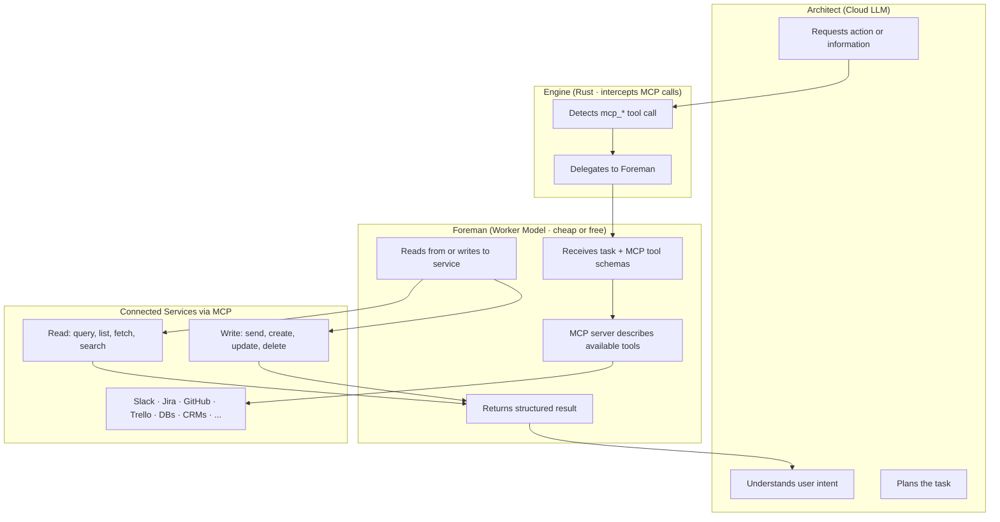

# The Foreman Protocol

**Bidirectional Access to 25,000+ Services via Worker Models and Self-Describing MCP**

*Open source (MIT). Part of the OpenPawz project.*

---

## The Problem

When an AI agent executes a tool — send a Slack message, generate a QR code, query a database — the actual API call is usually trivial. The expensive part is everything the cloud LLM does *around* it: reading tool schemas, reasoning about parameter formatting, generating structured JSON arguments, and interpreting the result. All of that burns paid cloud tokens.

For a simple action like posting a Slack message, the Slack API itself is free. But the cloud model has to process the tool schema, decide on parameters, format the call, wait for the result, and then summarize it back to the user. Every one of those steps consumes tokens at your provider's rate.

Now multiply that across an automation that sends 50 messages, creates 10 tickets, and updates 5 spreadsheets. The cloud API costs dominate — not because the tools are expensive, but because the *reasoning about how to call them* is expensive. And this cost scales with every tool you add to the agent's context.

### The Scaling Wall

The deeper problem is that traditional architectures require the cloud LLM to hold tool schemas in its context window in order to call them. As integrations grow, this breaks down completely:

- A small chatbot with 10 tools — manageable context overhead
- A platform with 400+ built-in tools — significant context consumed by schemas alone
- A system connected to 25,000+ integrations — impossible to load into any context window

Even loading a subset means every tool call routes through the most expensive model in the stack for work that doesn't require frontier intelligence. Formatting a JSON-RPC call is not a task that needs GPT-4 or Claude Opus.

---

## The Invention

The Foreman Protocol splits the agent into two roles:

- **Architect** (cloud LLM): Plans, reasons, talks to the user. Decides *what* needs to happen.
- **Foreman** (worker model): Interfaces with external services. Handles *how* it happens — both reading and writing. Can be a local Ollama model (zero cost) or a cheap cloud model (e.g. gemini-2.0-flash, gpt-4o-mini, claude-haiku — fraction of the Architect's cost).

The critical enabler is **MCP's self-describing schemas**. When the Foreman connects to an MCP server (n8n), the server tells it exactly what tools are available and how to call them — parameter names, types, descriptions, examples. The Foreman doesn't need pre-trained knowledge of Slack, Trello, or any integration. MCP provides the instruction manual at runtime.

### Bidirectional, Not a Pipeline

The Foreman is not a one-way executor in a sequence. It is a **bidirectional bridge** between your agent and every connected service. It can:

- **Read** — Query a database, list Slack channels, fetch open Jira tickets, check GitHub PR status
- **Write** — Send a message, create a ticket, update a spreadsheet, post to a webhook
- **Both in one task** — Read the open tickets, then post a summary to Slack

And it doesn't need to be part of a flow or automation chain. The agent can reach into any connected service at any point in a conversation, for any reason — to answer a question, to check a fact, to pull context before making a decision. There is no predetermined sequence. If you're connected to Slack, your Jira, your database, your CRM — the agent has live, bidirectional access to all of them through the Foreman, at any time.

This is what makes it fundamentally different from automation platforms like Zapier or Make, where you build *flows* — predefined sequences of steps. With the Foreman Protocol, the agent decides what information it needs and what actions to take in real time, reaching into whichever services are relevant to the current conversation.



### Examples

The Foreman handles reads and writes identically — it's just a tool call in either direction:

**Reading (querying information):**
> *"What are the open tickets assigned to me in Jira?"*
> → Architect decides it needs Jira data → Foreman queries Jira via MCP → returns ticket list → Architect summarizes for user

**Writing (taking action):**
> *"Send 'hello' to #general on Slack"*
> → Architect decides to post a message → Foreman calls Slack via MCP → message sent → Architect confirms

**Both in one conversation:**
> *"Summarize my open GitHub PRs and post the summary to #engineering on Slack"*
> → Architect plans two steps → Foreman reads from GitHub, then writes to Slack → Architect presents the result

**Ad-hoc access (no flow, no sequence):**
> *"How many unread messages do I have in Slack?"*
> → The agent just reaches into Slack, checks, and answers. No automation. No workflow. Just a question answered from a live data source.

The Architect never sees MCP schemas. The Foreman never reasons about user intent. Each model does only what it's suited for.

---

## Why Self-Describing MCP Is the Key

The Foreman Protocol would not work without self-describing tool schemas. Here's why:

**Traditional tool execution:** The LLM must have the tool's schema in its context to know how to call it. With thousands of potential integrations, you can't fit all their schemas into any context window.

**With MCP:** The Foreman connects to the MCP server and asks *"What tools do you have?"* n8n's MCP server responds with workflow-level tools (`search_workflows`, `execute_workflow`, `get_workflow_details`) along with their complete schemas. The Foreman uses these to find and execute the right workflow.

No pre-training. No static configuration. No context window overflow.

This means:
- **Any new n8n community node is accessible** — install the npm package, Paw auto-deploys a workflow, the Foreman can execute it
- **Zero configuration per service** — no prompt engineering, no few-shot examples, no fine-tuning
- **Any model works** — the Foreman just needs to follow JSON-RPC formatting, which any code-capable model can do
- **Reads are as natural as writes** — querying a database and sending a Slack message go through the same `execute_workflow` path

---

## What This Changes

### The cost structure inverts

In a traditional agent architecture, the cloud model handles everything — intent, planning, tool formatting, execution, response. You pay cloud rates for all of it.

With the Foreman Protocol, the cloud model only handles intent and planning. All service interaction — reading and writing — is delegated to a cheaper worker model. The Architect pays only for the tokens it actually needs frontier intelligence for — understanding the user and deciding what to do. The mechanical work of interfacing with external services shifts to a model that costs a fraction of the price — or nothing at all if running locally on Ollama.

The savings scale with usage. The more your agents interact with connected services, the more you save — because every read and every write that would have burned premium tokens is handled by the cheapest capable model in the stack.

### vs. Automation Platforms

| Platform | AI-Driven? | Tool Execution Cost | Integrations | Bidirectional? |
|----------|------------|---------------------|--------------|----------------|
| **OpenPawz (Foreman)** | Yes — natural language | Free (local) or cheap (cloud) | 25,000+ | Yes — read + write, any time |
| **Zapier** | Partial | Per-task pricing | 7,000 | No — predefined flows |
| **Make** | No | Per-operation pricing | 2,000 | No — predefined flows |
| **n8n Standalone** | No — manual workflows | Free (self-hosted) | 400+ built-in | No — predefined flows |

OpenPawz is the only platform where you can say *"What are my open PRs on GitHub, and post a summary to #engineering on Slack"* and have it work — with natural language, AI-driven execution, bidirectional service access, and free local tool execution across 25,000+ integrations.

---

## Key Design Decisions

### 1. Interception, Not Routing

The Foreman Protocol is wired into the main agent loop's `execute_tool()` path. Any `mcp_*` tool call is automatically intercepted — the Architect doesn't need to know the Foreman exists. This means:
- Zero changes to agent prompts or system instructions
- Works with any cloud provider
- Transparent fallback if no worker model is configured

### 2. Mini Agent Loop (8 Rounds Max)

The Foreman runs a constrained agent loop — up to 8 rounds of tool calls. This handles multi-step tasks (e.g., query a database → format results → post to Slack) and multi-read scenarios (e.g., check Jira + check GitHub + check Slack) without risking infinite loops.

### 3. No Recursion

The Foreman cannot spawn sub-workers or delegate to other agents. It receives a task, executes MCP tools, and returns a result. This prevents runaway delegation chains.

### 4. Direct MCP Execution

The Foreman calls MCP servers directly via JSON-RPC — it doesn't go back through the engine's `execute_tool()` path. This prevents the worker's MCP calls from being intercepted again (infinite loop) and keeps the execution path simple.

### 5. Graceful Fallback

If no `worker_model` is configured in **Settings → Models → Model Routing**, MCP tool calls execute directly via JSON-RPC as before. The Foreman Protocol is additive — it improves cost efficiency but is never required.

---

## Implementation

The Foreman Protocol is implemented in the OpenPawz Rust engine:

| File | Purpose |
|------|---------|
| `engine/tools/worker_delegate.rs` | Core module — `delegate_to_worker()`, `run_worker_loop()`, `execute_worker_tool()` |
| `engine/tools/mod.rs` | MCP interception point in `execute_tool()` |
| `engine/mcp/registry.rs` | MCP tool schema discovery |
| `engine/mcp/client.rs` | JSON-RPC tool execution |
| `commands/ollama.rs` | Worker model management (pull, Modelfile) |

### Core Flow (Simplified)

```rust
// In execute_tool() — MCP path
if tool_name.starts_with("mcp_") {
    // Try Foreman delegation first
    if let Some(result) = delegate_to_worker(
        tool_name, tool_args, engine_state
    ).await? {
        return Ok(result); // Foreman handled it locally
    }
    // Fallback: direct JSON-RPC execution
    registry.execute_tool(tool_name, tool_args).await
}

// delegate_to_worker checks for configured worker_model
// If found: spawns mini agent loop with the worker model (any provider)
// If not: returns None (fallback to direct execution)
```

### Worker Model Setup (Ollama Example)

When using a local Ollama model, the Foreman can use a custom Modelfile built on `qwen2.5-coder:7b`:

```dockerfile
FROM qwen2.5-coder:7b
SYSTEM You are a precise tool executor. Given a task and available MCP tools,
execute the correct tool call and return the result. Be concise.
PARAMETER temperature 0.1
PARAMETER num_ctx 8192
```

Low temperature ensures structured, deterministic tool calls. The 7B parameter model is large enough for reliable JSON-RPC formatting but small enough to run on consumer hardware.

---

## Model Requirements

The Foreman can run **any model from any provider**:

- **Local (Ollama)**: The default `qwen2.5-coder:7b` requires approximately 5 GB of disk and runs comfortably on 8+ GB RAM (CPU) or 5+ GB VRAM (GPU). On Apple Silicon (M1+), inference is fast enough that tool execution feels instant. Zero API cost.
- **Cloud (any provider)**: Use a cheap model from your existing provider — `gemini-2.0-flash`, `gpt-4o-mini`, `claude-haiku-4-5`, `deepseek-chat`. No local hardware needed. Ideal for enterprise environments that can't run Ollama.

---

## Try It

### Option A: Local Worker (Ollama — Free)

```bash
ollama pull qwen2.5-coder:7b
```

1. Go to **Settings → Advanced → Ollama** and click **Setup Worker Agent**
2. In **Settings → Models → Model Routing**, set Worker Model to `worker-qwen`

### Option B: Cloud Worker (Any Provider — Cheap)

1. Go to **Settings → Models → Model Routing**
2. Set your Boss Model (e.g. `gemini-3.1-pro-preview`, `gpt-4o`, `claude-opus-4-6`)
3. Set your Worker Model to a cheaper model from the same or different provider (e.g. `gemini-2.0-flash`, `gpt-4o-mini`, `claude-haiku-4-5`)
4. Use the preset chips for quick setup

### Use It

Just chat normally. When your agent calls any MCP tool, the Foreman handles execution automatically:

> "Generate a QR code for https://openpawz.ai"
>
> *Architect identifies the task → Librarian finds n8n QR code node → Foreman executes via MCP → QR code returned — tool execution was handled by the worker model, not the expensive Architect.*

---

## Relationship to The Librarian Method

The Foreman Protocol and [The Librarian Method](/reference/librarian-method) are complementary innovations that solve different parts of the same problem:

| | The Librarian Method | The Foreman Protocol |
|---|---|---|
| **Solves** | Tool discovery at scale | Service access cost and bidirectional reach |
| **Question answered** | *Which* tool to use? | *How* to access any service without cloud costs? |
| **Model used** | Any embedding model (e.g. `nomic-embed-text` locally, or a cloud embedding API) | Any cheap model (local or cloud) |
| **Works independently?** | Yes | Yes |
| **Better together?** | The Librarian finds the right tool, then the Foreman executes it for free |

Together, they enable an agent to discover and execute any of 25,000+ integrations at near-zero cost via auto-deployed workflows — something no other AI agent platform achieves.

---

## License & Attribution

The Foreman Protocol is part of **OpenPawz** and is released under the **MIT License**. You are free to use, modify, and redistribute this technique in any project, commercial or otherwise. Attribution is appreciated but not required.

If you reference this work in academic papers or technical writing:

> OpenPawz (2025). "The Foreman Protocol: Zero-Cost Tool Execution via Local Models and Self-Describing MCP." https://github.com/OpenPawz/openpawz
