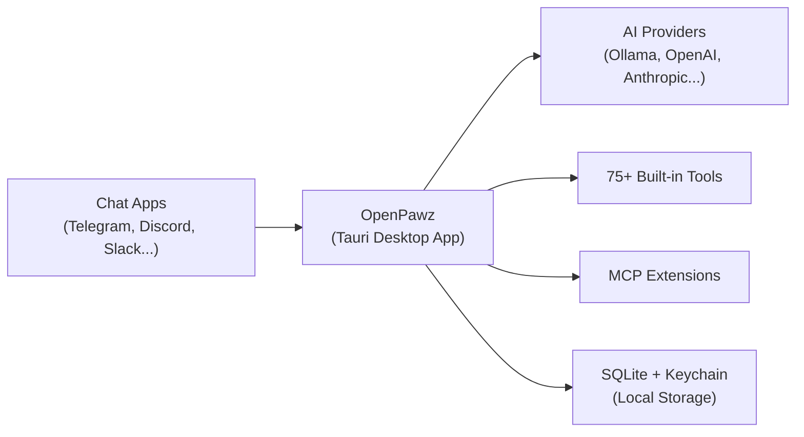

> "Your AI, your rules." — The whole point.

A native desktop AI agent platform built on [Tauri v2](https://v2.tauri.app/). Create autonomous agents, connect them to chat platforms, run tools — all locally on your machine. No cloud, no open ports, no Node.js backend.

<Columns cols={3}>
  <Card title="Get Started" href="/start/installation">
    Install OpenPawz and bring up the app in minutes.
  </Card>
  <Card title="Create an Agent" href="/start/first-agent">
    Guided setup for personality, provider, and tools.
  </Card>
  <Card title="Connect a Provider" href="/start/first-provider">
    Add OpenAI, Ollama, Anthropic, or 7 other providers.
  </Card>
</Columns>

---

## What is OpenPawz?

OpenPawz is the **open-source AI agent operating system** for your desktop. It's not a chatbot. It's not a wrapper around an API. It's a full-blown, multi-agent platform that runs natively on your machine — with zero cloud dependency.

**Imagine this:** You have autonomous AI agents with unique personalities, long-term memory, and access to 75+ tools — managing your emails, monitoring markets, researching the web, writing content, running shell commands, and responding to messages across **11 chat platforms simultaneously**. All from one app. All on your hardware. All under your control.

<Tabs>
  <Tab title="Who is it for?">
    **Everyone who's tired of walled-garden AI.** Developers who want to build and extend. Power users who want a personal AI army across every platform they use. Teams who need private, auditable AI that never phones home. If you've ever wished your AI could actually *do things* — not just talk — OpenPawz is what you've been waiting for.
  </Tab>
  <Tab title="What's different?">
    Most AI tools give you a chat window. OpenPawz gives you an **agent runtime**:
    - **11 channels at once** — Telegram, Discord, Slack, WhatsApp, Matrix, IRC, Twitch, and more
    - **Multi-agent orchestration** — Boss agents delegate to specialists, run parallel research
    - **Semantic memory** — Auto-capture, auto-recall, vector search across all conversations
    - **75+ built-in tools** — Email, GitHub, trading, browser, shell, TTS — not plugins, *built in*
    - **MCP extensions** — Connect to any Model Context Protocol server
    - **10 AI providers** — Ollama (local), OpenAI, Anthropic, Google, DeepSeek, and more
    - **Zero cloud** — SQLite, OS keychain, Tauri IPC. No servers, no ports, no subscriptions
    - **Native performance** — Tauri v2 + Rust backend. Not Electron.
  </Tab>
  <Tab title="Why open source?">
    Because your AI shouldn't have a landlord. OpenPawz is **MIT licensed** — fork it, extend it, deploy it however you want. The codebase is transparent, auditable, and community-driven. No vendor lock-in. No surprise pricing changes. No "we updated our privacy policy" emails.
  </Tab>
  <Tab title="Requirements">
    A computer (macOS, Linux, or Windows), 5 minutes, and one of:
    - A **local model** via [Ollama](https://ollama.com/) — completely free, completely private
    - An **API key** from any supported provider — OpenAI, Anthropic, Google, etc.

    That's it. No Docker required. No databases to manage. No infrastructure to maintain.
  </Tab>
</Tabs>

---

## How it works



The desktop app is the single source of truth for agents, sessions, routing, and channel connections. Everything communicates through **Tauri IPC** — no open ports, no HTTP servers.

---

## Key capabilities

<Columns cols={2}>
  <Card title="Multi-channel gateway">
    Telegram, Discord, Slack, Matrix, IRC, WhatsApp, Twitch, and 4 more with a single app.
  </Card>
  <Card title="Multi-agent orchestration">
    Boss/worker pattern with task delegation, agent squads, and workspace isolation.
  </Card>
  <Card title="75+ built-in tools">
    Email, GitHub, trading, TTS, browser automation, inter-agent comms, and more.
  </Card>
  <Card title="Semantic memory">
    Long-term memory with vector search and auto-recall — your agents never forget.
  </Card>
  <Card title="MCP extensions">
    Connect to any Model Context Protocol server for unlimited additional tools.
  </Card>
  <Card title="Task management">
    Kanban board with agent assignment, cron scheduling, and event triggers.
  </Card>
</Columns>

---

## Quick start

<Steps>
  <Step title="Clone and install">
    ```bash
    git clone https://github.com/elisplash/paw.git
    cd paw
    npm install
    ```
  </Step>
  <Step title="Build the Tauri app">
    ```bash
    npm run tauri dev
    ```
    The app launches with the built-in UI. No separate backend needed.
  </Step>
  <Step title="Add a provider">
    Open **Settings → Models** and add an API key for OpenAI, Anthropic, or point to a local Ollama instance.
  </Step>
  <Step title="Create your first agent">
    Go to **Agents → New Agent**, pick a model, and start chatting. Your agent is ready.
  </Step>
</Steps>

Need the full install guide? See [Installation](/start/installation).

---

## Start here

<Columns cols={3}>
  <Card title="Installation" href="/start/installation">
    Prerequisites and build instructions for macOS, Linux, and Windows.
  </Card>
  <Card title="First Agent" href="/start/first-agent">
    Step-by-step guide to creating and configuring an agent.
  </Card>
  <Card title="First Provider" href="/start/first-provider">
    Connect to any of 10 supported AI providers.
  </Card>
  <Card title="Channels" href="/channels/overview">
    Connect Telegram, Discord, Slack, and 8 more.
  </Card>
  <Card title="Skills & Tools" href="/guides/skills">
    Browse the 75+ built-in tools available to agents.
  </Card>
  <Card title="Architecture" href="/reference/architecture">
    Understand how the Tauri + Rust + TypeScript stack fits together.
  </Card>
</Columns>

---

## Learn more

<Columns cols={3}>
  <Card title="Agents" href="/guides/agents">
    Agent configuration, policies, and lifecycle.
  </Card>
  <Card title="Memory" href="/guides/memory">
    Semantic memory, auto-recall, and the Memory Palace.
  </Card>
  <Card title="Orchestrator" href="/guides/orchestrator">
    Multi-agent workflows and task delegation.
  </Card>
  <Card title="Browser" href="/guides/browser">
    Headless browser automation and research.
  </Card>
  <Card title="Security" href="/reference/security">
    Command risk classification, sandboxing, and agent policies.
  </Card>
  <Card title="Troubleshooting" href="/reference/troubleshooting">
    Common issues and diagnostic steps.
  </Card>
</Columns>
