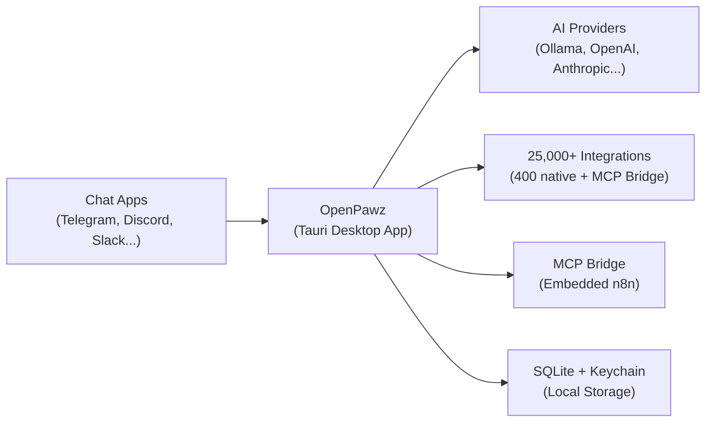

> **Your AI, your rules.** — The whole point.

The open-source AI agent OS built on [Tauri v2](https://v2.tauri.app/). Create autonomous agents with **25,000+ integrations via MCP bridge**, connect them to 11 chat platforms, and run everything locally on your machine. No cloud, no open ports, no Node.js backend.

<Columns cols={3}>
  <Card title="Get Started" href="/start/installation" icon="download">
    Install OpenPawz and bring up the app in minutes.
  </Card>
  <Card title="Create an Agent" href="/start/first-agent" icon="robot">
    Guided setup for personality, provider, and tools.
  </Card>
  <Card title="Connect a Provider" href="/start/first-provider" icon="server">
    Add OpenAI, Ollama, Anthropic, or 7 other providers.
  </Card>
</Columns>

---

## What is OpenPawz?

OpenPawz is the **open-source AI agent operating system** for your desktop. It's not a chatbot. It's not a wrapper around an API. It's a full-blown, multi-agent platform that runs natively on your machine — with zero cloud dependency.

**Imagine this:** You have autonomous AI agents with unique personalities, long-term memory, and access to **25,000+ integrations** — managing Notion boards, Slack channels, GitHub repos, email, trading crypto on three chains, voicing responses aloud, monitoring infrastructure, controlling smart home devices, researching the web, deploying to AWS, writing content, and responding to messages across **11 chat platforms simultaneously**. 400+ integrations ship built-in, and 25,000+ more are available via the embedded n8n engine and MCP Bridge — agents discover and install them at runtime, on demand. Just configure credentials and go.

<Tabs>
  <Tab title="Who is it for?">
    **Everyone who's tired of walled-garden AI.** Developers who want to build and extend. Power users who want a personal AI army across every platform they use. Teams who need private, auditable AI that never phones home. If you've ever wished your AI could actually *do things* — not just talk — OpenPawz is what you've been waiting for.
  </Tab>
  <Tab title="What's different?">
    Most AI tools give you a chat window. OpenPawz gives you an **agent operating system**:
    - **25,000+ integrations** — 400+ native built-in, plus 25,000+ community integrations via the MCP Bridge to n8n — all discoverable and auto-deployable at runtime
    - **11 channels at once** — Telegram, Discord, Slack, WhatsApp, Matrix, IRC, Twitch, and more
    - **Multi-agent orchestration** — Boss/worker delegation, agent squads, inter-agent messaging
    - **Multi-chain DeFi trading** — Coinbase + Solana (Jupiter/Pump.fun) + Ethereum (Uniswap) with policy guardrails
    - **Hybrid semantic memory** — BM25 + vector + MMR + temporal decay
    - **Voice** — Three TTS providers (Google, OpenAI, ElevenLabs) + speech-to-text
    - **Visual node editor** — Drag-and-drop workflow builder for agent pipelines
    - **Model routing** — Auto complexity-based routing + daily budget caps + thinking level control
    - **Self-improving agents** — Agents search PawzHub and install skills for themselves at runtime
    - **Remote access** — Tailscale mesh VPN + webhook server for triggering agents from anywhere
    - **10 AI providers** — Ollama (local), OpenAI, Anthropic, Google, DeepSeek, and more
    - **Zero cloud** — SQLite, OS keychain, AES-256-GCM encryption. No servers, no ports, no subscriptions
    - **Native performance** — Tauri v2 + Rust backend. Not Electron. 530 tests. Zero CVEs.
  </Tab>
  <Tab title="Why open source?">
    Because your AI shouldn't have a landlord. OpenPawz is **MIT licensed** — fork it, extend it, deploy it however you want. The codebase is transparent, auditable, and community-driven. No vendor lock-in. No surprise pricing changes. No "we updated our privacy policy" emails.
  </Tab>
  <Tab title="Requirements">
    A computer (macOS, Linux, or Windows), 5 minutes, and one of:
    - A **local model** via [Ollama](https://ollama.com/) — completely free, completely private
    - An **API key** from any supported provider — OpenAI, Anthropic, Google, etc.

    That's it. No Docker required. No databases to manage. No infrastructure to maintain.
  </Tab>
</Tabs>

---

## How it works



The desktop app is the single source of truth for agents, sessions, routing, and channel connections. Everything communicates through **Tauri IPC** — no open ports, no HTTP servers.

---

## Key capabilities

<Columns cols={2}>
  <Card title="25,000+ integrations" icon="puzzle">
    400+ native integrations built in, plus 25,000+ community integrations via the MCP Bridge to n8n. Agents discover and auto-deploy per-service workflows at runtime — zero configuration.
  </Card>
  <Card title="Multi-agent orchestration" icon="users">
    Boss/worker delegation, persistent agent squads, inter-agent messaging, and workspace isolation. Full project lifecycle management.
  </Card>
  <Card title="Multi-channel gateway" icon="message-lines">
    Telegram, Discord, Slack, Matrix, IRC, WhatsApp, Twitch, and 4 more with a single app. Per-channel agent routing and smart message splitting.
  </Card>
  <Card title="Multi-chain DeFi" icon="bitcoin-sign">
    Coinbase + Solana (Jupiter/Pump.fun) + Ethereum (Uniswap). Trading policy engine with daily loss limits. Full trade audit trail.
  </Card>
  <Card title="Voice (TTS/STT)" icon="microphone">
    Three TTS providers (Google, OpenAI, ElevenLabs) + speech-to-text. Auto-speak mode reads responses aloud as they arrive.
  </Card>
  <Card title="Visual node editor" icon="diagram-project">
    Drag-and-drop workflow builder. Connect triggers, agents, tools, conditions, and outputs visually — no code required.
  </Card>
  <Card title="Model routing" icon="route">
    Automatic complexity-based routing. Simple queries go to cheap models, complex tasks to powerful ones. Daily USD budget caps.
  </Card>
  <Card title="10 AI providers" icon="server">
    Ollama (local & free), OpenAI, Anthropic, Google, DeepSeek, Grok, Mistral, OpenRouter, and any custom endpoint.
  </Card>
</Columns>

---

## Memory that never forgets

Most AI tools forget everything between conversations. OpenPawz doesn't.

<Columns cols={2}>
  <Card title="Semantic long-term memory" icon="brain">
    Every important fact, preference, and detail is automatically captured and stored with vector embeddings. When context is relevant, it's auto-recalled into the conversation — no manual prompting needed.
  </Card>
  <Card title="Memory Palace" icon="building-columns">
    A dedicated interface to browse, search, edit, and manage everything your agents have learned. Full visibility into what your AI knows about you.
  </Card>
</Columns>

<Tip>Agents share a memory namespace by default, so knowledge captured by one agent is available to all. You can also isolate memory per agent or per workspace.</Tip>

---

## Token savings with session compaction

Long conversations burn tokens fast. OpenPawz has a built-in solution: **automatic session compaction**.

When a conversation approaches the model's context window limit, OpenPawz:
1. **Summarizes** the older parts of the conversation into a compact digest
2. **Preserves** key facts and decisions in memory
3. **Archives** the full session for later reference
4. **Continues** the conversation seamlessly with the summary + memory context

<Note>This means your agents can run **indefinitely long conversations** without hitting context limits or losing important context — and you pay for fewer tokens in the process.</Note>

---

## Security you can actually trust

OpenPawz was designed from the ground up with a **zero-trust, local-first security model**.

<Columns cols={2}>
  <Card title="100% local — no data leaves your machine" icon="shield-halved">
    All conversations, memories, agent configs, and files stay on your hardware. No cloud sync, no telemetry, no analytics. The only outbound traffic is to AI providers you explicitly configure.
  </Card>
  <Card title="OS-level credential storage" icon="key">
    API keys and secrets are stored in your operating system's native keychain — macOS Keychain, Windows Credential Manager, or Linux Secret Service. Never in plain text. Never in a config file.
  </Card>
  <Card title="Command risk classification" icon="triangle-exclamation">
    Every tool and shell command is rated on a 1–5 risk scale. High-risk operations (file deletion, system commands, network access) require explicit user confirmation before execution.
  </Card>
  <Card title="Sandboxed execution" icon="box">
    Run agent shell commands in isolated Docker containers with configurable resource limits, network policies, and filesystem restrictions. Agents can't touch your host system.
  </Card>
</Columns>

<Columns cols={2}>
  <Card title="Per-agent policies" icon="lock">
    Control exactly what each agent can do — which tools it can access, which channels it can use, what risk level it's allowed to execute at. Full granular permission control.
  </Card>
  <Card title="Prompt injection defense" icon="shield">
    Built-in prompt injection detection analyzes incoming messages for manipulation attempts and flags suspicious content before it reaches your agents.
  </Card>
</Columns>

<Columns cols={2}>
  <Card title="TLS certificate pinning" icon="lock">
    Custom `rustls` config pinned to Mozilla root CAs only — OS trust store excluded. Even a compromised CA on the user's machine cannot intercept provider traffic.
  </Card>
  <Card title="Request signing & memory zeroing" icon="fingerprint">
    Every outbound AI request SHA-256 signed for tamper detection. API keys auto-zeroed from RAM on provider drop via `Zeroizing<String>`.
  </Card>
</Columns>

---

## Quick start

<Steps>
  <Step title="Clone and install">
    ```bash
    git clone https://github.com/OpenPawz/openpawz.git
    cd paw
    npm install
    ```
  </Step>
  <Step title="Build the Tauri app">
    ```bash
    npm run tauri dev
    ```
    The app launches with the built-in UI. No separate backend needed.
  </Step>
  <Step title="Add a provider">
    Open **Settings → Providers** and add an API key for OpenAI, Anthropic, or point to a local Ollama instance.
  </Step>
  <Step title="Create your first agent">
    Go to **Agents → New Agent**, pick a model, and start chatting. Your agent has immediate access to 25,000+ integrations via the MCP Bridge.
  </Step>
</Steps>

Need the full install guide? See [Installation](/start/installation).

---

## Start here

<Columns cols={3}>
  <Card title="Installation" href="/start/installation" icon="download">
    Prerequisites and build instructions for macOS, Linux, and Windows.
  </Card>
  <Card title="First Agent" href="/start/first-agent" icon="robot">
    Step-by-step guide to creating and configuring an agent.
  </Card>
  <Card title="First Provider" href="/start/first-provider" icon="server">
    Connect to any of 10 supported AI providers.
  </Card>
  <Card title="Channels" href="/channels/overview" icon="message-lines">
    Connect Telegram, Discord, Slack, and 8 more.
  </Card>
  <Card title="Integrations" href="/guides/integrations" icon="puzzle">
    Browse the 25,000+ integrations available to agents.
  </Card>
  <Card title="Architecture" href="/reference/architecture" icon="sitemap">
    Understand how the Tauri + Rust + TypeScript stack fits together.
  </Card>
</Columns>

---

## Learn more

<Columns cols={3}>
  <Card title="Agents" href="/guides/agents" icon="robot">
    Agent configuration, policies, and lifecycle.
  </Card>
  <Card title="Memory" href="/guides/memory" icon="brain">
    Semantic memory, auto-recall, and the Memory Palace.
  </Card>
  <Card title="Orchestrator" href="/guides/orchestrator" icon="users">
    Multi-agent workflows and task delegation.
  </Card>
  <Card title="Browser" href="/guides/browser" icon="globe">
    Headless browser automation and research.
  </Card>
  <Card title="Security" href="/reference/security" icon="shield-halved">
    Command risk classification, sandboxing, and agent policies.
  </Card>
  <Card title="Troubleshooting" href="/reference/troubleshooting" icon="wrench">
    Common issues and diagnostic steps.
  </Card>
</Columns>
